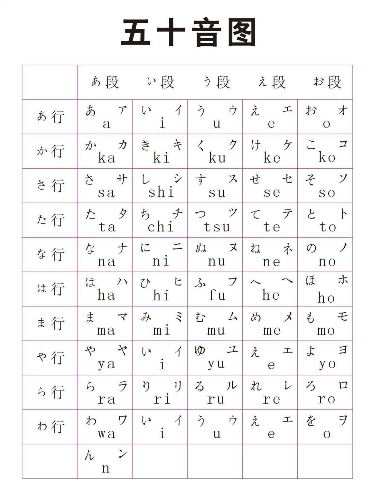
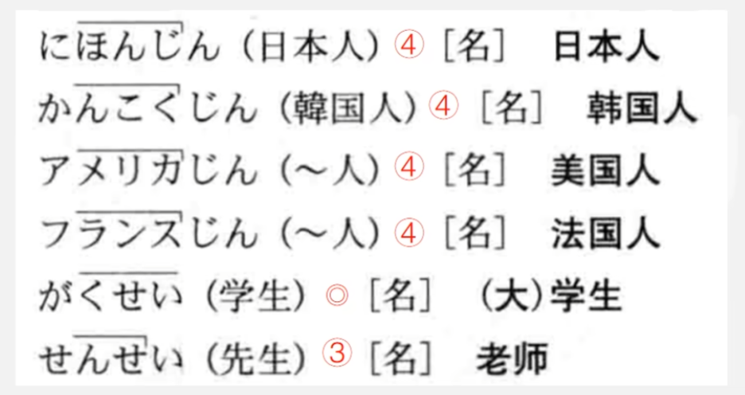
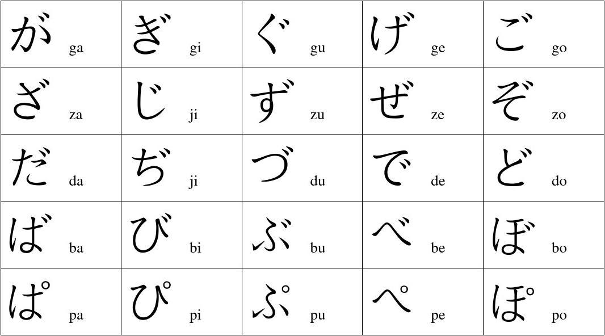

# 五十音图

# 日语声调的标记方法

    
    <ul style='flex-grow: 1;'>
        <li>第1个音和第2个音不是同音</li>
        <li>出现降音就不会升回去</li>
        <li>高 - 低：在第几个音出现，就是几型</li>
    </ul>

# 浊音

> k 浊化 g
>
> s 浊化 z
>
> t 浊化 d
>
> h 浊化 b 半浊化 p

# 特殊发音

- し　SHI - XI                  浊化后                     じ　ZI - JI
- す　SU - SI                   浊化后                      ず　ZU - ZI
- ち　TI - QI                    浊化后                     ぢ　DI - JI
- つ　TU - CI                   浊化后                     づ　DU - ZI
