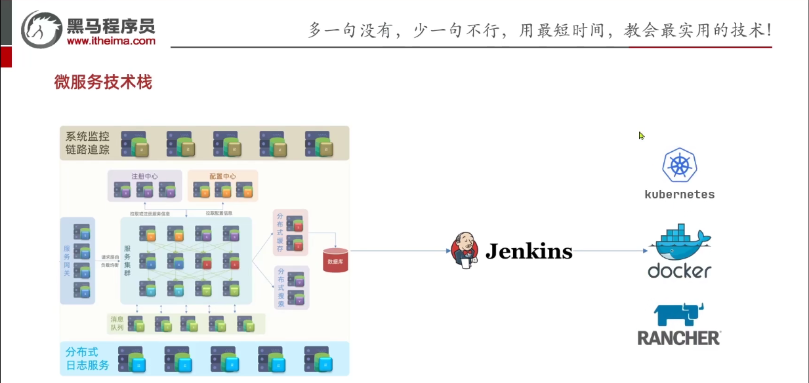
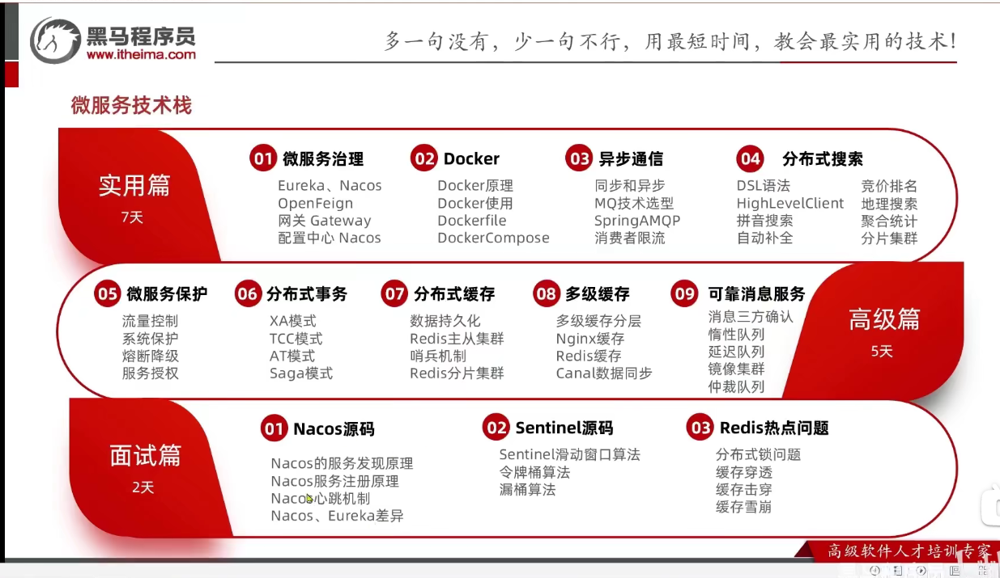
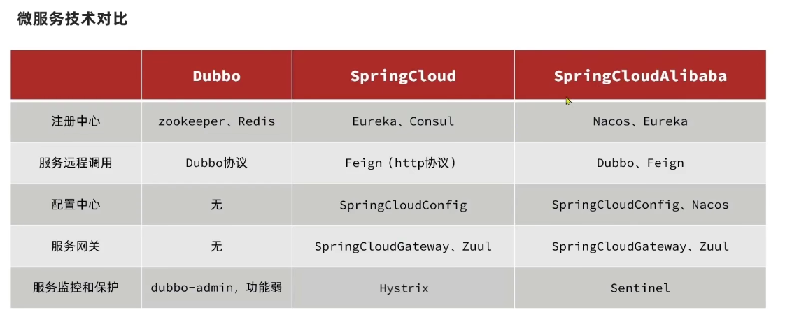
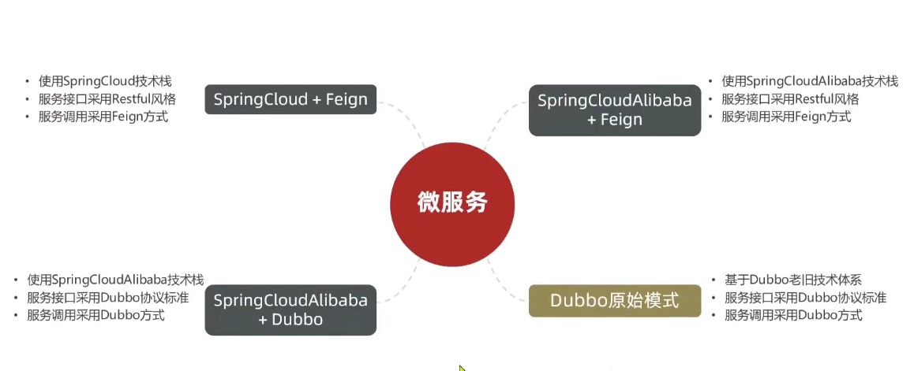
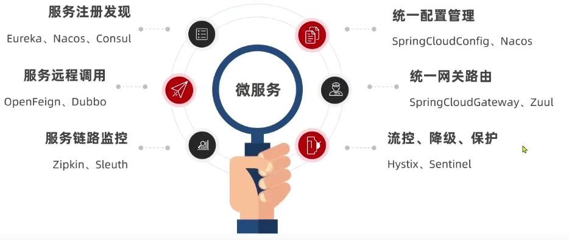
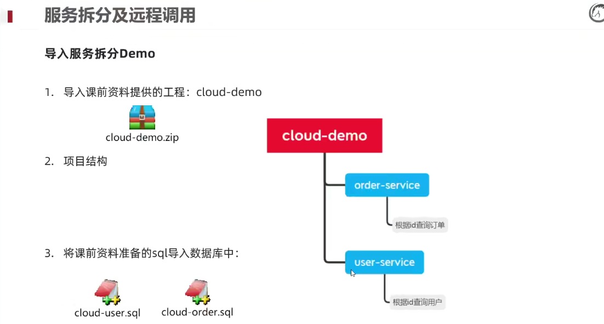
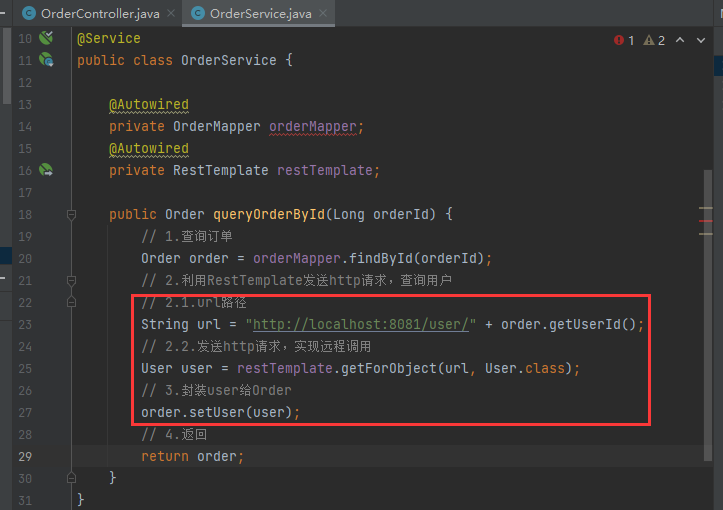

# Java微服务

> SpringCloud+RabbitMQ+Docker+Redis+搜索+分布式

## 微服务技术栈





## 01 微服务框架

- 认识微服务
- 分布式服务架构案例
- eureka注册中心
- Ribbon负载均衡原理
- nacos注册中心

### 1、认识微服务

- 服务架构演变
- SpringCloud

#### （1）单体架构

**单体架构**：将业务的所有功能集中在一个项目中开发，打成一个包部署

**优点**：

- 架构简单
- 部署成本低

**缺点**：

- 耦合度高

#### （2）分布式架构

**分布式架构**：根据业务功能对系统进行拆分，每个业务模块作为独立项目开发，称为一个服务

**优点**：

- 降低服务耦合
- 有利于服务升级拓展

**服务治理**：

分布式架构要考虑的问题：

- 服务拆分粒度如何？
- 服务集群地址如何维护？
- 服务之间如何实现远程调用？
- 服务健康状态如何感知？

**微服务**

<font color='red'>微服务是一种经过良好架构设计的**分布式**架构方案，微服务架构特征：</font>

- 单一职责：微服务拆分粒度更小，每一个服务都对应唯一的义务功能，做到单一职责，避免重复业务开发
- 面向服务：微服务对外暴露业务接口
- 自治：团队独立、技术独立、数据独立、部署独立
- 隔离性强：服务调用做好隔离、容错、降级，避免出现级联问题

#### （3）微服务结构

微服务这种方案需要技术框架来落地，全球的互联网公司都在积极尝试自己的微服务落地技术。在国内最知名的就是SpringCloud和阿里巴巴的Dubbo。



#### （4）企业需求



### 2、SpringCloud

- SpringCloud是目前国内使用最广泛的微服务框架。官网地址[Spring Cloud](https://spring.io/projects/spring-cloud)
- SpringCloud集成了各种微服务功能组件，并基于SpringBoot实现了这些组件的自动装配，从而提供了良好的开箱即用体验：



## 02 服务拆分及远程调用

- 服务拆分
- 服务间调用

### 服务拆分

#### 1、服务拆分注意事项

（1）不同微服务，不要重复开发相同业务

（2）微服务数据独立，不要访问其他微服务的数据库

（3）微服务可以将自己的业务暴露为接口，供其他微服务调用

#### 2、导入服务拆分Demo



#### 3、服务拆分及远程调用

- 微服务需要根据业务模块拆分，做到单一职责，不要重复开发相同业务
- 微服务可以将业务暴露为接口，供其他微服务使用
- 不同微服务都应该有自己独立的数据库

### 微服务远程调用

<font color='red' size='4px'><strong>案例 根据订单id查询订单功能</strong></font>

需求：根据订单id查询订单的同时，把订单所属的用户信息一起返回

> 如果我们的订单模块，也能像 js、浏览器一样发起一个 HTTP 请求，就可以完成我们的业务

<font color='red' size='4px'><strong>如何在我们的Java代码中发起一个HTTP请求</strong></font>

#### 1、注册RestTemplate

在order-service的OrderApplication中注册RestTemplate

```java
package cn.itcast.order;

import org.mybatis.spring.annotation.MapperScan;
import org.springframework.boot.SpringApplication;
import org.springframework.boot.autoconfigure.SpringBootApplication;
import org.springframework.context.annotation.Bean;
import org.springframework.web.client.RestTemplate;

@MapperScan("cn.itcast.order.mapper")
@SpringBootApplication
public class OrderApplication {

    public static void main(String[] args) {
        SpringApplication.run(OrderApplication.class, args);
    }

    @Bean
    public RestTemplate restTemplate() {
        return new RestTemplate();
    }
}
```

#### 2、服务远程调用RestTemplate



#### 3、总结

1. 微服务调用方式
   - 基于RestTemplate发起的http请求实现远程调用
   - http请求做远程调用是与语言无关的调用，只要知道对方的ip、端口、接口路径、请求参数即可。

### 提供者与消费者

- 服务提供者：一次业务中，被其他微服务调用的服务。（提供接口给其他微服务）

- 服务消费者：一次业务中，调用其他微服务的服务。（调动其他微服务提供的接口）

- <font color='red'><strong>服务A调用服务B，服务B调用服务C，那么服务B是什么角色？</strong></font>

  > 一个服务，相对于不同的业务而言，既可以是服务提供者，也可以是服务消费者

- 提供者与消费者角色其实是**相对的**

## 03 Eureka注册中心

- 远程调用的问题
- eureka原理
- 搭建EurekaServer
- 服务注册
- 服务发现

