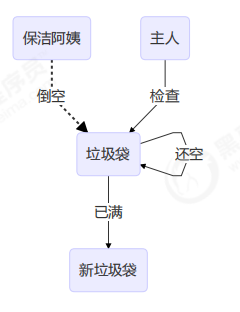
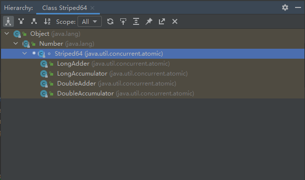
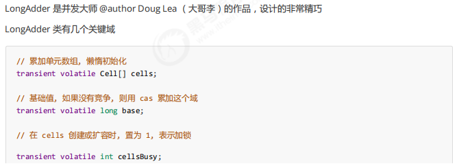
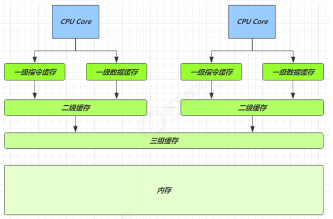
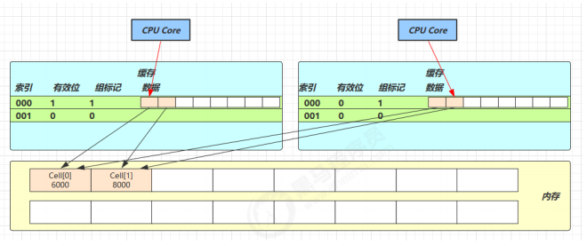

# CAS 的 ABA 问题

## ABA 问题及解决

### 原子引用-ABA 问题

为什么需要原子引用类型？

- AtomicReference
- AtomicMarkableReference
- **AtomicStampedReference**（stamped 时间戳）

```java
static AtomicReference<String> ref = new AtomicReference<>("A");
public static void main(String[] args) throws InterruptedException {
    log.debug("main start...");
    // 获取值 A
    // 这个共享变量被它线程修改过？
    String prev = ref.get();
    other();
    sleep(1);
    // 尝试改为 C
    log.debug("change A->C {}", ref.compareAndSet(prev, "C"));
}
private static void other() {
    new Thread(() -> {
        log.debug("change A->B {}", ref.compareAndSet(ref.get(), "B"));
    }, "t1").start();
    sleep(0.5);
    new Thread(() -> {
 log.debug("change B->A {}", ref.compareAndSet(ref.get(), "A"));
 }, "t2").start();
}
```

输出

```
11:29:52.325 c.Test36 [main] - main start... 
11:29:52.379 c.Test36 [t1] - change A->B true 
11:29:52.879 c.Test36 [t2] - change B->A true 
11:29:53.880 c.Test36 [main] - change A->C true
```

==主线程仅能判断出共享变量的值与最初值 A 是否相同，不能感知到这种从 A 改为 B 又 改回 A 的情况==，如果主线程希望：

<u>只要有其它线程【动过了】共享变量，那么自己的 cas 就算失败，这时，仅比较值是不够的，需要再加一个<font color='red'>版本号</font></u>

### AtomicStampedReference

```java
static AtomicStampedReference<String> ref = new AtomicStampedReference<>("A", 0);
public static void main(String[] args) throws InterruptedException {
    log.debug("main start...");
    // 获取值 A
    String prev = ref.getReference();
    // 获取版本号
    int stamp = ref.getStamp();
    log.debug("版本 {}", stamp);
    // 如果中间有其它线程干扰，发生了 ABA 现象
    other();
    sleep(1);
    // 尝试改为 C
    log.debug("change A->C {}", ref.compareAndSet(prev, "C", stamp, stamp + 1));
}
private static void other() {
    new Thread(() -> {
        log.debug("change A->B {}", ref.compareAndSet(ref.getReference(), "B", 
                                                      ref.getStamp(), ref.getStamp() + 1));
        log.debug("更新版本为 {}", ref.getStamp());
    }, "t1").start();
    sleep(0.5);
    new Thread(() -> {
        log.debug("change B->A {}", ref.compareAndSet(ref.getReference(), "A", 
                                                      ref.getStamp(), ref.getStamp() + 1));
        log.debug("更新版本为 {}", ref.getStamp());
    }, "t2").start();
}
```

AtomicStampedReference 可以给原子引用加上版本号，追踪原子引用整个的变化过程，如：<span style='background: silver'> A -> B -> A -> C </span>，通过AtomicStampedReference，我们可以知道，引用变量中途被更改了几次。

但是有时候，并不关心引用变量更改了几次，只是单纯的关心**是否更改过**，所以就有了 ==AtomicMarkableReference==

### AtomicMarkableReference



```java
class GarbageBag {
    String desc;
    public GarbageBag(String desc) {
        this.desc = desc;
    }
    public void setDesc(String desc) {
        this.desc = desc;
    }
    @Override
    public String toString() {
        
        return super.toString() + " " + desc;
    }
}
```

```java
@Slf4j
public class TestABAAtomicMarkableReference {
    public static void main(String[] args) throws InterruptedException {
        GarbageBag bag = new GarbageBag("装满了垃圾");
        // 参数2 mark 可以看作一个标记，表示垃圾袋满了
        AtomicMarkableReference<GarbageBag> ref = new AtomicMarkableReference<>(bag, true);
        log.debug("主线程 start...");
        GarbageBag prev = ref.getReference();
        log.debug(prev.toString());
        new Thread(() -> {
            log.debug("打扫卫生的线程 start...");
            bag.setDesc("空垃圾袋");
            while (!ref.compareAndSet(bag, bag, true, false)) {}
            log.debug(bag.toString());
        }).start();
        Thread.sleep(1000);
        log.debug("主线程想换一只新垃圾袋？");
        boolean success = ref.compareAndSet(prev, new GarbageBag("空垃圾袋"), true, false);
        log.debug("换了么？" + success);
        log.debug(ref.getReference().toString());
    }
}
```

输出

```
2019-10-13 15:30:09.264 [main] 主线程 start... 
2019-10-13 15:30:09.270 [main] cn.itcast.GarbageBag@5f0fd5a0 装满了垃圾
2019-10-13 15:30:09.293 [Thread-1] 打扫卫生的线程 start... 
2019-10-13 15:30:09.294 [Thread-1] cn.itcast.GarbageBag@5f0fd5a0 空垃圾袋
2019-10-13 15:30:10.294 [main] 主线程想换一只新垃圾袋？
2019-10-13 15:30:10.294 [main] 换了么？false 
2019-10-13 15:30:10.294 [main] cn.itcast.GarbageBag@5f0fd5a0 空垃圾袋
```

可以注释掉打扫卫生线程代码，再观察输出


# 原子数组-保护数组里的元素

- AtomicIntegerArray
- AtomicLongArray
- AtomicReferenceArray

## 有如下方法：


```java
/**
 参数1，提供数组、可以是线程不安全数组或线程安全数组
 参数2，获取数组长度的方法
 参数3，自增方法，回传 array, index
 参数4，打印数组的方法
*/
// supplier 提供者 无中生有 ()->结果
// function 函数 一个参数一个结果 (参数)->结果 , BiFunction (参数1,参数2)->结果
// consumer 消费者 一个参数没结果 (参数)->void, BiConsumer (参数1,参数2)->
private static <T> void demo(
    Supplier<T> arraySupplier,
    Function<T, Integer> lengthFun,
    BiConsumer<T, Integer> putConsumer,
    Consumer<T> printConsumer ) {
    List<Thread> ts = new ArrayList<>();
    T array = arraySupplier.get();
    int length = lengthFun.apply(array);
    for (int i = 0; i < length; i++) {
        // 每个线程对数组作 10000 次操作
        ts.add(new Thread(() -> {
            for (int j = 0; j < 10000; j++) {
                putConsumer.accept(array, j%length);
            }
        }));
    }
    ts.forEach(t -> t.start()); // 启动所有线程
    ts.forEach(t -> {
        try {
            t.join();
        } catch (InterruptedException e) {
            e.printStackTrace();
        }
    }); // 等所有线程结束
    printConsumer.accept(array);
}
```

## 不安全的数组

```java
demo(
    ()->new int[10],
    (array)->array.length,
    (array, index) -> array[index]++,
    array-> System.out.println(Arrays.toString(array))
);
```

结果

```
[9870, 9862, 9774, 9697, 9683, 9678, 9679, 9668, 9680, 9698]
```

## 安全的数组

```java
demo(
    ()-> new AtomicIntegerArray(10),
    (array) -> array.length(),
    (array, index) -> array.getAndIncrement(index),
    array -> System.out.println(array)
);
```

结果

```
[10000, 10000, 10000, 10000, 10000, 10000, 10000, 10000, 10000, 10000]
```

# 字段更新器-保护某个对象里的属性（成员变量）

- AtomicReferenceFieldUpdater // 域 字段
- AtomicIntegerFieldUpdater
- AtomicLongFIeldUpdater

利用字段更新器，可以针对对象的某个域（Field）进行原子操作，只能配合 volatile 修饰的字段使用，否则会出现异常

```
Exception in thread "main" java.lang.IllegalArgumentException: Must be volatile type
```

```java
public class Test5 {
    private volatile int field;
    public static void main(String[] args) {
        AtomicIntegerFieldUpdater fieldUpdater =
            AtomicIntegerFieldUpdater.newUpdater(Test5.class, "field");
        Test5 test5 = new Test5();
        fieldUpdater.compareAndSet(test5, 0, 10);
        // 修改成功 field = 10
        System.out.println(test5.field);
        // 修改成功 field = 20
        fieldUpdater.compareAndSet(test5, 10, 20);
        System.out.println(test5.field);
        // 修改失败 field = 20
        fieldUpdater.compareAndSet(test5, 10, 30);
        System.out.println(test5.field);
    }
}
```

输出

```
10 
20 
20
```

# 原子累加器



性能提升的原因很简单，==就是在有竞争时，设置多个累加单元==，Therad-0 累加 Cell[0]（不会超过 CPU 核心数），而 Thread-1 累加Cell[1]... 最后将结果汇总。这样它们在累加时操作的不同的 Cell 变量，因此减少了 CAS 重试失败，从而提高性能。



## MESI 缓存一致性协议

### <font color='blue'>* 原理之伪共享</font> 一个缓存行加入了多个cell对象

其中 Cell 即为累加单元

```java
// 防止缓存行伪共享
@sun.misc.Contended
    static final class Cell {
        volatile long value;
        Cell(long x) { value = x; }

        // 最重要的方法, 用来 cas 方式进行累加, prev 表示旧值, next 表示新值
        final boolean cas(long prev, long next) {
            return UNSAFE.compareAndSwapLong(this, valueOffset, prev, next);
        }
        // 省略不重要代码
    }
```

### @sun.misc.Contended

得从缓存说起

缓存与内存的速度比较



> <font color='red' face='楷体'>因为 CPU 与 内存的速度差异很大，需要靠预读数据至缓存来提升效率。</font>
>
> <font color='red' face='楷体'>而缓存以缓存行为单位，每个缓存行对应着一块内存，一般是 64 byte（8个long）</font>
>
> <font color='red' face='楷体'>缓存的加入会造成<b>数据副本</b>的产生，即同一份数据会缓存在不同核心的缓存行中</font>
>
> <font color='red' face='楷体'>CPU 要保证数据的一致性，如果某个 CPU 核心更改了数据，其他 CPU 核心对应的整个缓存行必须失效</font>



@sun.misc.Contended 用来解决这个问题，<font color='blue' face='楷体'>它的原理是在使用此注解的对象或字段的前后各增加128字节大小的padding，从而让CPU将对象预读至缓存时占用不同的缓存行，这样，不会造成对方缓存行的失效。</font>

# transient的用途及使用方法

## 用途

　　我们知道，当一个对象实现了Serilizable接口，这个对象就可以被序列化，我们不关心其内在的原理，只需要了解这个类实现了Serilizable接口，这个类的所有属性和方法都会自动序列化。而在开发过程中，我们可能要求：**当对象被序列化时（写入字节序列到目标文件）时，有些属性需要序列化，而其他属性不需要被序列化**，打个比方，如果一个用户有一些敏感信息（如密码，银行卡号等），为了安全起见，不希望在网络操作（主要涉及到序列化操作，本地序列化缓存也适用）中被传输，这些信息对应的变量就可以加上transient关键字。==换句话说，这个字段的生命周期仅存于调用者的内存中而不会写到磁盘里持久化==。
　所以，transient的用途在于：阻止实例中那些用此关键字声明的变量持久化；当对象被反序列化时（从源文件读取字节序列进行重构），这样的实例变量值不会被持久化和恢复。例如，当反序列化对象——数据流（例如，文件）可能不存在时，原因是你的对象中存在类型为java.io.InputStream的变量，序列化时这些变量引用的输入流无法被打开。

# cas 锁

```java
// 不要用于实践！！！
public class LockCas {
    private AtomicInteger state = new AtomicInteger(0);
    public void lock() {
        while (true) {
            if (state.compareAndSet(0, 1)) {
                break;
            }
        }
    }
    public void unlock() {
        log.debug("unlock...");
        state.set(0);
    }
}
```

测试

```java
LockCas lock = new LockCas();
new Thread(() -> {
    log.debug("begin...");
    lock.lock();
    try {
        log.debug("lock...");
        sleep(1);
    } finally {
        lock.unlock();
    }
}).start();
new Thread(() -> {
    log.debug("begin...");
    lock.lock();
    try {
        log.debug("lock...");
    } finally {
        lock.unlock();
    }
}).start();
```

输出

```
18:27:07.198 c.Test42 [Thread-0] - begin... 
18:27:07.202 c.Test42 [Thread-0] - lock... 
18:27:07.198 c.Test42 [Thread-1] - begin... 
18:27:08.204 c.Test42 [Thread-0] - unlock... 
18:27:08.204 c.Test42 [Thread-1] - lock... 
18:27:08.204 c.Test42 [Thread-1] - unlock...
```

