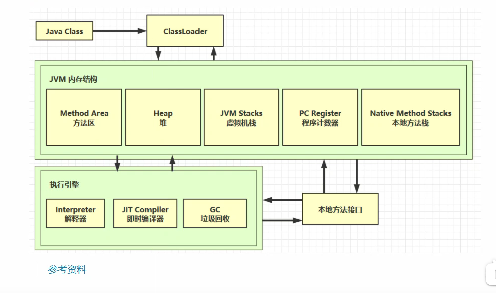
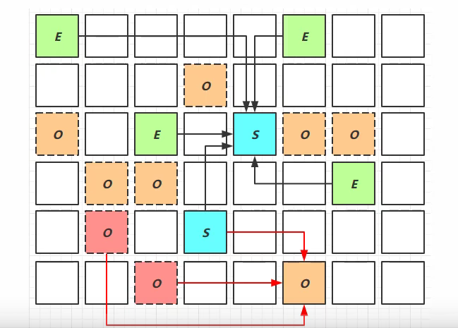
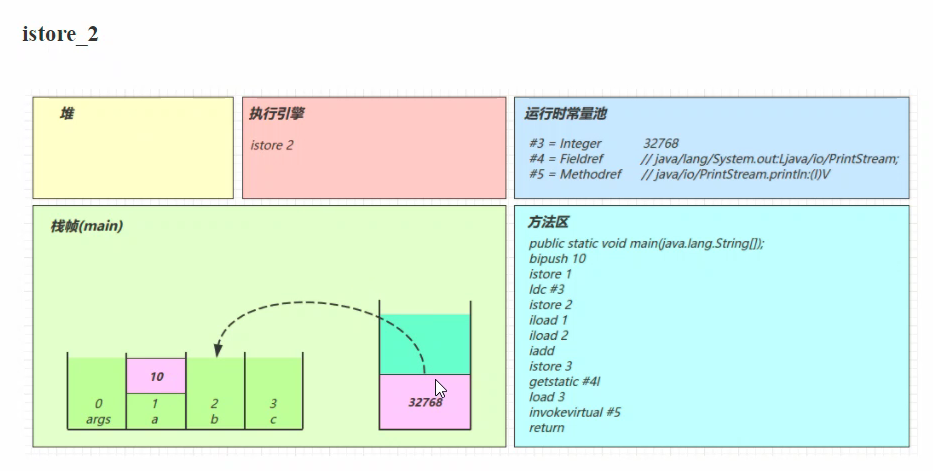
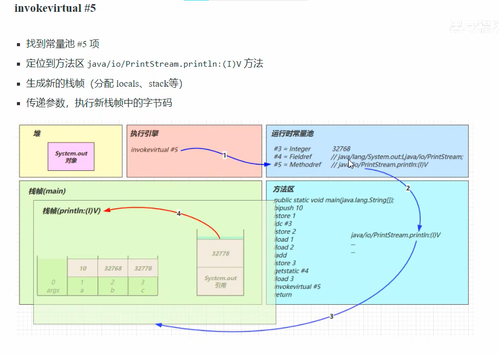
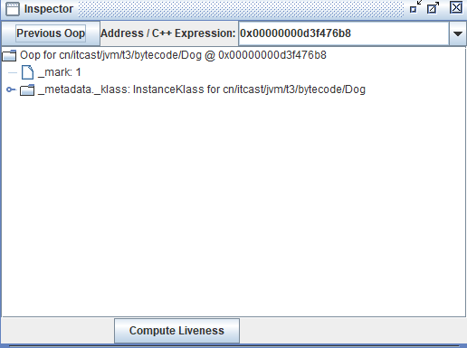
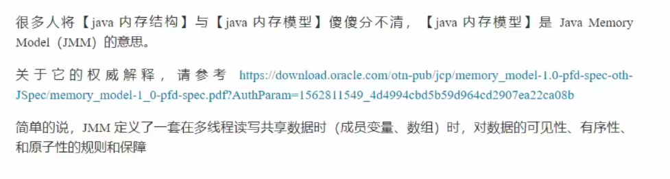
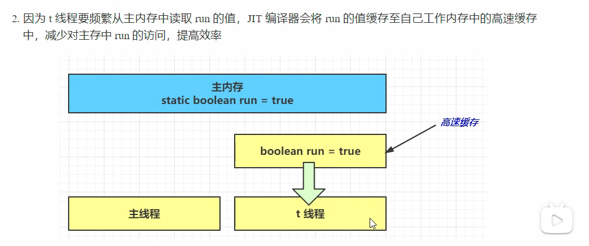
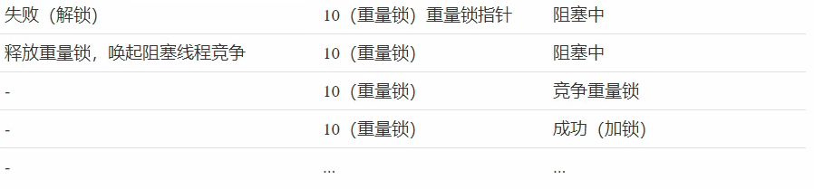
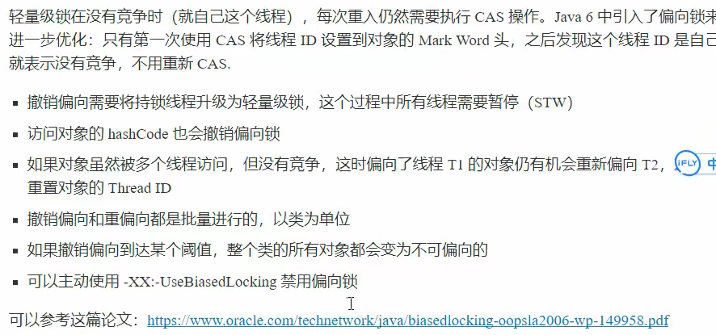

## 引言


## 一、学习路线



Klass都是放在**方法区**中；

类创建实例对象都是放在**堆**中；

堆里的对象，在调用方法时，就会用到**虚拟机栈**、**程序计数器**、**本地方法栈**；


[Klass和Class的区别](https://zhuanlan.zhihu.com/p/51695160)

方法执行时，它的每行代码是由**解释器**逐行解释的；

方法里的频繁被调用的代码，会有一个**即时编译器**做一个优化以后的执行；

**GC**会对**堆**里面一些不再被引用的对象，进行一个垃圾回收；


还有一些Java代码不方便实现的功能，必须调用底层操作系统的功能，所以我们要跟操作系统一些功能打交道，就要借助本地方法接口，来调用操作系统提供的功能方法。


## 二、内存结构

### 1、程序计数器

#### 1.1 定义

Program Counter Register 程序计数器（寄存器）

**作用：记住下一条jvm指令的执行地址**，如1.2中前面的那些数字

**特点：**

​	是线程私有的，随着线程创建而创建，随着线程销毁和销毁

​	不会存在内存溢出

​	是一块较小的内存空间

#### 1.2 作用

​			二进制字节码         jvm指令								     Java 源代码

```java
	0: getstatic	 #20					// PrintStream out = System.out;
    3: astore_1								// --
    4: aload_1								// out.println(1);
    5: iconst_1								// --
    6: invokevirtual #26					// --
    9: aload_1								// out.println(2);
   10: iconst_2								// --
   11: invokevirtual #26					// --
   14: aload_1								// out.println(3);
   15: iconst_3								// --
   16: invokerirtual #26					// --
   19: aload_1								// out.println(4);
   20: iconst_4								// --
   21: invokevirtual #26					// out.println(5);
   24: aload_1								// --
   26: invokevirtual #26					// --
   29: return
```

Java跨平台的基础就是这一套jvm指令，它对所有的平台都是一致的（Windows、Linux）

这些指令还是不能交给CPU去执行；

需要一个解释器，去把每一条虚拟机指令解释成为一条机器码，再交给CPU去执行。


### 2、虚拟机栈

**线程运行时，需要的一个内存空间。每一个虚拟机栈由栈帧组成，一个栈帧就对应一次方法的调用。**

**栈**：线程运行需要的内存空间

**栈帧**：每个方法运行时需要的内存（参数、局部变量、返回地址）

#### 2.1 定义

Java Virtual Machine Stacks（Java 虚拟机栈）

​	每个线程运行时所需要的内存，成为虚拟机栈

​	每个栈由多个栈帧（Frame）组成，对应着每次方法调用时所占用的内存

​	每个线程只能有一个**活动栈帧**，对应着当前正在执行的那个方法（即，在当前栈顶部的栈帧）


问题辨析

1. 垃圾回收是否设计栈内存？

   不涉及，栈内存就是一次次的方法调用产生的栈帧，而栈帧内存在每次方法调用结束都会被弹出栈，自动被回收掉，所以不需要垃圾回收。

2. 栈内存分配越大越好吗？

   **-Xss size：指定运行 Java 代码时，栈的内存空间；（如：-Xss256k）**

   每个线程在创建的时候都会创建一个虚拟机栈，而物理内存是固定的，栈内存划分的越大，可分配的线程数就越少。

3. 方法内的局部变量是否线程安全？

   是否是线程安全？是看这个变量是对多个线程是共享的，还是线程私有的。

   如果方法内的局部变量没有逃离方法的作用范围，它是线程安全的

   如果是局部变量引用了对象，并逃离方法的作用范围，需要考虑线程安全


#### 2.2 栈内存溢出

1. 栈帧过多导致栈内存溢出
2. 栈帧过大导致栈内存溢出


#### 2.3 线程运行诊断

1. cpu 占用过多

   Linux中，用top定位哪个线程对cpu的占用过高

   ps H -eo pid,tid,%cpu | grep 进程id（用ps命令进一步定位是哪个线程引起的cpu占用过高）

   **jstack 进程id**

   ​	可以根据线程id找到有问题的线程，进一步定位到问题代码的源码行号

2. 程序运行很长时间没有结果

   

### 3、本地方法栈

还有一些Java代码不方便实现的功能，必须调用底层操作系统的功能，所以我们要跟操作系统一些功能打交道，就要借助本地方法接口，来调用操作系统提供的功能方法。


### 4、堆

#### 4.1 定义

Heap 堆

​	通过new关键字，创建对象都会使用堆内存

特点

​	它是线程共享的，堆中对象都需要考虑线程安全的问题

​	有垃圾回收机制

#### 4.2 堆内存溢出

**-Xmx size：指定运行 Java 代码时，堆的内存空间；（如：-Xmx8m）**

>  -Xmx10240m：代表最大堆
>
>  -Xms10240m：代表最小堆
>
>  -Xmn5120m：代表新生代
>
>  -XXSurvivorRatio=3：代表Eden:Survivor = 3

#### 4.3 堆内存诊断

 1. jps 工具

    查看当前系统中有哪些java进程

 2. jmap 工具          **jmap -heap 进程id**

    查看堆内存占用情况（只能查看某一个时刻的堆内存占用情况）

 3. jconsole 工具

    图形界面的，多功能的监测工具，可以连续监测


案例

​	垃圾回收后，内存占用仍然很高

​	使用jvisualvm工具


### 5、方法区

#### 5.1 定义

​	**所有Java虚拟机共享的一个区域**；它存放了跟**类结构**相关的一些信息：==成员变量、方法数据、成员方法以及构造方法代码部分，以及特殊方法。还有一个**运行时常量池**。==

​	虚拟机启动时，被创建。

​	==逻辑上是堆的一个组成部分。==


​	用于存储已被虚拟机<font color='blue'><b>加载的类信息、常量、静态常量、即时编译器后的代码等数据</b></font>，方法编译出的字节码也是保存在这个区域。

[Kclass在方法区看具体实现；详细信息见这里](https://www.cnblogs.com/xy-nb/p/6773051.html)

​	**栈区（虚拟机栈）：主要是存储局部变量表（当然也还有其他信息）**


​	*其实栈区中的数据，也就是栈帧，他描述的是方法的一次执行瞬间。栈帧里面放的就是一些方法中的局部变量和方法的形参。并且这些局部变量/形参的生命周期是比较短暂的，在本方法调用的时候拥有生命，调用结束后生命结束。*

​	*然而方法区中存的就是代码，也就是方法的指令数据（第一步执行什么，第二步执行什么）*

#### 5.2 组成


StringTable：字符串表，串池

1.8以后 Method Area不再占用堆的空间了，也就是说不再JVM来管理了。

-->

*java7之前，方法区位于永久代（PermGen），永久代和堆相互隔离，永久代的大小在启动JVM时可以设置一个固定值，不可变；*

*java7中，static变量从永久代移到堆中；*

*java8中，取消永久代，方法存放于元空间（Metaspace），元空间仍然与堆不相连，但与堆共享物理内存，逻辑上可认为在堆中。*


ClassLoader 类加载器可以用来加载类的二进制字节码（加载、连接、初始化）

​	defineClass() 执行类的加载

ClassWriter 作用是生成类的二进制字节码

​	visit(类的版本号,类的访问修饰符,类名,包名,父类,接口);

​	toByteArray() 返回byte[]数组


#### 5.3 方法区内存溢出

​	1.8 以前会导致永久代内存溢出

​	1.8 以后会导致元空间内存溢出

​		**-XX:MaxMetaspaceSize=8m**

```java
import jdk.internal.org.objectweb.asm.ClassWriter;
import jdk.internal.org.objectweb.asm.Opcodes;

import java.io.UnsupportedEncodingException;

public class Demo1_8 extends ClassLoader{

    /**
     * 演示元空间内存溢出，默认是使用的内存的空间，所以默认是无上限的
     * -XX:MaxMetaspaceSize=8m
     */
    public static void main(String[] args) { // 可以用来加载类的二进制字节码
        int j = 0;
        try {
            Demo1_8 test = new Demo1_8();
            for(int i = 0; i < 10000; i++, j++) {
                // ClassWriter 作用是生成类的二进制字节码
                ClassWriter cw = new ClassWriter(0);
                // 版本号，public，类名，包名，父类，接口
                cw.visit(Opcodes.V1_8,Opcodes.ACC_PUBLIC,"Class"+i,null,"java/lang/Object",null);
                // 返回 byte[]
                byte[] code = cw.toByteArray();
                // 执行了类的加载
                test.defineClass("Class"+i,code,0,code.length);
            }
        } finally {
            System.out.println(j);
        }

    }

```


#### 5.4 常量池

​	常量池，就是一张表，虚拟机指令根据这张常量表找到要执行的类名、方法名、参数类型、字面量等信息；

​	运行时常量池，常量池是 *.class 文件中的，当该类被加载，它的常量池信息就会放入运行时常量池，并把里面的符号地址变为真实地址。

​	-->

​	常量池分为两个类型，一是 **.class 文件中的静态常量池**，二是 **.class 文件中的静态常量池被加载到JVM中而形成的运行时常量池**。


##### 5.4.1 静态常量池

​	.class 文件中的常量池可以看做一个数组，数组中存储了一些常量，当需要在字节码指令中用到这个常量的时候，就通过数组的索引来访问它。

​	看下面的代码：

```java
String m = "hellohellohellohellohello";
String n = "hellohellohellohellohello";
```

​	它在字节码中将会是这种形式：

```java
// 常量池
#1 hellohellohellohellohello
#2 ...
...
----------------------------
    
String m = #1;
String n = #2;
```


##### 5.4.2 运行时常量池

​	理解了静态常量池之后，运行时常量池就很容易想明白了。简单来说，运行时常量池就是 .class 文件中的静态常量池在 JVM 中的运行时表示，每一个 **.class 文件的静态常量池都会生成一个对应的运行时常量池**。等到 JVM 在解释 String m = #1 这条指令时，它可以去这个类的运行时常量池中查找 #1 的定义。


#### 5.5 StringTable 字符串常量池 串池

​	字符串池是 Java 为了==重用 String 对象而设置的一个缓存池==，*Java1.7 之前设置在方法区上*，保存的是 String 对象; **Java1.7 之后设置在堆上，保存的是 String 对象的引用**，==String 对象本身存在于堆上的其他位置==。


看几道面试题：

```java
// intern() 方法返回字符穿对象的规范化表示形式
// 返回值：一个字符串，内容与此字符串相同，但一定取自具有唯一字符串的池
// 它遵循以下规则：对于任意两个字符串s和t，当且仅当s.equals(t)为true时，s.intern==t.intern()才为true
/*
   尽管在输出中调用intern方法并没有什么效果，但是实际上后台这个方法会做一系列的动作和操作。在调用"ab".intern()方法时候会返回"ab"，但是这个方法首先检查字符串池中是否有"ab"这个字符串，如果存在则返回这个字符串的引用，否则就将这个字符串添加到字符串池中，然后返回这个字符串的引用。
*/
String s1 = "a";
String s2 = "b";
String s3 = "a"+"b";
String s4 = s1 + s2;	// JVM底层调用的是StringBuild对象，进行拼接，然后将s4对象保存到堆中，但拼接的"ab"最后还是保存到了串池中了
String s5 = "ab";
String s6 = s4.intern();

// 问
System.out.println(s3 == s4);	// false
System.out.println(s3 == s5);	// true
System.out.println(s3 == s6);	// true

String x2 = new String("c") + new String("d");
String x1 = "cd";
x2.intern();
// x2.intern();
// String x1 = "cd";
// 这个结果最后是 true
/*
这里值得注意的是:
   字符串一旦进入字符串池中，就会先查找池中有无此对象。如果有此对象，则让对象引用指向此对象。如果无此对象，则先创建此对象，再让对象引用指向此对象。
   所以最后x1指向的是x2对象的引用
*/

// 问，如果调换了【最后两行代码】的位置呢，如果是jdk1.6呢
System.out.println(x1 == x2); // false
```


*javap 反编译：*

*查看常量池状态*，*如这里用的是 javap -v Demo1_9_1*

```java
// 初始状态 StringTable [] 串池 --> 数据结构上的一个 hash 表(数组+链表)-->长度确定，且不能扩容
public class Demo1_9_1 {
    // 常量池中的信息，都会被加载到运行时常量池中
    // 加载完了之后
    // 常量池里的信息，还没有成为对象
    // 如，"a"、"b"、"ab"这些都还只是常量池中的符号，还没有变成 java 字符串对象
    
    // 等到真正执行到引用它的那行代码上: 
    // 如 ldc #2，才会把 a 符号变为 "a" 字符串对象
    
    // 当把 "a" 变为字符串对象的时候，就会把 "a" 作为 key 去 StringTable 里找
// 如果第一次在 StringTable 里找，没有找到 "a" 这里 key，就会把 "a" 放入串池-->StringTable["a"]
    
    public static void main(String[] args) {
        String s1 = "a";
        String s2 = "b";
        String s3 = "ab";
    }
}


```

运行时常量池：


懒惰行为，只是加载到运行时常量池中，但没有创建相对应的对象


0: ldc			   #2			// String a

这条指令是指：我要到常量池中的2号位置，加载一个信息（可能是一个常量或者一个对象的引用）

2: astore_1	#3

这条指令是指：是把加载好的这个"a"字符串对象存储这个1号的局部变量


#### 5.6 StringTable 特性

​	1、常量池的字符串仅是符号（指令），第一次用到时（执行到该指令时）才变成对象

​	2、利用串池的机制，来避免重复创建字符串对象

​	3、字符串变量拼接的原理是 StringBuilder（1.8）

​	4、字符串常量拼接的原理是编译器优化

​	5、可以使用 intern 方法，主动将串池中还没有的字符串对象放入串池

​		1.8 将这个字符串对象尝试放入串池，如果有则并不会放入，如果没有则放入串池，会把串池中的对象返回

​		1.6 将这个字符串对象尝试放入串池，如果有则并不会放入，如果没有会把**此对象复制一份（深拷贝）**，放入串池，然后把串池的对象返回


#### 5.7 StringTable 位置


1.6 StringTable放在永久代里

1.8 StringTable放在堆中

```java
import java.util.ArrayList;
import java.util.List;

/**
 * 演示 StringTable 位置
 * 在 jdk8 下设置 -Xmx10m -XX:-UseGCOverheadLimit
 * 
 * -UseGCOverheadLimit "-"就表示不启动这个服务 "+"就表示启动这个服务
 * 在 jdk8 下，GC 垃圾回收器 做了什么工作呢：
 * GC会尽力去挽救内存空间，当GC尽力去回收垃圾时，仅仅只有2%的空间可以释放，其余98%被占用，就认为你这个程序没有救了，则显示GC Overhead Limit exceeded异常
 * 
 * 在 jdk6 下设置 -XX:MaxPermSize=10m    Perm  永久代
 */
public class Demo1_6 {
    public static void main(String[] args) {
        List<String> list = new ArrayList<>();
        int i=0;
        try {
            for(int j = 0; j < 260000; j++) {
                list.add(String.valueOf(j).intern());
                i++;
            }
        } catch (Throwable e) {
            e.printStackTrace();
        } finally {
            System.out.println(i);
        }
    }
}

```


启动了UseGCOverheadLimit服务（默认启动）


关闭UseGCOverheadLimit服务 -XX:-UseGCOverheadLimit


#### 5.8 StringTable 垃圾回收

垃圾回收 GC 只会在内存紧张的时候才会触发

串池放的也是一个个对象，也会被gc

```java
/**
 * P37
 * 演示 StringTable 垃圾回收
 * -Xmx10m -XX:+PrintStringTableStatistics -XX:+PrintGCDetails -verbose:gc
 * 后面的参数是输出 StringTable 和 Gc 的详细信息
 */
public class Demo1_7 {
    public static void main(String[] args) {
        int i = 0;
        try {
            for(int j = 0; j < 10000; j++) {    // j=0,j=100,j=10000
                String.valueOf(j).intern();
                i++;
            }
        } catch (Throwable e) {
            e.printStackTrace();
        } finally {
            System.out.println(i);
        }
    }
}

```


#### 5.9 StringTable 调优

1、调整 -XX:StringTableSize=桶的个数

​	-XX:StringTableSize=200000 设置StringTable桶的个数

​	StringTable底层其实就是一个HashMap（也就是数组+链表），桶则是数组的长度，桶越大，则发生哈希冲突的可能性越小，查找速率越快

2、考虑将字符串对象是否入池

```java
import java.io.*;
import java.util.ArrayList;
import java.util.List;

/**
 * -XX:StringTableSize=200000 -XX:+PrintStringTableStatistics
 * -Xsx500m -Xmx500m -XX:+PrintStringTableStatistics -XX:StringTableSize=200000
 */
public class Demo1_25 {
    public static void main(String[] args) throws IOException {
        List<String> address = new ArrayList<>();
        System.in.read();
        for(int i = 0; i < 10; i++) {
            try (BufferedReader reader = new BufferedReader(new InputStreamReader(new FileInputStream("linux.words"),"utf-8"))) {
                String line = null;
                long start = System.nanoTime();
                while(true) {
                    line = reader.readLine();
                    if (line==null) {
                        break;
                    }
                    address.add(line.intern());
                }
            }
        }
        System.in.read();
    }
}

```


### 6、直接内存


ByteBuffer.class类

​	allocateDirect(): 分配一块直接内存

这个方法调用以后，会在操作系统内存里划分一块缓冲区，这个缓冲区我们的java代码可以直接访问，系统也可以使用，可以提高磁盘读写效率。

```java
DirectByteBuffer(int cap) {                   // package-private

        super(-1, 0, cap, cap);
        boolean pa = VM.isDirectMemoryPageAligned();
        int ps = Bits.pageSize();
        long size = Math.max(1L, (long)cap + (pa ? ps : 0));
        Bits.reserveMemory(size, cap);

        long base = 0;
        try {
            base = unsafe.allocateMemory(size);
        } catch (OutOfMemoryError x) {
            Bits.unreserveMemory(size, cap);
            throw x;
        }
        unsafe.setMemory(base, size, (byte) 0);
        if (pa && (base % ps != 0)) {
            // Round up to page boundary
            address = base + ps - (base & (ps - 1));
        } else {
            address = base;
        }
        cleaner = Cleaner.create(this, new Deallocator(base, size, cap));
        att = null;


    }
```

Cleanner 虚引用类型

特点是：当它所关联的这个对象被回收（gc）时，Cleanner就会触发虚引用的clean方法，去调用任务对象new Deallocator(base, size, cap)去释放直接内存

```java
private static class Deallocator
        implements Runnable
    {

        private static Unsafe unsafe = Unsafe.getUnsafe();

        private long address;
        private long size;
        private int capacity;

        private Deallocator(long address, long size, int capacity) {
            assert (address != 0);
            this.address = address;
            this.size = size;
            this.capacity = capacity;
        }

        public void run() {
            if (address == 0) {
                // Paranoia
                return;
            }
            unsafe.freeMemory(address);
            address = 0;
            Bits.unreserveMemory(size, capacity);
        }

    }
```


#### 6.1 定义

Direct Memory

* 常见于NIO操作，用于数据缓冲区
* 分配回收成本高，但读写性能高（即，这块区域，我们的gc不能回收->权限不够）
* 不受JVM内存回收管理


#### 6.2 分配和回收原理

* 使用了Unsafe对象完成直接内存的分配回收，并且回收需要主动调用freeMemory方法
* ByteBuffer的实现类内部，使用了Cleaner（虚引用）来检测ByteBuffer对象，一旦ByteBuffer对象被垃圾回收，那么就会由ReferenceHandler线程通过Cleaner的clean方法调用freeMemory来释放直接内存

-XX:+DisableExplicitGC 显式的垃圾回收无效

如，System.gc(); // 显式的垃圾回收，Full GC 意思是不管是新生代，还是老年代，都要进行垃圾回收


## 三、垃圾回收

堆中存在垃圾回收的机制

### 1、如何判读对象可以回收

#### 1.1 引用计数法

Python：只要有一个对象被其他变量所引用，则让它的计数+1，当你的计数为0时，则可以被垃圾回收

​				但存在问题，即**循环引用**

#### 1.2 可达性分析算法

Java：确定一系列的根对象（即，那些肯定不能当成垃圾被回收的对象）。在垃圾回收之前，我们会对堆中的数据		   进行一遍扫描，看看每一个对象是否直接或间接被根对象所引用。如果是，则这个对象不能被回收，反之，		   可以被回收。

* Java 虚拟机中的垃圾回收期采用可达性分析来探索所有存活的对象
* 扫描堆中的对象，看是否能够沿着 GC Root 对象为起点的引用链找到该对象，找不到，表示可以回收
* 哪些对象可以作为GC Root？


#### 1.3 GC Root

```java
1、虚拟机栈（栈帧中的本地变量表）中引用的对象
2、方法区中类静态属性引用的对象
3、方法区中常量引用的对象
4、本地方法栈中JNL（即一般说的native方法）中引用的对象
```


工具：Eclipse提供的Memory Analyzer（MAT）

抓取快照：jmap -dump:format=b,live,file=path(1.bin) pid

```java
public static void main(String args[]) throws InterruptedException, IOException {
    List<Object> list1 = new ArrayList<>();
    list1.add("a");
    list1.add("b");
    System.out.println(1);
    System.in.read();
    
    // new ArrayList<>()可以作为根对象
    // 被list1局部变量所引用
    // 当list1不引用new ArrayList<>()之后，GC时就不能在GC Root找到该对象
    // 即可以被垃圾回收
    
    list1=null;
    System.out.println(2);
    System.in.read();
    System.out.println("end...");
}
```


### 1.3 四种引用


##### 1.3.1、强引用

* 只有所有 GC Roots 对象都不通过【强引用】引用该对象，该对象才能被垃圾回收

##### 1.3.2、软引用 （SoftReference） 

GC Root对象间接引用的对象

发生GC时，内存仍然不够时，**软引用**对象会被垃圾回收

软引用就是softReference类实现，如：SoftReference sr = new SoftReference(强引用)


* 仅有软引用引用该对象时，在垃圾回收后，内存仍不足时会再次触发垃圾回收，回收软引用对象
* 可以配合引用队列来释放软引用自身

##### 1.3.3、弱引用 WeakReference

只要垃圾回收，不管是不是内存充足都会把**弱引用**对象垃圾


<u>软引用和弱引用本身也是对象，当他们引用的对象被GC时，自身可以进入一个ReferenceQueue（引用队列）进行进一步的垃圾回收（遍历）</u>


* 仅有弱引用引用该对象时，在垃圾回收时，无论内存是否充足，都会回收弱引用对象
* 可以配合引用队列来释放弱引用自身

```java
package reference;

import java.io.IOException;
import java.lang.ref.SoftReference;
import java.util.ArrayList;
import java.util.List;

/**
 * 演示软引用
 * -Xmx20m -XX:+PrintGCDetails -verbose:gc
 */

public class SoftDemo {

    private static final int _4MB = 4*1024*1024;

    public static void main(String[] args) throws IOException {
        // 强引用，应用场景：去下载网络上的图片，放到list集合里，是一些无关紧要的数据
        /*List<byte[]> list = new ArrayList<>();
        for(int i=0;i<5;i++) {
            list.add(new byte[_4MB]);
        }
        System.in.read();*/

        soft();
    }
    public static void soft() {
        // list --> softReference --> byte[]
        // list对softReference是一个强引用
        // softReference对byte[]则是一个软引用

        List<SoftReference<byte[]>> list = new ArrayList<>();
        for(int i=0;i<5;i++) {
            SoftReference<byte[]> ref = new SoftReference<>(new byte[_4MB]);
            System.out.println(ref.get());
            list.add(ref);
            System.out.println(list.size());
        }
        System.out.println("循环结束: "+list.size());
        for (SoftReference<byte[]> ref : list) {
            System.out.println(ref.get());
        }
    }
}

```


##### 1.3.4、虚引用 直接内存地址 （PhantomReference）

虚引用引用的对象被垃圾回收时，他自己就会放入引用队列，从而间接的有一个线程ReferenceHandler，来调用虚引用的方法，然后用Unsafe.freeMemory()去释放那块直接地址


* 必须配合引用队列使用，主要配合 ByteBuffer 使用，被引用对象回收时，会将虚引用入列，由ReferenceHandler线程调用虚引用相关方法释放直接内存

##### 1.3.5、终结器引用 （FinalReference）

当没有强引用来引用我们对象时，由虚拟机帮我们去创建一个终结器引用，当这个对象被垃圾回收时，就会把这个终结器引用加入到引用队列，再由一个优先级很低的线程FinalizerThread去查看这个引用队列中是否由这个终结器引用，就会去找到我们要垃圾回收的这个对象，然后去调用这个finallize()方法

垃圾回收效率很低


* 无需手动编码，但其内部配合引用队列使用，在垃圾回收时，终结器入队（被引用对象暂时没有被回收），再由 Finalier 线程通过终结器引用找到被引用对象并调用它的 finalize 方法，第二次 GC 时才能回收被引用对象。

### 2、垃圾回收算法

#### 2.1 标记清除

先标记（标记，哪些对象是可以被GC），再清除（只是将这个对象所占用的内存的起始和结束的地址，给它记录下来，放到一个空闲的地址列表里就可以了）

缺点：会造成内存碎片，最后导致内存溢出

#### 2.2 标记整理

先标记（标记，哪些对象是可以被GC），再整理（整理就是在清理垃圾的过程中，会把可以用的对象，向前进行移动，让内存变得紧凑）

优点：没有内存碎片

缺点：由于整理牵扯到了对象的移动，效率低，而且对象地址也会变

#### 2.3 复制

优点：不会产生内存碎片

缺点：会占用双倍的内存空间

### 3、分代垃圾回收


* 对象首先分配在伊甸园区域（Eden区）
* 新生代空间不足时，触发 minor gc，伊甸园和from存活的对象使用copy复制到to中，存活的对象年龄加1并且交换from to
* **minor gc会引发stop the world**，暂定其他用户的线程，等垃圾回收结束，用户线程才恢复运行
* 当对象寿命超过阈值时，会晋升至老年代，最大寿命是15（4bit）
* 当老年代空间不足，会先尝试触发minor gc，如果之后空间仍不足，**那么触发full gc，STW（stop the world）的时间更长**

#### **3.1 相关VM参数

**含义**																		**参数**

------

堆初始大小															-Xms

------

堆最大大小															-Xmx 或 -XX:MaxHeapSize=size

------

新生代大小															-Xmn 或 (-XX:NewSize=size + -XX:MaxNewSize=size)

------

幸存区比例（动态）											-XX:InitialSuvivorRatio=ratio 和 -XX:+UseAdaptiveSizePolicy

------

幸存区比例															-XX:InitialSuvivorRatio=ratio

------

晋升阈值																-XX:MaxTenuringThreshold=threshold

------

晋升详情																-XX:+PrintTenuringDistribution

------

GC详情																  -XX:+PrintGCDetials -verbose:gc

------

FullGC 前 MinorGC											  -XX:+ScavengeBeforeFullGC

------


### 4、垃圾回收器

#### 4.1 串行 SerialGC


新生代：复制

老年代：标记整理

#### 4.2 吞吐量优先 ParallelGC

##### 4.2.1 吞吐量公式

> F=VU * R / T
>
> 其中
>
> F：吞吐量；
>
> VU：虚拟用户个数；
>
> R：每个虚拟用户发出的请求数；
>
> T：性能测试所用的时间；


新生代：复制

老年代：标记整理

> 直观上，只要最大的垃圾收集停顿时间越小，吞吐量是越高的，**但是GC停顿时间的缩短是以牺牲吞吐量和新生代空间作为代价的**。⽐比如原来10秒收集一次，每次停顿100毫秒，现在变成5秒收集一次，每次停顿70毫秒。停顿时间下降的同时，吞吐量也下降了。

#### 4.3 响应时间优先 Concurrent Mark SweepGC


新生代：复制

老年代：标记清除

由于老年代是标记清除算法，所以会产生内存碎片，从而从降低成SerialGC

#### 4.4 G1（Garbage First）

JDK9 设置为默认的垃圾回收器，同时废弃了CMS

JDK9 以前不是默认的

使用场景：

* **同时注重吞吐量（Throughput）和低延迟（Low latency）**，默认的在暂停目标是 200ms
* 超大堆内存，会将堆划分为大小相等的 Region（每一个区域都可以有自己的新生代、老年代）
* 整体上是标记+整理算法，两个区域之间是复制算法


相关 JVM 参数

-XX:+UseG1GC

-XX:G1HeapRegionSize=size

-XX:MaxGCPauseMillis=time


```text
G1依旧存在着老年代和新生代，只不过相比起CMS等垃圾回收器将新生代和老年代区域划分的那么明显， 在G1中，老年代和新生代逐渐变成逻辑上的概念了。首先G1将整个堆内存划分成一个个Region，可以先将这个Region想像成是个完全中立的内存空间，它没有任何归属。随着程序的运行，对象会不断被新建，这些对象首先会进入年轻代，但是此时G1只有Region的概念，那么这些被分配到新对象的Region就是属于年轻代，慢慢的，随着对象的增多，就触发了GC，存活的对象就会被分配到其他空闲的Region，此时这些Region就归属于老年代。而一旦GC后Region中对象全部被回收，Region就会恢复空白属性，等待下一次分配。因此在G1中，每一个Region在不同的时刻都可能属于不同的分代，可能是老年代也可能是年轻代，所以可以感觉到，新生代和老年代各自的内存区域是会不断变动的，由G1来具体做控制。
```


##### 1）G1 垃圾回收阶段


##### 2）Young Collection

* 会 STW（Stop the world）


E：伊甸园（Eden）


S：幸存区


O：老年代

##### 3) Young Collection + CM（CM，concurrent mark，并发标记）

* 在 Young GC 时会进行GC Root的初始标记
* 并发标记就是从GC Root出发，去找到那些标记其他对象
* 老年代占用堆内存比例达到阈值时，进行并发标记（不会STW），由下面的JVM参数决定

-XX:InitiatingHeapOccupancyRercent = percent（默认45%，老年代占用到整个堆空间的45%）


##### 4）Mixed Collection

会对E、S、O进行全面垃圾回收

* 最终标记（Remark）会STW
* 拷贝存活（Evacuation）会STW

-XX:MaxGCPauseMillis=ms



根据最大暂停时间，来有选择的对老年代的区域进行垃圾回收，优先收集垃圾最多的区域。

##### 5）Full GC

* Serial GC
  * 新生代内存不足发生的垃圾收集 - minor gc
  * 老年代内存不足发生的垃圾收集 - full gc
* Parallel GC
  * 新生代内存不足发生的垃圾收集 - minor gc
  * 老年代内存不足发生的垃圾收集 - full gc
* CMS
  * 新生代内存不足发生的垃圾收集 - minor gc
  * 老年代内存不足
* G1
  * 新生代内存不足发生的垃圾收集 - minor gc
  * 老年代内存不足


**CMS和G1一般不会发生full gc，而是混合收集，只有在你并发时产生的垃圾>并发收集时的垃圾，才会退化成Serial GC，进行full gc**

##### 6）Young Collection 跨代引用


将老年代（CardTable）细分成一个个Card，如果这个Card引用了新生代的对象，即为“脏卡”，每个card大约是512k


##### 7）**Remark 三色标记之写屏障

使用了一个**写屏障**技术

> <font color='red' face='楷体'>灰色对象断开了白色对象的引用（直接或间接的引用）；即灰色对象原来成员变量的引用发生了变化。
> 黑色对象重新引用了该白色对象；即黑色对象成员变量增加了新的引用。
> 我们只要破坏其中一个条件就可以解决这个问题，而解决这个问题就需要用到读屏障和写屏障，在jvm的垃圾回收器中，zgc使用的是读屏障。</font>

##### 8）JDK 8u20 字符串去重

* 优点：节省大量内存
* 缺点：略微多占用cpu时间，新生代回收时间略微增加

-XX:+UseStringDeduplication

```java
String s1 = new String("hello"); // char[]{'h','e','l','l','o'}
String s2 = new String("hello"); // char[]{'h','e','l','l','o'}
```

* 将所有新分配的字符串放入一个队列
* 当新生代回收时，G1并发检查是否有字符串重复
* 如果它们值一样，让它们引用同一个char[]
* 注意，与String.intern()不一样
  * String.intern() 关注的是字符串对象
  * 而字符串去重关注的是char[]
  * 在JVM内部，使用了不同的字符串表

##### 9）JDK 8u40 并发标记类卸载

所有对象都经过并发标记后，就能知道哪些类不再被使用，当一个类加载器的所有类都不再使用，则卸载它所加载的所有类

-XX:+ClassUnloadingWithConcurrnetMark 默认启动

##### 10）JDK 8u60 回收巨型对象

* 一个对象大于 region 的一半时，称之为巨型对象
* **G1 不会对巨型对象进行拷贝**
* **回收时被优先考虑**
* G1 会跟踪老年代所有 incoming 引用，这样老年代 incoming 引用为0的巨型对象就可以在新生代垃圾回收时处理掉====>通过老年代的卡表，Remembered Set（一个hash表）


##### 11）JDK 9 并发标记起始时间的调整

* 并发标记必须在对空间占满前完成，否则退化为FullGC
* JDK9之前需要使用 -XX:InitiatingHeapOccupancyPercent
* JDK9 可以动态调整
  * -XX:InitaitingHeapOccupancyPercent 用来设置初始值
  * 进行数据采样并动态调整
  * 总会添加一个安全的空档空间

##### 12）JDK 9 更高效的回收

* 250+项增强
* 180+项修复

### 5、垃圾回收调优

**预备知识**

* 掌握GC相关的VM参数，会基本的空间调整
* 掌握相关工具（jps，jmap，jconsole，jvisualvm）
* 明白一点：调优根应用、环境有关，没有放之四海而皆准的法则


查看虚拟机运行参数

C:\Program Files\Java\jdk1.8.0_91\bin\java -XX:+PrintFlagsFinal -version | findstr "GC"

也就是

**java -XX:+PrintFlagsFinal -version | findstr "GC"**


#### 5.1 调优领域

* 内存
* 锁竞争
* cpu占用
* io

#### 5.2 确定目标

* 【低延迟】还是【高吞吐量】，选择合适的回收器
* CMS，G1，ZGC
* ParallelGC

#### 5.3 最快的GC是不发生GC

#### 5.4 预设堆内存

#### 5.5 理想的新生代

#### 5.6 案例

* 案例1：Full GC和Minor GC频繁
* 案例2：请求高峰期发生Full GC，单次暂定时间特别长（CMS）
* 案例3：老年代充裕情况下，发生Full GC（CMS jdk1.7，永久代）


## 四、类加载和字节码技术


### 1、类文件结构

一个简单的HelloWorld.java

```java
package clsload;

public class HelloWorld {
    public static void main(String[] args) {
        System.out.println("hello world");
    }
}

```

执行 javac -paramters -d . HelloWorld.java

编译为HelloWorld.class后是这个样子的：

```text
// 在 linux 下，可以用这个命令查看器二进制字节码文件的内容
od -t xC HelloWorld.class
```


根据JVM规范，类文件结构如下：

```text
ClassFile {
 // 字节数
	u4				magic;
	u2				minor_version;
	u2				major_version;
	u2				constant_pool_count;
	cp_info			constant_pool[constant_pool_count-1];
	u2				access_flags; // 访问修饰
	u2				this_class;	// 包名等信息
	u2				super_class;
	u2				interfaces_count;
	u2				interfaces[interfaces_count];
	u2				fields_count;
	field_info		fields[fields_count];
	u2				methods_count;
	method_info		methods[methods_count];
	u2				attributes_count;
	attribute_info	attributes[attributes_count];
}
```


#### 1.1 魔数

0~3个字节，表示它是否是【class】类型的文件

0000000 ***ca fe ba be*** 00 00 00 34 00 23 0a 00 06 00 15 09

作用：标识你这个文件是一个什么类型

cafebabe：标识class

#### 1.2 版本

4~7字节，表示类的版本00 34（52）表示是 Java 8（minor_version，小版本没有在类文件显示）

0000000 ca fe ba be ***00 00 00 34*** 00 23 0a 00 06 00 15 09

#### 1.3 常量池

**Constant Type**																														**Value**

------

CONSTANT_Class																														7

------

CONSTANT_Fieldref																													9

------

CONSTANT_Methodref // 方法引用								 												  	10

------

CONSTANT_InterfaceMethodref																							11

------

CONSTANT_String																													   8

------

CONSTANT_Integer																												    3

------

CONSTANT_Float																														4

------

CONSTANT_Long																														5

------

CONSTANT_Double																													6

------

CONSTANT_NameAndType																									12

------

CONSTANT_Utf8																														 1

------

CONSTANT_MethodHandle																								   15

------

CONSTANT_MethodType																									    16

------

CONSTANT_InvokeDynamic																							       18

------


8~9字节，表示常量池长度，00 23（35）表示常量池有 #1~#34项，注意 #0 项不计入，也没有值

0000000 ca fe ba be 00 00 00 34 ***00 23*** 0a 00 06 00 15 09


第 #1 项 ***0a*** 表示一个 Method 信息，00 06 和 00 15（21）表示它引用了常量池中 #6 和 #21 项来获取这个方法的【所属类】和【方法名】

0000000 ca fe ba be 00 00 00 34 00 23 ***0a 00 06 00 15*** 09


第 #2 项 09 表示一个 Field 信息，00 16（22）和00 17（23）表示它引用了常量池中 #22 和 #23 项来获得这个成员变量的【所属类】和【成员变量名】

0000000 ca fe ba be 00 00 00 34 00 23 0a 00 06 00 15 ***09***

0000020 ***00 16 00 17*** 08 00 18 0a 00 19 00 la 07 00 1b 07


第 #6 项 07 表示一个 Class 信息，00 1c（28）表示它引用了常量池中 #28 项

0000020 00 16 00 17 08 00 18 0a 00 19 00 la 07 00 1b ***07***

0000040 ***00 1c*** 01 00 06 3c 69 6e 69 74 3e 01 00 03 28 29


第 #7 项 01 表示一个 utf8 串，00 06 表示长度，3c 69 6e 69 74 3e 是【<init>】 **就是构造方法**

0000040 00 1c ***01 00 06 3c 69 6e 69 74 3e*** 01 00 03 28 29


第 #8 项 01 表示一个 utf8 串，00 03 表示长度，28 29 56 是【()V】其实就是无参、无返回值

0000040 00 1c 01 00 06 3c 69 6e 69 74 3e ***01 00 03 28 29***

0000060 ***56*** 01 00 04 43 6f 64 65 01 00 0f 4c 69 6e 65 4e


第 #21 项 0c 表示一个【名+类型】，00 07 00 08 引用了常量池中 #7 #8 两项

0000360 2e 6a 61 76 61 ***0c 00 07 00 08*** 07 00 1d 0c 00 1e


第 #28 项 01 表示一个 utf8 串，00 10（16）表示长度，是【java/lang/Object】

0000460 6f 57 6f 72 6c 64 ***01 00 10 6a 61 76 61 2f 6c 61***

0000500 ***6e 67 2f 4f 62 6a 65 63 74*** 01 00 01 6a 61 76 61

...


#### 1.4 访问标识和继承信息

21 表示该 class 是一个类，公共的

0000660 29 56 ***00 21*** 00 05 00 06 00 00 00 00 00 02 00 01

05 表示根据常量池中 #5 找到本类全限定名

0000660 29 56 00 21 ***00 05*** 00 06 00 00 00 00 00 02 00 01

06 表示根据常量池中 #6 找到父类全限定名

0000660 29 56 00 21 00 05 ***00 06*** 00 00 00 00 00 02 00 01

表示接口的数量，本类为 0

0000660 29 56 00 21 00 05 00 06 ***00 00*** 00 00 00 02 00 01

Flag Name 		  Value   Interpretation

------

ACC_PUBLIC	   0x0001 Declared public; may be accessed from outside its package.

------

ACC_FINAL 		 0x0010 Declared final; no subclasses allowed.

------

ACC_SUPER 		0x0020 Treat superclass methods specially when invoked by the invokespecial instruction.

------

ACC_INTERFACE 0x0200 Is an interface, not a class.

------

ACC_ABSTRACT  0x0400 Declared abstract; must not be instantiated.

------

ACC_SYNTHETIC 0x1000 Declared synthetic; not present in the source code. // 人工合成的

------

ACC_ANNOTATION 0x2000 Declared as an annotation type.

------

ACC_ENUM          0x4000 Declared as an enum type.

------


#### 1.5 Field 信息

#### 1.6 Method 信息

表示方法数量，本类为2

0000600 29 56 00 21 05 00 06 00 00 00 00 ***00 02*** 00 01

一个方法由 访问修饰符，名称，参数描述，方法属性数量，**方法属性组成（code属性）**


### 2、字节码指令

接着上一节，研究以下两组字节码指令，一个是

public cn.iccast.jvm.t5.HelloWorld(); 构造方法的字节码指令

```text
2a b7 00 01 b1
```

1. 2a => aload_0 加载 slot 0 的局部变量，即 this，作为下面的 invokespecial 构造方法调用的参数
2. b7 => invokespecial 预备调用构造方法，哪个方法呢？（也就是 . ）
3. 00 01 引用常量池中 #1 项，即【Method java/lang/Object."<init>":()V】
4. b1 表示返回


另一个是 public static void main(java.lang.String[]);主方法的字节码指令

```text
b2 00 02 12 03 b6 00 04 b1
```

1. b2 => getstatic 用来加载静态变量，哪个静态变量呢？
2. 00 02 引用常量池中 #2 项，即【Field java/lang/System.out:Ljava/io/PrintStream;】
3. 12 => ldc 加载参数，哪个参数呢？
4. 03 引用常量池中 #3 项，即【String hello world】
5. b6 => invokevirtual 预备调用成员方法，哪个方法呢？
6. 00 04 引用常量池中 #4 项，即【Method java/io/PrintStream.println:(Ljava/lang/String;)V】
7. b1 表示返回

#### 2.1 javap 工具

字节分析类文件结构太麻烦了，Oracle 提供了 javap 工具来反编译 class 文件

```java
[root@localhost ~]# javap -v HelloWorld.class
Classfile /root/HelloWorld.class
    Last modified JUl 7, 2019; size 597 bytes
    MO5 checksum 361dca1c3f4ae38644a9cd5060ac6dbc
   	Compiled from "HelloWorld.java"
public class cn.itcast.jvm.t5.HelloWorld
    minor version: 0
    major version: 52
    flags: ACC_PUBLIC,ACC_SUPER
Constant pool:
	#1 = Methodref		#6.#21		// java/lang/Object."<init>":()V
    #2 = Fieldref		#22.#23		// java/lang/System.out:Ljava/io/PrintStream;
    ...
{
    public cn.itcast.jvm.t5.HelloWorld(); # 构造方法
        descriptor: ()V 				  # 方法参数信息
        flags: ACC_PUBLIC 				  # 访问修饰符
        code:
        	stack=1, locals=1, args_size=1# stack：最大操作数栈的深度，locals：局部变量表的长度，args_size：参数的长度
                0: aload_0                # 前面的 0 代表的是字节码的代码行号
                1: invokespecial #1			// Method java/lang/Object."<init>":()V
                4: return
            LineNumberTable:			  # 行号表
        		line 4: 0				  # java源代码中的行号: 字节码中的行号
            LocalVariableTable:			  # 本地变量表
        		Start	Length	Slot	Name	Signature
                  0		  5      0	    this	Lcn/itcast/jvm/t5/HelloWorld;
    ...
}
```


#### 2.2 字节码指令 和 操作数栈、常量池的关系

##### 	1）原始 java 代码

```java
package cn.itcast.jvm.t3.bytecode;
/**
 * 演示 字节码指令 和 操作数栈、常量池的关系
 */
public class Demo3_1 {
    public static void main(String[] args) {
        int a = 10;
        int b = Short.MAX_VALUE + 1;
        int c = a + b;
        System.out.println(c);
    }
}
```

##### 	2）编译后的字节码文件

```text
D:\Spring Boot项目\JavaJVM\src>javap -v cn.itcast.jvm.t3.bytecode.Demo3_1
Classfile /D:/Spring Boot项目/JavaJVM/src/cn/itcast/jvm/t3/bytecode/Demo3_1.class
  Last modified 2021-10-16; size 458 bytes
  MD5 checksum c348d73829d4e1d222149a658eb88331
  Compiled from "Demo3_1.java"
public class cn.itcast.jvm.t3.bytecode.Demo3_1
  minor version: 0
  major version: 52
  flags: ACC_PUBLIC, ACC_SUPER
Constant pool:
   #1 = Methodref          #7.#16         // java/lang/Object."<init>":()V
   #2 = Class              #17            // java/lang/Short
   #3 = Integer            32768
   #4 = Fieldref           #18.#19        // java/lang/System.out:Ljava/io/PrintStream;
   #5 = Methodref          #20.#21        // java/io/PrintStream.println:(I)V
   #6 = Class              #22            // cn/itcast/jvm/t3/bytecode/Demo3_1
   #7 = Class              #23            // java/lang/Object
   #8 = Utf8               <init>
   #9 = Utf8               ()V
  #10 = Utf8               Code
  #11 = Utf8               LineNumberTable
  #12 = Utf8               main
  #13 = Utf8               ([Ljava/lang/String;)V
  #14 = Utf8               SourceFile
  #15 = Utf8               Demo3_1.java
  #16 = NameAndType        #8:#9          // "<init>":()V
  #17 = Utf8               java/lang/Short
  #18 = Class              #24            // java/lang/System
  #19 = NameAndType        #25:#26        // out:Ljava/io/PrintStream;
  #20 = Class              #27            // java/io/PrintStream
  #21 = NameAndType        #28:#29        // println:(I)V
  #22 = Utf8               cn/itcast/jvm/t3/bytecode/Demo3_1
  #23 = Utf8               java/lang/Object
  #24 = Utf8               java/lang/System
  #25 = Utf8               out
  #26 = Utf8               Ljava/io/PrintStream;
  #27 = Utf8               java/io/PrintStream
  #28 = Utf8               println
  #29 = Utf8               (I)V
{
  public cn.itcast.jvm.t3.bytecode.Demo3_1();
    descriptor: ()V
    flags: ACC_PUBLIC
    Code:
      stack=1, locals=1, args_size=1
         0: aload_0
         1: invokespecial #1                  // Method java/lang/Object."<init>":()V
         4: return
      LineNumberTable:
        line 6: 0

  public static void main(java.lang.String[]);
    descriptor: ([Ljava/lang/String;)V
    flags: ACC_PUBLIC, ACC_STATIC
    Code:
      stack=2, locals=4, args_size=1
         0: bipush        10
         2: istore_1
         3: ldc           #3                  // int 32768
         5: istore_2
         6: iload_1
         7: iload_2
         8: iadd
         9: istore_3
        10: getstatic     #4                  // Field java/lang/System.out:Ljava/io/PrintStream;
        13: iload_3
        14: invokevirtual #5                  // Method java/io/PrintStream.println:(I)V
        17: return
      LineNumberTable:
        line 8: 0
        line 9: 3
        line 10: 6
        line 11: 10
        line 12: 17
}
SourceFile: "Demo3_1.java"
```


##### 	3）（静态）常量池载入运行时常量池

​	底层会缓存 -128~127

​	也就是说 int a = 10; 是不会进入运行时常量池中，跟方法放在一起。


##### 	4）方法字节码载入方法区


##### 	5）main线程开始运行，分配栈帧内存


​	6）执行引擎开始执行字节码

​	

​	局部变量表有四个槽位 slot，执行istore_1：把操作数栈的顶10取出来，放在slot 1中，结果就是a赋值为10了


​	32768 = Short.MAX.VALUE + 1 在编译期间计算好，这是一种优化，**常量折叠**




​	a + b 的操作，只能在操作数栈中完成，局部变量表不能直接执行 a + b 的操作

​	故 iload_1 和 iload_2 是将局部变量表中 slot 1 和 slot 2 的数据加载进操作数栈中


​	iadd 会弹出两个操作数，并且把结果弹入操作数栈


​	getstatic: 在常量池中找到一个成员变量的引用，并放入操作数栈


​	载入System.out需要的参数c





#### 2.3 分析 a++

见 黑马程序员 的 JavaJVM P112

```java
package cn.itcast.jvm.t3.bytecode;
/**
 * 从字节码角度分析 a++ 相关题目
 */
public class Demo3_1 {
    public static void main(String[] args) {
        int a = 10;
        int b = a++ + ++a + a--;
        System.out.println(a); // 11
        System.out.println(b); // 34
    }
}
```


​	注意一点：

* iinc 指令是直接在局部变量 slot 上进行计算，也就是说 ”这是对栈中的局部变量的操作“
* a++ 和 ++a 的区别是先执行 iload 还是 先执行 iinc


#### 2.4 条件判断指令


​	long 和 double 的比较：

​		lcmp 比较 long 类型值；fcmpl 比较 float 类型值（当遇到 NaN 时，返回-1）；fcmpg 比较 float 类型值（当遇到 NaN 时，返回1）

​	if_int_compare_equals => if_icmpeq


* 几点说明：
  * byte, short, char 都会按 int 比较，因为操作数栈都是4字节
  * **goto 用来进行跳转到指定行号的字节码**


```java
// 从字节码角度来分析：条件判断指令
public class T04_ByteAnalyseIf {
    public static void main(String[] args) {
        int a = 0;
        if (a == 0) {
            a = 10;
        } else {
            a = 20;
        }
    }
}
```

​	**比较小的数是用 iconst 表示，从-1到5**


```java
         0: iconst_0            // int型常量值0进操作数栈
         1: istore_1            // 从操作数栈弹出数据存储局部变量表1号槽位
         2: iload_1             // 从局部变量表1号槽位中加载数据到操作数栈中
         3: ifne          12    // 当栈顶int型数值不等于0时跳转到12行
         6: bipush        10    // 将一个byte型常量值10 推送至栈顶
         8: istore_1            // 将栈顶int型数值存入第二个局部变量，从0开始计数
         9: goto          15    // 跳转到15行
        12: bipush        20    // 将一个byte型常量值20 推送至栈顶
        14: istore_1            // 将栈顶int型数值存入第二个局部变量，从0开始计数
        15: return              // 当前方法返回void         
```


#### 2.5 循环控制指令


#### 2.6 构造方法

​	1）\<cinit>()V => 整个类的构造方法


##### 	编译器会按从上至下的顺序，收集所有 static 静态代码块和静态成员赋值的代码，合并为一个特殊的方法/<cinit>()V:


​	2）\<init>()V => 每个实例对象的构造方法


​	aload_0 就是 this


#### 2.7 方法调用


```解析
new 指令，调用构造方法的时候，首先在堆空间中，分配了该对象需要的内存
	分配内存成功后，将内存的引用，放入操作数栈中
dup 指令，也就是 duplication，就是将 栈顶 的地址进行一个复制
invokespecial #3 就会栈顶的这个对象引用，根据它，去调用对应的构造方法；调用结束，就会把栈顶的引用给清除

也就是说，dup 指令，复制的这一份是为了给 构造方法 去使用的

------------------------------------------------
d.test4() : 调用静态方法，因为静态方法，不需要对象的引用所以 pop 掉了
aload_1		// 将 d 对象入栈
pop			// 出栈
invokestatic #7 // 去调用静态方法
```


private 、final、构造方法：invokespecial

普通方法：invokevirtual

static 方法：invokestatic

invokespecial  和 invokestatic 都属于静态绑定，字节码指令生成的时候就知道，如何找到这个是哪个类的哪个方法

```txt
invokespecial只能调用三类方法：<init>方法；私有方法；super.method()。因为这三类方法的调用对象在编译时就可以确定
invokevirtual是一种动态分派的调用指令；也就是引用的类型并不能决定方法属于哪个类型（不知道，该方法是父类的还是子类的）。
```

```txt
JVM调用方法有五条指令，分别是invokestatic,invokespecial,invokevirtual,invokeinterface,invokedynamic。invokestatic用来调用静态方法；invokespecial用来调用私有方法，父类方法(super.)，类构造器方法；invokeinterface调用接口方法；invokedynamic方法动态执行；invokevirtual调用所有虚方法，即除了以上的方法外全用invokevirtual调用。
```


#### 2.8 多态的原理

​	invokevirtual：使用方法的多态调用

```java
package cn.itcast.jvm.t3.bytecode;

import java.io.IOException;

/**
 * 演示多态原理，注意加上下面的 JVM 参数，禁止指针压缩
 * -XX:-UseCompressedOops -XX:-UseCompressedClassPointers
 */
public class Demo3_10 {
    public static void test(Animal animal) {
        animal.eat();
        System.out.println(animal.toString());
    }
    
    public static void main(String[] args) throws IOException {
        test(new Cat());
        test(new Dog());
        System.in.read();
    }
}

abstract class Animal {
    public abstract void eat();

    @Override
    public String toString() {
        return "我是" + this.getClass().getSimpleName();
    }
}

class Dog extends Animal {

    @Override
    public void eat() {
        System.out.println("啃骨头");
    }
}

class Cat extends Animal {

    @Override
    public void eat() {
        System.out.println("吃鱼");
    }
}

```

##### 	1）运行代码

​	停在System.in.read()方法上，这时运行 jps 获取进程 id


##### 	2）运行 HSDB 工具: 可以看到虚拟机中，比较底层的内存状态和内存地址

​	进入 JDK 安装目录，执行

```java
java -cp ./lib/sa-jdi.jar sun.jvm.hotspot.HSDB
```

​	进入图形界面 attach 进程 id


##### 	3）查找某个对象


##### 	4）查看对象内存结构

​	对象分为：对象头（16个字节） 和 对象的成员变量

```java
_mark: 1 对象的哈希码（8个字节）以及 未来对象 加锁时 的锁标记（Mark Word）
_metadata._klass:InstanceKlass for cn/itcast/jvm/t3/bytecode/Dog:类元信息
																 对象的类型指针，这个类型指针																  	 保存的是 Dog.class 的地址
```




##### 	5）查看对象 class 的内存地址

​	class 的数据结构对 C++ 来讲就是一个 struct 结构（instanceKlass）


​	mem（命令）+ 地址 + 2（word数据，mark word，类型指针地址）


##### 	6）查看类的 vtable

​	多态的方法：存在于一张 vtable 的虚方法表中

​	vtable 跟我们这个 class 对象的偏移地址是 1b8


​	对象头里显示 _vtable_len 为 6


​	这6个地址就是Dog类中，所有支持重写的方法的入口地址

​	查看 Dog 父类 Animal 和 Object 的方法地址


​	可以看到 eat() 方法的地址 和 我们 Dog 的 vtable 查出来的地址一致，所以它不会去调用 Animal 里的 eat() 方法

```text
虚方法表里存了对象应该执行的方法，多态底层实现原理
```


​	在 Animal 中找到 toString() 方法的入口地址 和 我们 Dog 的 vtable 的内存地址一样

```text
非虚方法：不能被重写或者说覆盖的方法，指的是构造方法、静态方法、私有方法和final 修饰的方法。
虚方法：则是能被重写的方法，一般指的是实例方法。
```

```text
Java的多态其实就是C++的多态实现，在C++中多态是通过虚函数 纯虚函数实现 具体是指针结合虚方法表。
```

```text
注意这里说的“class 类”是错误的说法，应该是类元信息，即instanceKlass
```

##### 	7）验证方法地址

​	见 6）和父类进行比较

##### 	8）小结

​	虚方法表 vtable 是在类的加载过程中的 **连接** 阶段会生成 虚方法表vtable

```text
当执行 invokevirtual 指令时，
1、先通过栈帧中的对象引用找到对象
2、分析对象头，找到对象的实际 Class（根据类元信息）
3、Class 结构中有 vtable，它在类加载的链接阶段就已经根据方法的重写规则生成好了
4、查表得到方法的具体地址
5、执行方法的字节码
```


#### 2.9 异常处理

##### try-catch


```text
那JVM怎么执行catch块里的内容呢？
	通过 方法中的 另一个属性 Exception table（异常表）：检测我们代码中from~to的代码，一旦发生了异常，先进行类型匹配（type），如果匹配成功了，就进入 target 行。
	from to （含头不含尾）
```


##### 多个 single-catch 块的情况


	由于异常一次只能发生一种，所以就用一个槽位 slot 2 来存放可能发生的异常。


##### multi-catch 的情况（Java 1.7以后，例如 catch(NoSuchMethodException | IllegalAccessException e) ）


##### finally 即使catch块捕获不到的异常（Throwable，error）也要执行


​	还有一个没有名字的 slot 3（其他异常）

```text
可以看到 finally 中的代码被复制了 3 份，分别放入 try 流程，catch 流程以及 catch 剩余的异常类型流程
```


##### 2.10 练习-finally 面试题

###### finally 出现了 return

该题答案是20


###### finally 对返回值的影响

该题答案是10


##### 2.11 synchronized

```java
package syn;

public class Demo3_13 {
    public static void main(String[] args) {
        Object lock = new Object();
        synchronized (lock) {
            System.out.println("ok");
        }
    }
}

```

```java
D:\Spring Boot项目\JavaJVM\out\production\JavaJVM>javap -v syn.Demo3_13
Classfile /D:/Spring Boot项目/JavaJVM/out/production/JavaJVM/syn/Demo3_13.class
  Last modified 2021-10-17; size 691 bytes
  MD5 checksum dca93833960349e40749377196c6e858
  Compiled from "Demo3_13.java"
public class syn.Demo3_13
  minor version: 0
  major version: 52
  flags: ACC_PUBLIC, ACC_SUPER
Constant pool:
   #1 = Methodref          #2.#26         // java/lang/Object."<init>":()V
   #2 = Class              #27            // java/lang/Object
   #3 = Fieldref           #28.#29        // java/lang/System.out:Ljava/io/PrintStream;
   #4 = String             #30            // ok
   #5 = Methodref          #31.#32        // java/io/PrintStream.println:(Ljava/lang/String;)V
   #6 = Class              #33            // syn/Demo3_13
   #7 = Utf8               <init>
   #8 = Utf8               ()V
   #9 = Utf8               Code
  #10 = Utf8               LineNumberTable
  #11 = Utf8               LocalVariableTable
  #12 = Utf8               this
  #13 = Utf8               Lsyn/Demo3_13;
  #14 = Utf8               main
  #15 = Utf8               ([Ljava/lang/String;)V
  #16 = Utf8               args
  #17 = Utf8               [Ljava/lang/String;
  #18 = Utf8               lock
  #19 = Utf8               Ljava/lang/Object;
  #20 = Utf8               StackMapTable
  #21 = Class              #17            // "[Ljava/lang/String;"
  #22 = Class              #27            // java/lang/Object
  #23 = Class              #34            // java/lang/Throwable
  #24 = Utf8               SourceFile
  #25 = Utf8               Demo3_13.java
  #26 = NameAndType        #7:#8          // "<init>":()V
  #27 = Utf8               java/lang/Object
  #28 = Class              #35            // java/lang/System
  #29 = NameAndType        #36:#37        // out:Ljava/io/PrintStream;
  #30 = Utf8               ok
  #31 = Class              #38            // java/io/PrintStream
  #32 = NameAndType        #39:#40        // println:(Ljava/lang/String;)V
  #33 = Utf8               syn/Demo3_13
  #34 = Utf8               java/lang/Throwable
  #35 = Utf8               java/lang/System
  #36 = Utf8               out
  #37 = Utf8               Ljava/io/PrintStream;
  #38 = Utf8               java/io/PrintStream
  #39 = Utf8               println
  #40 = Utf8               (Ljava/lang/String;)V
{
  public syn.Demo3_13();
    descriptor: ()V
    flags: ACC_PUBLIC
    Code:
      stack=1, locals=1, args_size=1
         0: aload_0
         1: invokespecial #1                  // Method java/lang/Object."<init>":()V
         4: return
      LineNumberTable:
        line 3: 0
      LocalVariableTable:
        Start  Length  Slot  Name   Signature
            0       5     0  this   Lsyn/Demo3_13;

  public static void main(java.lang.String[]);
    descriptor: ([Ljava/lang/String;)V
    flags: ACC_PUBLIC, ACC_STATIC
    Code:
      stack=2, locals=4, args_size=1
         0: new           #2                  // class java/lang/Object
         3: dup
         4: invokespecial #1                  // Method java/lang/Object."<init>":()V
         7: astore_1
         8: aload_1
         9: dup
        10: astore_2
        11: monitorenter
        12: getstatic     #3                  // Field java/lang/System.out:Ljava/io/PrintStream;
        15: ldc           #4                  // String ok
        17: invokevirtual #5                  // Method java/io/PrintStream.println:(Ljava/lang/String;)V
        20: aload_2
        21: monitorexit
        22: goto          30
        25: astore_3
        26: aload_2
        27: monitorexit
        28: aload_3
        29: athrow
        30: return
      Exception table:
         from    to  target type
            12    22    25   any
            25    28    25   any
      LineNumberTable:
        line 5: 0
        line 6: 8
        line 7: 12
        line 8: 20
        line 9: 30
      LocalVariableTable:
        Start  Length  Slot  Name   Signature
            0      31     0  args   [Ljava/lang/String;
            8      23     1  lock   Ljava/lang/Object;
      StackMapTable: number_of_entries = 2
        frame_type = 255 /* full_frame */
          offset_delta = 25
          locals = [ class "[Ljava/lang/String;", class java/lang/Object, class java/lang/Object ]
          stack = [ class java/lang/Throwable ]
        frame_type = 250 /* chop */
          offset_delta = 4
}
SourceFile: "Demo3_13.java"
```

synchronized 也需要两份对象引用，一份给 monitorenter，一份给 monitorexit，分别对应 加锁 和 解锁 操作。

```text
注意：
方法级别的 synchronized 不会在字节码指令中有所体现
```


### 3、编译器处理


#### 3.1 默认构造器

```java
public class Candy1 {
    
}
```

编译成 class 后的代码：

```java
public class Candy1 {
    // 这个无参构造是编译器帮助我们加上的
    public Candy1() {
        super(); // 即调用父类 Object 的无参构造方法，即调用 java/lang/Object."<init>":()V
    }
}
```

#### 3.2 自动拆装箱

这个特性是 JDK 5 开始加入的，代码片段1：

```java
public class Candy2 {
    public static void main(String[] args) {
        Integer x = 1;
        int y = x;
    }
}
```

这段代码在 JDK 5 之前是无法编译通过的，必须改写为 代码片段2：

```java
public class Candy2 {
    public static void main(String[] args) {
        Integer x = Integer.valueOf(1);
        int y = x.intValue();
    }
}
```


```java
public static void main(java.lang.String[]);
    descriptor: ([Ljava/lang/String;)V
    flags: ACC_PUBLIC, ACC_STATIC
    Code:
      stack=1, locals=3, args_size=1
         0: iconst_1
         1: invokestatic  #2                  // Method java/lang/Integer.valueOf:(I)Ljava/lang/Integer;
         4: astore_1
         5: aload_1
         6: invokevirtual #3                  // Method java/lang/Integer.intValue:()I
         9: istore_2
        10: return
      LineNumberTable:
        line 5: 0
        line 6: 5
        line 7: 10
      LocalVariableTable:
        Start  Length  Slot  Name   Signature
            0      11     0  args   [Ljava/lang/String;
            5       6     1     x   Ljava/lang/Integer;
           10       1     2     y   I

```

#### 3.3 泛型集合取值

泛型也是在 JDK 5 开始加入的特性，但 java 在编译泛型后会执行 **泛型擦除** 的动作，即泛型新信息在编译为字节码之后就丢失了，实际的类型都当做了 Object 类型来处理：

```java
public class Candy3 {
    public static void main(String[] args) {
        List<Integer> list = new ArrayList<>();
        list.add(10); // 实际调用的是 list.add(Object e)
        Integer x = list.get(0); // 实际调用的是 Object obj = list.get(int index);
    }
}
```

所以在取值时，编译器真正生成的字节码中，还要额外做一个类型转换的操作：

```java
// 需要将 Object 转为 Integer
Integer x = (Integer)list.get(0);
```

如果前面的 x 变量类型修改为 int 基本类型那么最终生成的字节码是：

```java
// 需要将 Object 转为 Integer，并执行拆箱操作
// checkcast 字节码指令：实现了类型转换 -> 强制类型转换
int x = ((Integer)list.get(0)).intValue();
```

还好这些麻烦事都不用自己做。

```java
D:\Spring Boot项目\JavaJVM\out\production\JavaJVM>javap -v autopack.Demo1
Classfile /D:/Spring Boot项目/JavaJVM/out/production/JavaJVM/autopack/Demo1.class
  Last modified 2021-10-17; size 772 bytes
  MD5 checksum 44bd7323a8da3c635b753c21dca4a464
  Compiled from "Demo1.java"
public class autopack.Demo1
  minor version: 0
  major version: 52
  flags: ACC_PUBLIC, ACC_SUPER
Constant pool:
   #1 = Methodref          #9.#29         // java/lang/Object."<init>":()V
   #2 = Class              #30            // java/util/ArrayList
   #3 = Methodref          #2.#29         // java/util/ArrayList."<init>":()V
   #4 = Methodref          #7.#31         // java/lang/Integer.valueOf:(I)Ljava/lang/Integer;
   #5 = InterfaceMethodref #32.#33        // java/util/List.add:(Ljava/lang/Object;)Z
   #6 = InterfaceMethodref #32.#34        // java/util/List.get:(I)Ljava/lang/Object;
   #7 = Class              #35            // java/lang/Integer
   #8 = Class              #36            // autopack/Demo1
   #9 = Class              #37            // java/lang/Object
  #10 = Utf8               <init>
  #11 = Utf8               ()V
  #12 = Utf8               Code
  #13 = Utf8               LineNumberTable
  #14 = Utf8               LocalVariableTable
  #15 = Utf8               this
  #16 = Utf8               Lautopack/Demo1;
  #17 = Utf8               main
  #18 = Utf8               ([Ljava/lang/String;)V
  #19 = Utf8               args
  #20 = Utf8               [Ljava/lang/String;
  #21 = Utf8               list
  #22 = Utf8               Ljava/util/List;
  #23 = Utf8               x
  #24 = Utf8               Ljava/lang/Integer;
  #25 = Utf8               LocalVariableTypeTable
  #26 = Utf8               Ljava/util/List<Ljava/lang/Integer;>;
  #27 = Utf8               SourceFile
  #28 = Utf8               Demo1.java
  #29 = NameAndType        #10:#11        // "<init>":()V
  #30 = Utf8               java/util/ArrayList
  #31 = NameAndType        #38:#39        // valueOf:(I)Ljava/lang/Integer;
  #32 = Class              #40            // java/util/List
  #33 = NameAndType        #41:#42        // add:(Ljava/lang/Object;)Z
  #34 = NameAndType        #43:#44        // get:(I)Ljava/lang/Object;
  #35 = Utf8               java/lang/Integer
  #36 = Utf8               autopack/Demo1
  #37 = Utf8               java/lang/Object
  #38 = Utf8               valueOf
  #39 = Utf8               (I)Ljava/lang/Integer;
  #40 = Utf8               java/util/List
  #41 = Utf8               add
  #42 = Utf8               (Ljava/lang/Object;)Z
  #43 = Utf8               get
  #44 = Utf8               (I)Ljava/lang/Object;
{
  public autopack.Demo1();
    descriptor: ()V
    flags: ACC_PUBLIC
    Code:
      stack=1, locals=1, args_size=1
         0: aload_0
         1: invokespecial #1                  // Method java/lang/Object."<init>":()V
         4: return
      LineNumberTable:
        line 6: 0
      LocalVariableTable:
        Start  Length  Slot  Name   Signature
            0       5     0  this   Lautopack/Demo1;

  public static void main(java.lang.String[]);
    descriptor: ([Ljava/lang/String;)V
    flags: ACC_PUBLIC, ACC_STATIC
    Code:
      stack=2, locals=3, args_size=1
         0: new           #2                  // class java/util/ArrayList
         3: dup
         4: invokespecial #3                  // Method java/util/ArrayList."<init>":()V
         7: astore_1
         8: aload_1
         9: bipush        10
        11: invokestatic  #4                  // Method java/lang/Integer.valueOf:(I)Ljava/lang/Integer;
        14: invokeinterface #5,  2            // InterfaceMethod java/util/List.add:(Ljava/lang/Object;)Z
        19: pop
        20: aload_1
        21: iconst_0
        22: invokeinterface #6,  2            // InterfaceMethod java/util/List.get:(I)Ljava/lang/Object;
        27: checkcast     #7                  // class java/lang/Integer
        30: astore_2
        31: return
      LineNumberTable:
        line 8: 0
        line 9: 8
        line 10: 20
        line 11: 31
      LocalVariableTable:
        Start  Length  Slot  Name   Signature
            0      32     0  args   [Ljava/lang/String;
            8      24     1  list   Ljava/util/List;
           31       1     2     x   Ljava/lang/Integer;
      LocalVariableTypeTable:
        Start  Length  Slot  Name   Signature
            8      24     1  list   Ljava/util/List<Ljava/lang/Integer;>;
}
SourceFile: "Demo1.java"
```

#### 3.4 可变参数

可变参数也是 JDK 5 开始加入的新特性:

例如:

```java
public class Candy4  {
    public static void foo(String... args) {
        String[] array = args; // 直接赋值
        System.out.println(array);
    }
    public static void main(String[] args) {
        foo("hello", "world");
    }
}
```

可变参数 String... args 其实是一个 String[] args，从代码中的赋值语句中就可以看出来。

同样 java 编译器会在编译期间将上述代码变换为：

```java
public class Candy4 {
    public static void foo(String[] args) {
        String[] array = args; // 直接赋值
        System.out.println(array);
    }
    public static void main(String[] args) {
        foo(new String[]{"hello", "world"});
    }
}
```

```java
注意
   如果调用了 foo() 则等价代码为 foo(new String[]{})，创建了一个空的数组，而不会传递 null 进去
```


#### 3.5 foreach 循环

仍是 JDK 5 开始引入的语法糖，数组的循环：

```java
public class Candy5_1 {
    public static void main(String[] args) {
        int[] array = {1,2,3,4,5}; // 数组赋初值的简化写法也是语法糖哦
        for (int e : array) {
            System.out.println(e);
        }
    }
}
```

会被编译器转换为：

```java
public class Candy5_1 {
    public Candy5_1() {
    }
    public static void main(String[] args) {
        int[] array = new int[]{1,2,3,4,5};
        for(int i=0; i < array.length; ++i) {
            int e = array[i];
            System.out.println(e);
        }
    }
}
```

而集合的循环：

```java
public class Candy5_2 {
    public static void main(String[] args) {
        List<Integer> list = Arrays.asList(1,2,3,4,5);
        for(Integer i : list) {
            System.out.println(i);
        }
    }
}
```

实际被编译器转换为对迭代器的调用：

```java
public class Candy5_2 {
    public Candy5_2() {
    }
    public static void main(String[] args) {
        List<Integer> list = Arrays.asList(1,2,3,4,5);
        Iterator iter = list.iterator();
        while(iter.hasNext()) {
            Integer e = (Integer)iter.next();
            System.out.println(e);
        }
    }
}
```

```java
注意
    foreach 循环写法，能够配合数组，以及所有实现了 Iterable 接口的集合类一起使用，其中 Iterator 用来获取集合的迭代器（Iterator）
```

#### 3.6 switch 字符串

从 JDK 7 开始，switch 可以用作用于字符串和枚举类，这个功能其实也是语法糖，例如：

```java
public class Candy6_1 {
    public static void choose(String str) {
        switch (str) {
            case "hello" : {
                System.out.println("h");
                break;
            }
            case "world" : {
                System.out.println("w");
                break;
            }
        }
    }
}
```

```java
注意
    switch 配合 String 和 枚举 使用时，变量不能为 null，原因是分析完语法糖转换后的代码应该清楚会被编译器转换为：
```

```java
public class Candy6_1 {
    public Candy6_1() {
    }
    public static void choose(String str) {
        byte x = -1;	// byte 整数，入栈
        switch(str.hasCode()) {
            case 99162322: // hello 的 hashCode
                if (str.equals("hello")) { // 这里比较 equals 是为了防止哈希冲突
                    x = 0;
                }
                break;
            case 113318802: // world 的 hashCode
                if (str.equals("world")) {
                    x = 1;
                }
        }
        switch(x) {
            case 0:
                System.out.println("h");
                break;
            case 1:
                System.out.println("w");
        }
    }
}
```

```java
D:\Spring Boot项目\JavaJVM\out\production\JavaJVM>javap -v autopack.Candy6_1
Classfile /D:/Spring Boot项目/JavaJVM/out/production/JavaJVM/autopack/Candy6_1.class
  Last modified 2021-10-17; size 783 bytes
  MD5 checksum 4db231c44a5b2d7fdbe47e339ea06cc5
  Compiled from "Candy6_1.java"
public class autopack.Candy6_1
  minor version: 0
  major version: 52
  flags: ACC_PUBLIC, ACC_SUPER
Constant pool:
   #1 = Methodref          #11.#27        // java/lang/Object."<init>":()V
   #2 = Methodref          #28.#29        // java/lang/String.hashCode:()I
   #3 = String             #30            // hello
   #4 = Methodref          #28.#31        // java/lang/String.equals:(Ljava/lang/Object;)Z
   #5 = String             #32            // world
   #6 = Fieldref           #33.#34        // java/lang/System.out:Ljava/io/PrintStream;
   #7 = String             #35            // h
   #8 = Methodref          #36.#37        // java/io/PrintStream.println:(Ljava/lang/String;)V
   #9 = String             #38            // w
  #10 = Class              #39            // autopack/Candy6_1
  #11 = Class              #40            // java/lang/Object
  #12 = Utf8               <init>
  #13 = Utf8               ()V
  #14 = Utf8               Code
  #15 = Utf8               LineNumberTable
  #16 = Utf8               LocalVariableTable
  #17 = Utf8               this
  #18 = Utf8               Lautopack/Candy6_1;
  #19 = Utf8               choose
  #20 = Utf8               (Ljava/lang/String;)V
  #21 = Utf8               str
  #22 = Utf8               Ljava/lang/String;
  #23 = Utf8               StackMapTable
  #24 = Class              #41            // java/lang/String
  #25 = Utf8               SourceFile
  #26 = Utf8               Candy6_1.java
  #27 = NameAndType        #12:#13        // "<init>":()V
  #28 = Class              #41            // java/lang/String
  #29 = NameAndType        #42:#43        // hashCode:()I
  #30 = Utf8               hello
  #31 = NameAndType        #44:#45        // equals:(Ljava/lang/Object;)Z
  #32 = Utf8               world
  #33 = Class              #46            // java/lang/System
  #34 = NameAndType        #47:#48        // out:Ljava/io/PrintStream;
  #35 = Utf8               h
  #36 = Class              #49            // java/io/PrintStream
  #37 = NameAndType        #50:#20        // println:(Ljava/lang/String;)V
  #38 = Utf8               w
  #39 = Utf8               autopack/Candy6_1
  #40 = Utf8               java/lang/Object
  #41 = Utf8               java/lang/String
  #42 = Utf8               hashCode
  #43 = Utf8               ()I
  #44 = Utf8               equals
  #45 = Utf8               (Ljava/lang/Object;)Z
  #46 = Utf8               java/lang/System
  #47 = Utf8               out
  #48 = Utf8               Ljava/io/PrintStream;
  #49 = Utf8               java/io/PrintStream
  #50 = Utf8               println
{
  public autopack.Candy6_1();
    descriptor: ()V
    flags: ACC_PUBLIC
    Code:
      stack=1, locals=1, args_size=1
         0: aload_0
         1: invokespecial #1                  // Method java/lang/Object."<init>":()V
         4: return
      LineNumberTable:
        line 3: 0
      LocalVariableTable:
        Start  Length  Slot  Name   Signature
            0       5     0  this   Lautopack/Candy6_1;

  public static void choose(java.lang.String);
    descriptor: (Ljava/lang/String;)V
    flags: ACC_PUBLIC, ACC_STATIC
    Code:
      stack=2, locals=3, args_size=1
         0: aload_0
         1: astore_1
         2: iconst_m1
         3: istore_2
         4: aload_1
         5: invokevirtual #2                  // Method java/lang/String.hashCode:()I
         8: lookupswitch  { // 2
                99162322: 36
               113318802: 50
                 default: 61
            }
        36: aload_1
        37: ldc           #3                  // String hello
        39: invokevirtual #4                  // Method java/lang/String.equals:(Ljava/lang/Object;)Z
        42: ifeq          61
        45: iconst_0
        46: istore_2
        47: goto          61
        50: aload_1
        51: ldc           #5                  // String world
        53: invokevirtual #4                  // Method java/lang/String.equals:(Ljava/lang/Object;)Z
        56: ifeq          61
        59: iconst_1
        60: istore_2
        61: iload_2
        62: lookupswitch  { // 2
                       0: 88
                       1: 99
                 default: 107
            }
        88: getstatic     #6                  // Field java/lang/System.out:Ljava/io/PrintStream;
        91: ldc           #7                  // String h
        93: invokevirtual #8                  // Method java/io/PrintStream.println:(Ljava/lang/String;)V
        96: goto          107
        99: getstatic     #6                  // Field java/lang/System.out:Ljava/io/PrintStream;
       102: ldc           #9                  // String w
       104: invokevirtual #8                  // Method java/io/PrintStream.println:(Ljava/lang/String;)V
       107: return
      LineNumberTable:
        line 5: 0
        line 7: 88
        line 8: 96
        line 11: 99
        line 15: 107
      LocalVariableTable:
        Start  Length  Slot  Name   Signature
            0     108     0   str   Ljava/lang/String;
      StackMapTable: number_of_entries = 6
        frame_type = 253 /* append */
          offset_delta = 36
          locals = [ class java/lang/String, int ]
        frame_type = 13 /* same */
        frame_type = 10 /* same */
        frame_type = 26 /* same */
        frame_type = 10 /* same */
        frame_type = 249 /* chop */
          offset_delta = 7
}
SourceFile: "Candy6_1.java"

```

```java
JVM中 iconst 是一个入栈指令，其作用是用来将 int 类型的数字、取值在 -1 到 5 之间的整数压入栈中。当取值等于 -1 时，采用 iconst_m1 指令，当取值在 0 到 5 之间时，分别对应 iconst_0、iconst_1、iconst_2、iconst_3、iconst_4、iconst_5 这几个指令。
```

```java
这里一开始的 iconst_m1 也就是 -1，将它放入 slot 2 中，是为了给 str 一个默认值。
```

#### 3.7 switch 枚举

switch 枚举的例子，原始代码：

```java
enum Sex {
    MALE, FEMALE
}
```

```java
public class Candy7 {
    public static void foo(Sex sex) {
        switch (sex) {
            case MALE:
                System.out.println("男");break;
            case FEMALE:
                System.out.println("女");break;
        }
    }
}
```

转换后代码：

```java
public class Candy7 {
    /**
     * 定义一个合成类（仅 jvm 使用，对我们不可见）
     * 用来映射枚举的 ordinal 与数组元素的关系
     * 枚举的 ordinal 表示枚举对象的序号，从 0 开始
     * 即 MALE 的 ordinal()=0，FEMALE 的 ordinal()=1
     */
	private static class $MAP {
        // 数组大小即枚举元素个数，里面存储 case 用来比较的数字
        static int[] map = new int[2];
        static {
            map[Sex.MALE.ordinal()] = 1;
            map[Sex.FEMALE.ordinal()] = 2;
        }
    }
    public static void foo(Sex sex) {
        int x = $MAP.map[sex.ordinal()];
        switch (x) {
            case 1:
                System.out.println("男");
                break;
            case 2:
                System.out.println("女");
                break
        }
    }
}
```

```java
D:\Spring Boot项目\JavaJVM\out\production\JavaJVM>javap -v autopack.Candy7
Classfile /D:/Spring Boot项目/JavaJVM/out/production/JavaJVM/autopack/Candy7.class
  Last modified 2021-10-17; size 749 bytes
  MD5 checksum 64dec5f95cc902a026246e2df05188c7
  Compiled from "Candy7.java"
public class autopack.Candy7
  minor version: 0
  major version: 52
  flags: ACC_PUBLIC, ACC_SUPER
Constant pool:
   #1 = Methodref          #9.#26         // java/lang/Object."<init>":()V
   #2 = Fieldref           #10.#27        // autopack/Candy7$1.$SwitchMap$autopack$Sex:[I
   #3 = Methodref          #28.#29        // autopack/Sex.ordinal:()I
   #4 = Fieldref           #30.#31        // java/lang/System.out:Ljava/io/PrintStream;
   #5 = String             #32            // 男
   #6 = Methodref          #33.#34        // java/io/PrintStream.println:(Ljava/lang/String;)V
   #7 = String             #35            // 女
   #8 = Class              #36            // autopack/Candy7
   #9 = Class              #37            // java/lang/Object
  #10 = Class              #38            // autopack/Candy7$1
  #11 = Utf8               InnerClasses
  #12 = Utf8               <init>
  #13 = Utf8               ()V
  #14 = Utf8               Code
  #15 = Utf8               LineNumberTable
  #16 = Utf8               LocalVariableTable
  #17 = Utf8               this
  #18 = Utf8               Lautopack/Candy7;
  #19 = Utf8               foo
  #20 = Utf8               (Lautopack/Sex;)V
  #21 = Utf8               sex
  #22 = Utf8               Lautopack/Sex;
  #23 = Utf8               StackMapTable
  #24 = Utf8               SourceFile
  #25 = Utf8               Candy7.java
  #26 = NameAndType        #12:#13        // "<init>":()V
  #27 = NameAndType        #39:#40        // $SwitchMap$autopack$Sex:[I
  #28 = Class              #41            // autopack/Sex
  #29 = NameAndType        #42:#43        // ordinal:()I
  #30 = Class              #44            // java/lang/System
  #31 = NameAndType        #45:#46        // out:Ljava/io/PrintStream;
  #32 = Utf8               男
  #33 = Class              #47            // java/io/PrintStream
  #34 = NameAndType        #48:#49        // println:(Ljava/lang/String;)V
  #35 = Utf8               女
  #36 = Utf8               autopack/Candy7
  #37 = Utf8               java/lang/Object
  #38 = Utf8               autopack/Candy7$1
  #39 = Utf8               $SwitchMap$autopack$Sex
  #40 = Utf8               [I
  #41 = Utf8               autopack/Sex
  #42 = Utf8               ordinal
  #43 = Utf8               ()I
  #44 = Utf8               java/lang/System
  #45 = Utf8               out
  #46 = Utf8               Ljava/io/PrintStream;
  #47 = Utf8               java/io/PrintStream
  #48 = Utf8               println
  #49 = Utf8               (Ljava/lang/String;)V
{
  public autopack.Candy7();
    descriptor: ()V
    flags: ACC_PUBLIC
    Code:
      stack=1, locals=1, args_size=1
         0: aload_0
         1: invokespecial #1                  // Method java/lang/Object."<init>":()V
         4: return
      LineNumberTable:
        line 3: 0
      LocalVariableTable:
        Start  Length  Slot  Name   Signature
            0       5     0  this   Lautopack/Candy7;

  public static void foo(autopack.Sex);
    descriptor: (Lautopack/Sex;)V
    flags: ACC_PUBLIC, ACC_STATIC
    Code:
      stack=2, locals=1, args_size=1
         0: getstatic     #2                  // Field autopack/Candy7$1.$SwitchMap$autopack$Sex:[I
         3: aload_0
         4: invokevirtual #3                  // Method autopack/Sex.ordinal:()I
         7: iaload
         8: lookupswitch  { // 2
                       1: 36
                       2: 47
                 default: 55
            }
        36: getstatic     #4                  // Field java/lang/System.out:Ljava/io/PrintStream;
        39: ldc           #5                  // String 男
        41: invokevirtual #6                  // Method java/io/PrintStream.println:(Ljava/lang/String;)V
        44: goto          55
        47: getstatic     #4                  // Field java/lang/System.out:Ljava/io/PrintStream;
        50: ldc           #7                  // String 女
        52: invokevirtual #6                  // Method java/io/PrintStream.println:(Ljava/lang/String;)V
        55: return
      LineNumberTable:
        line 5: 0
        line 7: 36
        line 9: 47
        line 11: 55
      LocalVariableTable:
        Start  Length  Slot  Name   Signature
            0      56     0   sex   Lautopack/Sex;
      StackMapTable: number_of_entries = 3 // 栈图，code 属性
        frame_type = 36 /* same */
        frame_type = 10 /* same */
        frame_type = 7 /* same */
}
SourceFile: "Candy7.java"
InnerClasses:
     static #10; //class autopack/Candy7$1
```

```java
iaload 是对数组的一个操作指令
    通过栈顶的 索引 和 对象，得到 值
    
    栈帧
    0
    [map
     
    即 iaload 就是 map[0]
 
iastore 则是相反
     
    栈帧
    1 
    0
    map
    
    即 iatore 就是 map[0]=1
```

#### 3.8 枚举类

JDK 4 新增了枚举类，以前面的性别枚举为例：

```java
enum Sex {
    MALE, FEMALE
}
```

转换后代码：

```java
public final class Sex extends Enum<Sex> {
    public static final Sex MALE;
    public static final Sex FEMALE;
    private static final Sex[] $VALUES;
    
    static {
        MALE = new Sex("MALE", 0);
        FEMALE = new Sex("FEMALE", 1);
        $VALUES = new Sex[]{MALE, FEMALE};
    }
    private Sex(String name, int ordinal) {
        super(name, ordinal);
    }
    
    public static Sex[] values() {
        return $VALUES.clone();
    }
    
    public static Sex valueOf(String name) {
        return Enum.valueOf(Sex.class, name);
    }
}
```

#### **3.9 try-with-resources

JDK 7 开始新增了对需要关闭的资源处理的特殊语法 'try-with-resources':

```java
try(资源变量 = 创建资源对象) {
    
} catch() {
    
}
```

其中资源对象需要实现 **AutoCloseable** 接口，例如 InputStream、OutputStream、Connection、Statement、ResultSet 等接口都实现了 AutoCloseable，**使用 try-with-resources 可以不用写 finally 语句块，编译器会帮助生成关闭资源代码**，例如：

```java
public class Candy9 {
    public static void main(String[] args) {
        try(InputStream is = new FileInputStream("d:\1.txt")) {
            System.out.println(is);
        } catch (IOException e) {
            e.printStackTrace();
        }
    }
}
```

会被转换为：

```java
public class Candy9 {
    public Candy9() {
    }
    public static void main(String[] args) {
        try {
            InputStream is = new FileInputStream("d:\1.txt");
            Throwable t = null;
            try {
                System.out.println(is);
            } catch (Throwable e1) {
                // t 是我们代码出现的异常
                t = e1;
                throw e1;
            } finally {
                // 判断了资源不为空
                if (is != null) {
                    // 如果我们代码有问题
                    if (t != null) {
                        try {
                            is.close();
                        } catch (Throwable e2) {
                            // 如果 close 出现异常，作为被压制异常添加
                            t.addSuppressed(e2);
                        }
                    } else {
                        // 如果我们代码没有出现异常，close 出现的异常就是最后 catch 块中的 e
                        is.close();
                    }
                }
            }
        } catch (IOException e) {
            e.printStackTrace();
        }
    }
}
```

```java
D:\Spring Boot项目\JavaJVM\out\production\JavaJVM>javap -v autopack.Candy9
Classfile /D:/Spring Boot项目/JavaJVM/out/production/JavaJVM/autopack/Candy9.class
  Last modified 2021-10-17; size 1120 bytes
  MD5 checksum 4fb58045568a7a4072838464132b12cb
  Compiled from "Candy9.java"
public class autopack.Candy9
  minor version: 0
  major version: 52
  flags: ACC_PUBLIC, ACC_SUPER
Constant pool:
   #1 = Methodref          #13.#36        // java/lang/Object."<init>":()V
   #2 = Class              #37            // java/io/FileInputStream
   #3 = String             #38            // d:\1.txt
   #4 = Methodref          #2.#39         // java/io/FileInputStream."<init>":(Ljava/lang/String;)V
   #5 = Fieldref           #40.#41        // java/lang/System.out:Ljava/io/PrintStream;
   #6 = Methodref          #42.#43        // java/io/PrintStream.println:(Ljava/lang/Object;)V
   #7 = Methodref          #44.#45        // java/io/InputStream.close:()V
   #8 = Class              #46            // java/lang/Throwable
   #9 = Methodref          #8.#47         // java/lang/Throwable.addSuppressed:(Ljava/lang/Throwable;)V
  #10 = Class              #48            // java/io/IOException
  #11 = Methodref          #10.#49        // java/io/IOException.printStackTrace:()V
  #12 = Class              #50            // autopack/Candy9
  #13 = Class              #51            // java/lang/Object
  #14 = Utf8               <init>
  #15 = Utf8               ()V
  #16 = Utf8               Code
  #17 = Utf8               LineNumberTable
  #18 = Utf8               LocalVariableTable
  #19 = Utf8               this
  #20 = Utf8               Lautopack/Candy9;
  #21 = Utf8               main
  #22 = Utf8               ([Ljava/lang/String;)V
  #23 = Utf8               is
  #24 = Utf8               Ljava/io/InputStream;
  #25 = Utf8               e
  #26 = Utf8               Ljava/io/IOException;
  #27 = Utf8               args
  #28 = Utf8               [Ljava/lang/String;
  #29 = Utf8               StackMapTable
  #30 = Class              #28            // "[Ljava/lang/String;"
  #31 = Class              #52            // java/io/InputStream
  #32 = Class              #46            // java/lang/Throwable
  #33 = Class              #48            // java/io/IOException
  #34 = Utf8               SourceFile
  #35 = Utf8               Candy9.java
  #36 = NameAndType        #14:#15        // "<init>":()V
  #37 = Utf8               java/io/FileInputStream
  #38 = Utf8               d:\1.txt
  #39 = NameAndType        #14:#53        // "<init>":(Ljava/lang/String;)V
  #40 = Class              #54            // java/lang/System
  #41 = NameAndType        #55:#56        // out:Ljava/io/PrintStream;
  #42 = Class              #57            // java/io/PrintStream
  #43 = NameAndType        #58:#59        // println:(Ljava/lang/Object;)V
  #44 = Class              #52            // java/io/InputStream
  #45 = NameAndType        #60:#15        // close:()V
  #46 = Utf8               java/lang/Throwable
  #47 = NameAndType        #61:#62        // addSuppressed:(Ljava/lang/Throwable;)V
  #48 = Utf8               java/io/IOException
  #49 = NameAndType        #63:#15        // printStackTrace:()V
  #50 = Utf8               autopack/Candy9
  #51 = Utf8               java/lang/Object
  #52 = Utf8               java/io/InputStream
  #53 = Utf8               (Ljava/lang/String;)V
  #54 = Utf8               java/lang/System
  #55 = Utf8               out
  #56 = Utf8               Ljava/io/PrintStream;
  #57 = Utf8               java/io/PrintStream
  #58 = Utf8               println
  #59 = Utf8               (Ljava/lang/Object;)V
  #60 = Utf8               close
  #61 = Utf8               addSuppressed
  #62 = Utf8               (Ljava/lang/Throwable;)V
  #63 = Utf8               printStackTrace
{
  public autopack.Candy9();
    descriptor: ()V
    flags: ACC_PUBLIC
    Code:
      stack=1, locals=1, args_size=1
         0: aload_0
         1: invokespecial #1                  // Method java/lang/Object."<init>":()V
         4: return
      LineNumberTable:
        line 7: 0
      LocalVariableTable:
        Start  Length  Slot  Name   Signature
            0       5     0  this   Lautopack/Candy9;

  public static void main(java.lang.String[]);
    descriptor: ([Ljava/lang/String;)V
    flags: ACC_PUBLIC, ACC_STATIC
    Code:
      stack=3, locals=6, args_size=1
         0: new           #2                  // class java/io/FileInputStream
         3: dup
         4: ldc           #3                  // String d:\1.txt
         6: invokespecial #4                  // Method java/io/FileInputStream."<init>":(Ljava/lang/String;)V
         9: astore_1
        10: aconst_null
        11: astore_2
        12: getstatic     #5                  // Field java/lang/System.out:Ljava/io/PrintStream;
        15: aload_1
        16: invokevirtual #6                  // Method java/io/PrintStream.println:(Ljava/lang/Object;)V
        19: aload_1
        20: ifnull        90
        23: aload_2
        24: ifnull        43
        27: aload_1
        28: invokevirtual #7                  // Method java/io/InputStream.close:()V
        31: goto          90
        34: astore_3
        35: aload_2
        36: aload_3
        37: invokevirtual #9                  // Method java/lang/Throwable.addSuppressed:(Ljava/lang/Throwable;)V
        40: goto          90
        43: aload_1
        44: invokevirtual #7                  // Method java/io/InputStream.close:()V
        47: goto          90
        50: astore_3
        51: aload_3
        52: astore_2
        53: aload_3
        54: athrow
        55: astore        4
        57: aload_1
        58: ifnull        87
        61: aload_2
        62: ifnull        83
        65: aload_1
        66: invokevirtual #7                  // Method java/io/InputStream.close:()V
        69: goto          87
        72: astore        5
        74: aload_2
        75: aload         5
        77: invokevirtual #9                  // Method java/lang/Throwable.addSuppressed:(Ljava/lang/Throwable;)V
        80: goto          87
        83: aload_1
        84: invokevirtual #7                  // Method java/io/InputStream.close:()V
        87: aload         4
        89: athrow
        90: goto          98
        93: astore_1
        94: aload_1
        95: invokevirtual #11                 // Method java/io/IOException.printStackTrace:()V
        98: return
      Exception table:
         from    to  target type
            27    31    34   Class java/lang/Throwable
            12    19    50   Class java/lang/Throwable
            12    19    55   any
            65    69    72   Class java/lang/Throwable
            50    57    55   any
             0    90    93   Class java/io/IOException
      LineNumberTable:
        line 9: 0
        line 10: 12
        line 11: 19
        line 9: 50
        line 11: 55
        line 13: 90
        line 11: 93
        line 12: 94
        line 14: 98
      LocalVariableTable:
        Start  Length  Slot  Name   Signature
           10      80     1    is   Ljava/io/InputStream;
           94       4     1     e   Ljava/io/IOException;
            0      99     0  args   [Ljava/lang/String;
      StackMapTable: number_of_entries = 10
        frame_type = 255 /* full_frame */
          offset_delta = 34
          locals = [ class "[Ljava/lang/String;", class java/io/InputStream, class java/lang/Throwable ]
          stack = [ class java/lang/Throwable ]
        frame_type = 8 /* same */
        frame_type = 70 /* same_locals_1_stack_item */
          stack = [ class java/lang/Throwable ]
        frame_type = 68 /* same_locals_1_stack_item */
          stack = [ class java/lang/Throwable ]
        frame_type = 255 /* full_frame */
          offset_delta = 16
          locals = [ class "[Ljava/lang/String;", class java/io/InputStream, class java/lang/Throwable, top, class java/lang/Throwable ]
          stack = [ class java/lang/Throwable ]
        frame_type = 10 /* same */
        frame_type = 3 /* same */
        frame_type = 255 /* full_frame */
          offset_delta = 2
          locals = [ class "[Ljava/lang/String;" ]
          stack = []
        frame_type = 66 /* same_locals_1_stack_item */
          stack = [ class java/io/IOException ]
        frame_type = 4 /* same */
}
SourceFile: "Candy9.java"
```

##### 测试 close() 关闭资源异常

```java
public class Test6 {
    public static void main(String[] args) {
        try (MyResource resource = new MyResource()) {
            int i = 1/0;
        } catch (Exception e) {
            e.printStackTrace();
        }
    }
}

class MyResource implements AutoCloseable {
    public void close() throws Exception {
        throw new Exception("close 异常");
    }
}
```


#### 3.10 方法重写时的桥接方法

我们都知道，方法重写时对返回值分两种情况：

* 父子类的返回值完全一致
* 子类返回值可以是父类返回值的子类（比较绕口，见下面的例子）

```java
class A {
    public Number m() {
        return 1;
    }
}
class B extends A {
    @Override
    // 子类 m 方法的返回值
    public Integer m() {
        return 2;
    }
}
```

对于子类，java编译器会做如下处理:

```java
class B extends A {
    public Integer m() {
        return 2;
    }
    // 此方法才是真正重写了父类 public Number m() 方法
    public synthetic bridge Number m() {
        // 调用 public Integer m()
        return m();
    }
}
```

其中桥接方法比较特殊，仅对 java 虚拟机可见，并且与原来的 public Integer m() 没有命名冲突，可以用下面反射代码来验证:

```java
for(Method m : B.class.getDeclaredMethods()) {
    System.out.println(m);
}
```

会输出:

```java
public java.lang.Integer test.candy.B.m()
public java.lang.Number test.candy.B.m()
```


#### 3.11 匿名内部类

源代码：

```java
public class Candy11 {
    public static void main(String[] args) {
        Runnable runnable = new Runnable() {
            @Override
            public void run() {
                System.out.println("ok");
            }
        }
    }
}
```

转换后代码：

```java
// 额外生成的类
final class Candy11$1 implements Runnable {
    Candy11$1() {
    }
    public void run() {
        System.out.println("ok");
    }
}
```

```java
public class Candy11 {
    public static void main(String[] args) {
        Runnable runnable = new Candy11$1();
    }
}
```


引用局部变量的匿名内部类，源代码：

```java
public class Candy11 {
    public static void test(final int x) {
         Runnable runnable = new Runnable() {
            @Override
            public void run() {
                System.out.println("okL "+x);
            }
        }
    }
}
```

```java
注意：
    匿名内部类将这个局部变量传入到匿名内部类中，以成员变量的形式存在，值传递由构造函数完成。保存线程安全。
    不加final,编译器默认会加上的
```

转换后的代码:

```java
// 额外生成的类
final class Candy11$1 implements Runnable {
    int val$x;
    Candy11$1(int x) {
        this.val$x = x;
    }
    public void run() {
        System.out.println("ok: "+this.val$x);
    }
}
```

```java
public class Candy11 {
    public static void test(final int x) {
        Runnable runnable = new Candy11$1(x);
    }
}

/**
 * 注意：
 * 这同时解释了为什么匿名内部类引用局部变量时，局部变量必须是 final 的：因为在创建 Candy11$1 对象时
 * ，将 x 的值复制给了 Candy11$1 对象的 val$x 属性，所以 x 不应该再发生变化了，如果变化，那么 val$x
 * 没有机会再跟着一起变化了
 */
```

### 4、类加载阶段

#### 4.1 加载


#### 4.2 链接

##### 类加载-链接-验证


##### 类加载-链接-准备

```java
final 修饰的变量，并不会在初始化阶段赋值，而是在准备阶段赋值
    如 final static int a = 10;
	   final static String b = "hello";
但是如果是用了 new 关键字，声明的 final 字段，则还是在初始化阶段完成的
    如 final static Object o = new Object();
static 修饰的变量，则是在初始化<cinit>时初始化
    即 分配空间 是在准备阶段完成的，而赋值是在初始化阶段完成的
```

##### 类加载-链接-解析

将常量池中的符号引用解析为直接引用


```java
类的加载都是
    懒惰式的
    
    比如 你使用了 类C，而没有是使用到 类D，则虚拟机是不会去加载 类D 的。
    
    loadClass 只会导致 类C 的加载，而不会导致 类C 的解析、初始化。
```

#### 4.3 初始化

##### 	<**cinit**>()V方法


##### 	发生的时机——懒惰式


#### 4.4 练习


​	这个线程安全，是由JVM来保障的！！！


### 5、类加载器


```java
启动类加载器：Bootstrap ClassLoader
拓展类加载器：Extension ClassLoader -> 该加载器调用 getParent() 会显示null，因为无法访问
应用程序类加载器：Application CLassLoader
    
下级的类加载器，会去询问上级的类加载器时候加载过该类？
    
双亲委派的类加载模式：
    先由下到上询问，后由上到下加载
```

#### 5.1 启动类加载器


```java
java -Xbootclasspath/a:. cn.itcast.jvm.t3.load.Load5_1
    /a 表示启动时 后 追加些信息
       :. 表示 把当前目录追加上去
    /p 表示启动时 前 追加些信息
```


#### 5.2 扩展类加载器

```java
扩展类加载器的类 必须是以jar包的形式存在的
```

#### 5.3 双亲委派模式


#### 5.4 线程上下文类加载器 ContextClassLoader


```java
private static void loadInitialDrivers() {
        String drivers;
        try {
            drivers = AccessController.doPrivileged(new PrivilegedAction<String>() {
                public String run() {
                    return System.getProperty("jdbc.drivers");
                }
            });
        } catch (Exception ex) {
            drivers = null;
        }
        // If the driver is packaged as a Service Provider, load it.
        // Get all the drivers through the classloader
        // exposed as a java.sql.Driver.class service.
        // ServiceLoader.load() replaces the sun.misc.Providers()

        AccessController.doPrivileged(new PrivilegedAction<Void>() {
            public Void run() {

                ServiceLoader<Driver> loadedDrivers = ServiceLoader.load(Driver.class);
                Iterator<Driver> driversIterator = loadedDrivers.iterator();

                /* Load these drivers, so that they can be instantiated.
                 * It may be the case that the driver class may not be there
                 * i.e. there may be a packaged driver with the service class
                 * as implementation of java.sql.Driver but the actual class
                 * may be missing. In that case a java.util.ServiceConfigurationError
                 * will be thrown at runtime by the VM trying to locate
                 * and load the service.
                 *
                 * Adding a try catch block to catch those runtime errors
                 * if driver not available in classpath but it's
                 * packaged as service and that service is there in classpath.
                 */
                try{
                    while(driversIterator.hasNext()) {
                        driversIterator.next();
                    }
                } catch(Throwable t) {
                // Do nothing
                }
                return null;
            }
        });

        println("DriverManager.initialize: jdbc.drivers = " + drivers);

        if (drivers == null || drivers.equals("")) {
            return;
        }
        String[] driversList = drivers.split(":");
        println("number of Drivers:" + driversList.length);
        for (String aDriver : driversList) {
            try {
                println("DriverManager.Initialize: loading " + aDriver);
                Class.forName(aDriver, true,
                        ClassLoader.getSystemClassLoader());
            } catch (Exception ex) {
                println("DriverManager.Initialize: load failed: " + ex);
            }
        }
    }
```


```java
public static <S> ServiceLoader<S> load(Class<S> service) {
    // 获取线程上下文加载器
    // 一般来说，线程启动时，JVM会把应用程序类加载器赋值给当前线程
    // 所以 ContextClassLoader() 拿到的就是应用程序类加载器
        ClassLoader cl = Thread.currentThread().getContextClassLoader();
        return ServiceLoader.load(service, cl);
}
```


```java
private ServiceLoader(Class<S> svc, ClassLoader cl) {
    service = Objects.requireNonNull(svc, "Service interface cannot be null");
    loader = (cl == null) ? ClassLoader.getSystemClassLoader() : cl;
    acc = (System.getSecurityManager() != null) ? AccessController.getContext() : null;
    reload();
}
```

```java
private S nextService() {
    if (!hasNextService())
        throw new NoSuchElementException();
    String cn = nextName;
    nextName = null;
    Class<?> c = null;
    try {
        c = Class.forName(cn, false, loader);
    } catch (ClassNotFoundException x) {
        fail(service,
             "Provider " + cn + " not found");
    }
    if (!service.isAssignableFrom(c)) {
        fail(service,
             "Provider " + cn  + " not a subtype");
    }
    try {
        S p = service.cast(c.newInstance());
        providers.put(cn, p);
        return p;
    } catch (Throwable x) {
        fail(service,
             "Provider " + cn + " could not be instantiated",
             x);
    }
    throw new Error();          // This cannot happen
}
```

#### 5.5 自定义类加载器


```java
class MyClassLoader extends ClassLoader {
     @Override // name 就是类名称
    protected Class<?> findClass(String name) throws ClassNotFoundException {
        String path = "e:\myclasspath\" + name +".class";
        
        try {
            ByteArrayOutputStream os = new ByteArrayOutputStream();
       		Files.copy(Paths.get(path), os);
            // 得到字节数组
            byte[] bytes = os.toByteArray();
            
            // byte[] -> *.class 对象
            return defineClass(name, bytes, 0, bytes.length);
        } catch (IOException e) {
			e.printStackTrace();
            throw new ClassNotFoundException("类文件未找到", e);
        }
    }
}
```

```java
一个class对象是否相同，一个是其包名是否一致，另一个就是加载器是否是同一个！！！
```

示例：

```java
package cinit;

import java.io.ByteArrayOutputStream;
import java.io.IOException;
import java.nio.file.Files;
import java.nio.file.Paths;

public class Load7 {
    public static void main(String[] args) throws ClassNotFoundException, InstantiationException, IllegalAccessException {
        MyClassLoader classLoader1 = new MyClassLoader();
        Class<?> c1 = classLoader1.loadClass("b.B");
        Class<?> c2 = classLoader1.loadClass("b.B");
        System.out.println( c1 == c2);

        MyClassLoader classLoader2 = new MyClassLoader();
        Class<?> c3 = classLoader2.loadClass("b.B");
        System.out.println( c1 == c3);

        c1.newInstance();
    }
}

class MyClassLoader extends ClassLoader {
    @Override // name 就是类名称
    protected Class<?> findClass(String name) throws ClassNotFoundException {
        int i = name.lastIndexOf(".");
        String lastName = name.substring(i+1);
        String path = "D:\Spring Boot项目\b\" + lastName +".class";

        try {
            ByteArrayOutputStream os = new ByteArrayOutputStream();
            Files.copy(Paths.get(path), os);
            // 得到字节数组
            byte[] bytes = os.toByteArray();

            // byte[] -> *.class 对象
            return defineClass(name, bytes, 0, bytes.length);
        } catch (IOException e) {
            e.printStackTrace();
            throw new ClassNotFoundException("类文件未找到", e);
        }
    }
}
```

### 6、运行期优化

#### 6.1 即时编译

##### 分层编译（TieredCompilation）

// -XX:+PrintCompilation -XX:-DoEscapeAnalysis


即时编译器（JIT）与解释器的区别：

​	JIT 会将一些字节码编译为机器码，并存入 Code Cache，下次遇到相同代码，直接执行，无需在编译。


```java
	老师没讲出逃逸分析的作用：通过逃逸分析后的对象，可将这些对象直接在栈上进行分配，而非堆上。极大的降低了GC次数，从而提升了程序整体的执行效率。
	再补充下栈上分配，确定逃逸的对象通过“标量替换”将该对象分解在栈上分配内存。

	Java的逃逸分析只发在JIT的即时编译中，为什么不在前期的静态编译中就进行呢，知乎上已经有过这样的提问。
```

```java
	基于逃逸分析的优化
	当判断出对象不发生逃逸时，编译器可以使用逃逸分析的结果作一些代码优化

	将堆分配转化为栈分配。如果某个对象在子程序中被分配，并且指向该对象的指针永远不会逃逸，该对象就可以在分配在栈上，而不是在堆上。在有垃圾收集的语言中，这种优化可以降低垃圾收集器运行的频率。
	同步消除。如果发现某个对象只能从一个线程可访问，那么在这个对象上的操作可以不需要同步。
	分离对象或标量替换。如果某个对象的访问方式不要求该对象是一个连续的内存结构，那么对象的部分（或全部）可以不存储在内存，而是存储在CPU寄存器中。
```


##### 方法内联（Inlining）


```java
-XX:+PrintInlining 打印内联信息
-XX:ComlileCommand=dontinline,*JIT2.square
    * 表示通配符
    JIT2.square 表示哪个类下的哪个方法
```


##### 字段优化


如：

```java
class A {
    int[] arr={...}
    
    public void test1() {
        for(int i=0; i<arr.length; i++) {
            ...// 每次循环都要去访问，成员变量，太耗费时间了
        }
    }
    // 成为热点代码后，使用了inlining，则会做以下处理
    public void test2() {
        int[] local = arr;
        for(int i=0; i<local.length; i++) {
            ...// 减少了访问成员变量的时间
        }
    }
}
```

#### 6.2 反射优化


底层默认使用NativeMethodAccessorImpl.class

```java
//
// Source code recreated from a .class file by IntelliJ IDEA
// (powered by FernFlower decompiler)
//

package sun.reflect;

import java.lang.reflect.InvocationTargetException;
import java.lang.reflect.Method;
import sun.reflect.misc.ReflectUtil;

class NativeMethodAccessorImpl extends MethodAccessorImpl {
    private final Method method;
    private DelegatingMethodAccessorImpl parent;
    private int numInvocations;

    NativeMethodAccessorImpl(Method var1) {
        this.method = var1;
    }

    public Object invoke(Object var1, Object[] var2) throws IllegalArgumentException, InvocationTargetException {
        // numInvocations 计算方法调用次数
        // inflationThreshold（通货膨胀率阈值） 默认值是15
        // 也就是这个方法运行了15以上，就会对这个方法访问器进行一个替代
        if (++this.numInvocations > ReflectionFactory.inflationThreshold() && !ReflectUtil.isVMAnonymousClass(this.method.getDeclaringClass())) {
            MethodAccessorImpl var3 = (MethodAccessorImpl)(new MethodAccessorGenerator()).generateMethod(this.method.getDeclaringClass(), this.method.getName(), this.method.getParameterTypes(), this.method.getReturnType(), this.method.getExceptionTypes(), this.method.getModifiers());// 运行期间动态生成的一个访问器
            // 新生成的这个类，是sun.reflect.GeneratedMethodAccessor
            this.parent.setDelegate(var3);
        }

        return invoke0(this.method, var1, var2);
    }

    void setParent(DelegatingMethodAccessorImpl var1) {
        this.parent = var1;
    }

    private static native Object invoke0(Method var0, Object var1, Object[] var2); // 本地方法的 invoke 方法，性能较差
}

```

```java
public class ReflectionFactory {
    private static boolean initted = false;
    private static final Permission reflectionFactoryAccessPerm = new RuntimePermission("reflectionFactoryAccess");
    private static final ReflectionFactory soleInstance = new ReflectionFactory();
    private static volatile LangReflectAccess langReflectAccess;
    private static volatile Method hasStaticInitializerMethod;
    private static boolean noInflation = false;
    private static int inflationThreshold = 15;
```

```java
在写代码的时候，发现从父类class通过getDeclaredMethod获取的Method可以调用子类的对象，而子类改写了这个方法，从子类class通过getDeclaredMethod也能获取到Method，这时去调用父类的对象也会报错。虽然这是很符合多态的现象，也符合java的动态绑定规范，但还是想弄懂java是如何实现的，就学习了下Method的源代码。 
Method的invoke方法 

1.先检查 AccessibleObject的override属性是否为true。

AccessibleObject是Method,Field,Constructor的父类，override属性默认为false,可调用setAccessible方法改变，如果设置为true,则表示可以忽略访问权限的限制，直接调用。

2.如果不是ture,则要进行访问权限检测。用Reflection的quickCheckMemberAccess方法先检查是不是public的，如果不是再用Reflection.getCallerClass(1)方法获

得到调用这个方法的Class,然后做是否有权限访问的校验，校验之后缓存一次，以便下次如果还是这个类来调用就不用去做校验了，直接用上次的结果，（很奇怪用这种方式缓存，因为这种方式如果下次换个类来调用的话，就不用会缓存了，而再验证一遍，把这次的结果做为缓存，但上一次的缓存结果就被冲掉了。这是一个很简单的缓冲机制，只适用于一个类的重复调用)。 

3.调用MethodAccessor的invoke方法。每个Method对象包含一个root对象，root对象里持有一个MethodAccessor对象。我们获得的Method独享相当于一个root对象的镜像，所有这类Method共享root里的MethodAccessor对象,(这个对象由ReflectionFactory方法生成,ReflectionFactory对象在Method类中是static final的由native方法实例化)。
*****************************************************************************************
ReflectionFactory生成MethodAccessor：
    // noInfaltion 是 ReflectionFacotry.class 的一个属性，就是“不要膨胀”
    如果noInflation的属性为true则直接返回MethodAccessorGenerator创建的一个MethodAccessor。
    否则返回DelegatingMethodAccessorImpl，并将他与一个NativeMethodAccessorImpl互相引用。但DelegatingMethodAccessorImpl执行invoke方法的时候又委托给NativeMethodAccessorImpl了。

再一步深入
*****************************************************************************************
4.NativeMethodAccessorImpl的invkoe方法:

调用natiave方法invoke0执行方法调用.

注意这里有一个计数器numInvocations，每调用一次方法+1,当比 ReflectionFactory.inflationThreshold(15)大的时候,用MethodAccessorGenerator创建一个MethodAccessor,并把之前的DelegatingMethodAccessorImpl引用替换为现在新创建的。下一次DelegatingMethodAccessorImpl就不会再交给NativeMethodAccessorImpl执行了，而是交给新生成的java字节码的MethodAccessor。

MethodAccessorGenerator使用了asm字节码动态加载技术，暂不深入研究。 

总结 一个方法可以生成多个Method对象，但只有一个root对象，主要用于持有一个MethodAccessor对象，这个对象也可以认为一个方法只有一个，相当于是static的。因为Method的invoke是交给MethodAccessor执行的，所以我所想要知道的答案在MethodAccessor的invoke中，深入MethodAccessor： 
```

```java
//java -jar arthas-boot.jar
// arthas-boot.jar 是阿里巴巴的一个反编译工具
/*
 * cn.itcast.jvm.t3.reflect.Reflectl
 */
package sun. reflect;
import cn.itcast.jvm.t3.reflect.Reflectl;
import java.lang.reflect.InvocationTargetException,
import sun.reflect.MethodAccessorImpl;
public class GeneratedlethodAccessorl
extends MethodAccessorImp1 (
    /*
	 * Loose catch block
	 * Enabled aggressive block sorting
	 * Enabled unnecessary exception pruning
	 * Enabled aggressive exception aggregation
	 * Lifted jumps to return sites
	 */
public Object invoke (0b ject object, Object [] arrobject) throws InvocationTargetException {
    block4: {
        if(arrobject == null || arrobject.length == 0) break block4;
        throw new IllegalArgumentException();
    }
    try {
        Reflectl.foo();	// 可以看出这里是直接调用对象的方法，而不经过反射调用了
        // 因为没有返回值
        return null;
    }
    catch (Throwable throwable) {
        throw new InvocationTargetException(throwable);
    }
    catch (ClassCastException | NullPointerException runtimeException) {
        throw new IllegalArgumentException(Object.super.toString());
    }
}
    
Affect (row-cnt: 1) cost in 1120 ms.
```


## 五、JMM（Java Memory Model）

### 内存模型

### 1、Java 内存模型



### 2、原子性

原子性在学习线程时讲过，下面来个例子简单回顾一下：

问题提出，两个线程对初始值为0的静态变量一个做自增，一个做自减，各做5000次，结果是0吗？

```java
在并发编程中分析线程安全的问题时往往需要切入点，那就是两大核心：JMM抽象内存模型以及happens-before规则（在这篇文章中已经经过了），三条性质：原子性，有序性和可见性。关于synchronized和volatile已经讨论过了，就想着将并发编程中这两大神器在 原子性，有序性和可见性上做一个比较，当然这也是面试中的高频考点，值得注意。

原子性是指一个操作是不可中断的，要么全部执行成功要么全部执行失败，有着“同生共死”的感觉。
如果把一个事务可看作是一个程序,它要么完整的被执行,要么完全不执行。这种特性就叫原子性
    
当然，java内存模型中定义了8中操作都是原子的，不可再分的：
lock(锁定)：作用于主内存中的变量，它把一个变量标识为一个线程独占的状态；
unlock(解锁):作用于主内存中的变量，它把一个处于锁定状态的变量释放出来，释放后的变量才可以被其他线程锁定
read（读取）：作用于主内存的变量，它把一个变量的值从主内存传输到线程的工作内存中，以便后面的load动作使用；
load（载入）：作用于工作内存中的变量，它把read操作从主内存中得到的变量值放入工作内存中的变量副本
use（使用）：作用于工作内存中的变量，它把工作内存中一个变量的值传递给执行引擎，每当虚拟机遇到一个需要使用到变量的值的字节码指令时将会执行这个操作；
assign（赋值）：作用于工作内存中的变量，它把一个从执行引擎接收到的值赋给工作内存的变量，每当虚拟机遇到一个给变量赋值的字节码指令时执行这个操作；
store（存储）：作用于工作内存的变量，它把工作内存中一个变量的值传送给主内存中以便随后的write操作使用；
write（操作）：作用于主内存的变量，它把store操作从工作内存中得到的变量的值放入主内存的变量中。
    
synchronized语义表示锁在同一时刻只能由一个线程进行获取，当锁被占用后，其他线程只能等待。因此，synchronized语义就要求线程在访问读写共享变量时只能“串行”执行，因此synchronized具有有序性。
   
可见性是指当一个线程修改了共享变量后，其他线程能够立即得知这个修改。通过之前对synchronzed内存语义进行了分析，当线程获取锁时会从主内存中获取共享变量的最新值，释放锁的时候会将共享变量同步到主内存中。从而，synchronized具有可见性。同样的在volatile分析中，会通过在指令中添加lock指令，以实现内存可见性。因此, volatile具有可见性。
```

#### 2.1 问题分析


​	Java的内存模型分为：主内存和工作内存


#### 2.2 解决方法：保证原子性（synchronized）

synchronized（同步关键字）

语法

```java
synchronized(对象){
    要作为原子操作代码
}
```

**进程间的通信：共享内存和消息传递**

```java
每个对象都有一个 monitor（监视器） 区域
    只有 我们用了 synchronized 关键字，才会生效

monitor 区域，监视器

Owner minitor监视器的所有者
    同一时刻只能有一个线程成为 owner
   	对应字节码，执行了 monitorenter
    
EntryList 阻塞，排队等待区

当有一个线程执行完毕，monitorexit，则会通知 minitor
    
waitSet 
```


### 3、可见性

#### 3.1 退不出的循环





#### 3.2 解决办法


#### 2.3 可见性


```java
public void println(int x) {
    synchronized (this) {
        print(x);
        newLine();
    }
}
```

### 4、有序性

#### 4.1 诡异的结果


##### ！！！指令重排 JIT编译器优化！！！


#### 4.2 解决办法

volatile 修饰的变量，可以禁用指令重排

#### 4.3 有序性理解


#### 4.4 happens-before


* 线程 t1 打断 t2 （ interrupt ) 前对变量的写，对于其他线程得知 t2 被打断后对变量的读可见（通过 t2.interrupted 或 t2.isInterrupted）


### 5、CAS 与 原子类

#### 5.1 CAS

CAS 即 Compare and Swap，它体现的一种乐观锁的思想，比如多个线程要对一个共享的整型变量执行 +1 操作：


#### 5.2 乐观锁与悲观锁


#### 5.3 原子操作类


可以使用 AtomicInteger 改写之前的例子：


### 6 synchronized 优化


#### ！！！

无锁状态时，锁对象（ obj ）的对象头放的是 对象的 hashcode()

有锁状态时，锁对象（ obj ）的对象头放的就是 线程信息

#### 6.1 轻量级锁


```java
static Object obj = new Object();
public static void method1() {
    synchronized( obj ) {
        // 同步块 A
        method2();
    }
}
public static void method2() {
    synchronized( obj ) {
        // 同步块 B
    }
}
```

每个线程的栈帧都会包含一个锁记录的结构，内部可以存储锁对象的 Mark Word


**锁记录结构作用：**

​	Mark Word 8个字节

​	给对象加锁的时候，要把 Mark Word 原来旧的信息暂存起来

​	存在 栈帧 的所记录结构中

​	等 解锁 的时候，再把 暂存的 旧的 Mark Word 恢复回去


对象 Mark Word 指的是 obj（锁对象）

当第一次执行到 synchronized 时，会把 obj 的 Mark Word 暂存到 线程1 的栈帧的锁记录表中

然后将 线程1 的锁记录地址复制给 obj


#### 6.2 锁膨胀：从轻量级锁膨胀为重量级锁




#### 6.3 重量锁：使用 monitorenter 和 moniterexit 的操作


#### 6.4 偏向锁：解决锁重入的情况，两次及其以上 synchronized 发现是同一个 锁对象；第一次 CAS 将 线程 ID 设置到对象的 Mark Word 头



#### 6.5 其他优化

##### 1、减少上锁时间

同步代码块中尽量短

##### 2、减少锁的粒度

*ConcurrentHashMap：提高并发度*

*具体实现：*

​	*如果我们 锁住了 整个HashMap，那么读写操作完全时互斥的*

​	*但如果我们 只锁住了 链表头，那么一次读写只会 锁住 一个链表*


##### 3、锁粗化


```java
new StringBuffer().append("a").append("b").append("c");
```

##### 4、锁消除

JVM 会进行代码的逃逸分析，例如某个加锁对象是方法内局部变量，不会被其他线程所访问到，这时候就会被即时编译器忽略掉所有同步操作。

##### 5、读写分离

CopyOnWriteArrayList

ConvOnWriteSet
