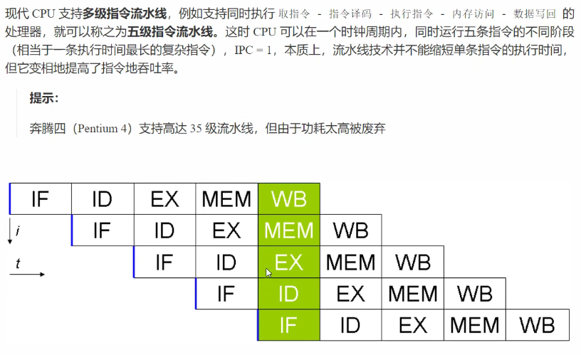

<h2 align='center'> Java内存模型——JMM</h2>

<p>JMM 即 Java Memory Model，它定义了主存、工作内存抽象概念，底层对应着 CPU 寄存器、缓存、硬件内存、CPU 指令优化等。</p>

<p>JMM 体现在以下几个方面</p>

* 原子性 - 保证指令不会受到线程上下文切换的影响
* 可见性 - 保证指令不会受 cpu 缓存的影响
* 有序性 - 保证指令不会受 cpu 指令并优化的影响


主存：所有线程都共享的数据，如：static

工作内存：每个内存都私有的数据


<h2 align='center'>synchronized 保证 可见性的原理</h2>

1、==synchronized 修饰的代码段中值，在释放锁的时候会将变量的值刷新回主内存，工作线程通过总线嗅探，当发现自己缓存的值发生变化时，会重新从主内存拉去变量的最新值==

2、==synchronized 会清空工作内存，代码块结束后将更改后的共享变量的值刷新到主内存中==

> <font color='black' face='楷体'><b>注意</b></font>
>
> <font face='楷体' color='black'>synchronized 语句块既可以保证代码块的原子性，也同时保证代码块内变量的可见性。但缺点是 synchronized 是属于重量级操作，性能相对更低。</font>
>
> <font face='楷体' color='black'>如果在前面实例的死循环中加入 System.out.println() 会发现即使不加 volatile 修饰符，线程 t 也能正确看到对 run 变量的修改。想一想为什么？</font>
>
> <font color='black' face='楷体'>==因为 System.out.prinln() 方法上有 synchronized 修饰符==</font>


<h2 align='center'>同步模式之 Balking</h2>

Balking（犹豫）模式用在一个线程发现另一个线程或本线程已经做了某一件相同的事，那么本线程就无需再做了，直接结束返回

例如：

```java
public class MonitorService {
    // 用来表示是否已经有线程正在执行启动了
    private volatile boolean starting;
    public void start() {
        log.info("尝试启动监视线程...");
        synchronized (this) {
            if (starting) {
                return;
            }
            starting = true;
        }
        // 真正启动监视线程...
    }
}
```


<h2 align='center'>volatile 保证 可见性、有序性</h2>

<h3 align='center'>有序性</h3>

JVM 会在不影响正确性的前提下，可以调整语句的执行顺序，思考下面的一段代码

```java
static int i;
static int j;

// 在某个线程内执行如下赋值操作
i = ...;
j = ...;
```

可以看到，至于先执行 i 还是 还执行 j，对最终的结果不会产生影响。所以，上面代码真正执行时，既可以是

```java
i = ...;
j = ...;
```

也可以是

```java
j = ...;
i = ...;
```

这种特性称之为【指令重排】，多线程下【指令重排】会影响正确性。为什么要有重排指令这项优化呢？从 CPU 执行指令的原理来理解一下吧！

<style type="text/css">
    font {
        color: black;
        font-family: 楷体;
    }
</style>

> <font face='楷体' color='red'>事实上，现代处理器会设计为一个时间周期完成一条执行时间最长的CPU指令。为什么这么呢？可以想到指令还可以再划分成一个个更小的阶段，例如，每条指令都可以划分为： </font><font color='green' face='楷体'>取指令 - 指令译码 - 执行指令 - 内存访问 - 数据写回</font><font color='red' face='楷体'>这5个阶段</font>
>
> <font color='black' face='楷体'>**术语参考**</font>
>
> - instruction fetch (IF)
> - instruction decode (ID)
> - execute (EX)
> - memory access (MEM)
> - register write back (WB)

<h3 align='center'>支持流水线的处理器</h3>



<h3 align='center'>指令重排序优化</h3>

在不改变程序结果的前提下，这些指令的各个阶段可以通过**重排序**和**组合**来实现**指令级并行**，这一技术在 80's 中叶到 90's 中叶占据了计算机架构的重要地位。

> 提示：
>
> 分阶段，分工是提升效率的关键！

指令重排的前提是，重排指令不能影响结果，例如

```java
// 可以重排的例子
int a = 10; // 指令1
int b = 20; // 指令2
System.out.println( a + b );

// 不能重排的例子
int a = 10; // 指令1
int b = a -5; // 指令2
```

