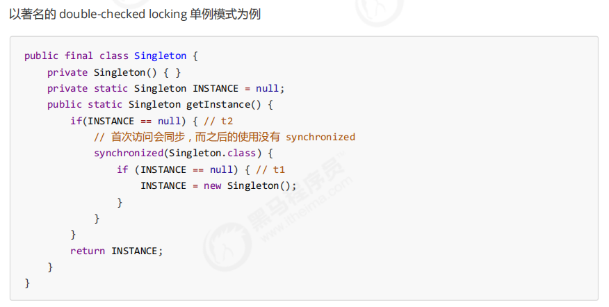
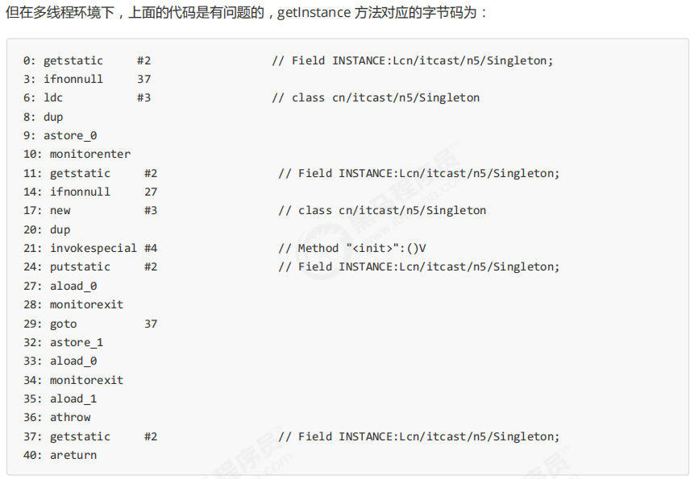
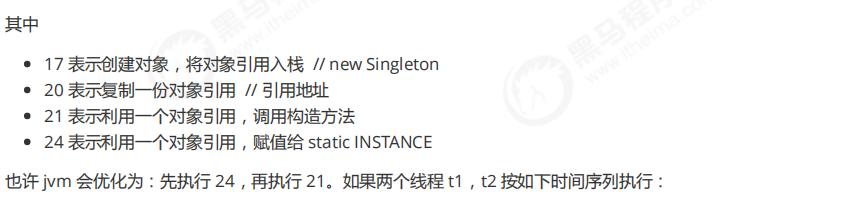
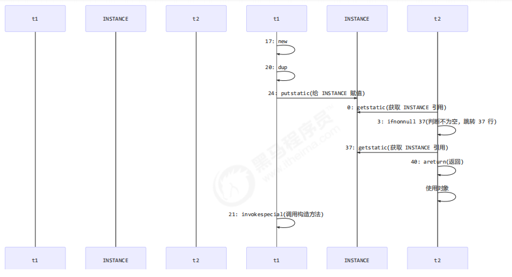

#                              volatile 原理

volatile 的底层实现原理是内存屏障，Memory Barrier（Memory Fence）

- 对 volatile 变量的写指令后会加入写屏障
- 对 volatile 变量的读操作前会加入读屏障


##                                     1、如何保证可见性

- 写屏障（sfence）保证在该屏障之前的，对共享变量的改动，都同步到主存当中

- ```java
  public void actor2(I_Result r) {
      num = 2;
      ready = true; // ready 是 volatile 赋值带写屏障
      // 写屏障
  }
  ```

- 而读屏障（lfence）保证在该屏障之后，对共享变量的读取，加载的是主存中最新数据

- ```java
  public void actor1(I_Result r) {
      // 读屏障
      // ready 是 volatile 读取值带读屏障
      if(ready) {
          r.r1 = num + num;
      } else {
          r.r1 = 1;
      }
  }
  ```

> 防止指令重排：
>
> 写屏障，防止写屏障之前的代码出现在写屏障后面
>
> 读屏障，防止读屏障之后的代码出现在读屏障前面

##                      2、double-checked locking 问题

==临界区内部还会做指令重排，临界区只保证临界区执行前后的指令不会重排==

> synchronized 代码块中这些指令，仍然是可以重排序的，synchronized 不能阻止重排序
>
> volatile 是可以阻止重排序
>
> 如果 这个共享变量 完全交由synchronized来管理，是不会有有序性问题的









[详细见(ctrl+click)](./并发编程_原理.pdf)

