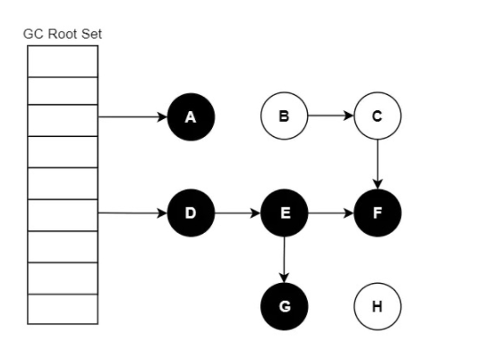
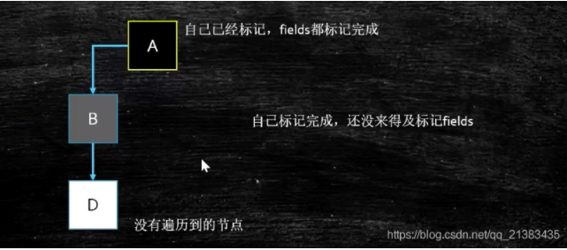
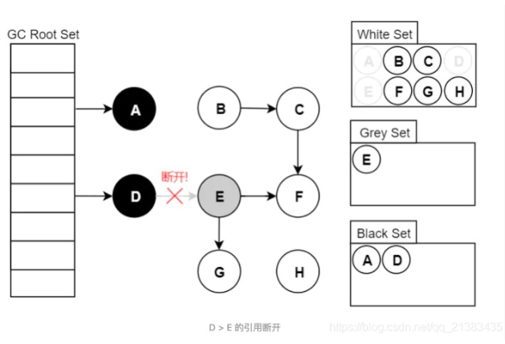
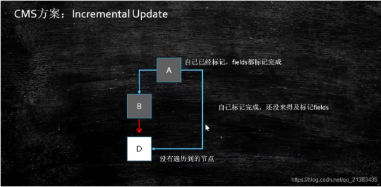
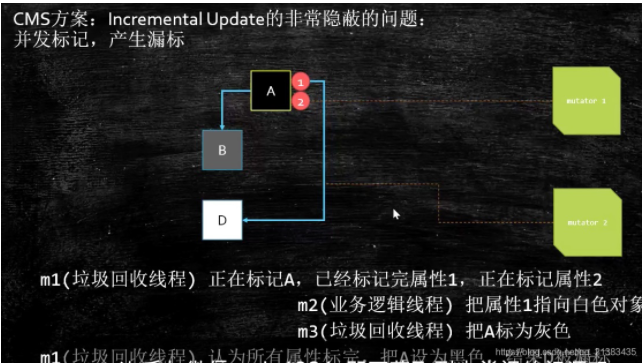
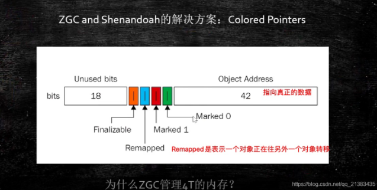

#                        三色标记法与读写屏障

##                                              1. 概述

首先：<font color='red'>CMS 和 G1 都使用了三色标记</font>

关于垃圾回收算法，基本就是那么几种：`标记-清除`、`标记-复制`、`标记-整理`。在此基础上可以增加分代（`新生代`/`老年代`），每代采取不同的回收算法，以提高整体的分配和回收效率。

无论使用哪种算法，标记总是必要的一步。这是理所当然，你不先找到垃圾，怎么进行回收？

垃圾回收器的工作流程大体如下：<span style='background:pink;color:red'>能标记的都是可用的，未标记的都是垃圾</span>。

标记出哪些对象是存活的，哪些是垃圾（可回收）

进行回收（清除/复制/整理），如果有移动过对象（复制/整理），还需要更新引用

本文着重来看下标记的部分

###                                   1.1 什么是 GC Roots

> <p style='font-family: 楷体;color:red'>虚拟机栈（栈帧中的本地变量表）中引用的对象</p>
>
> <p style='font-family: 楷体;color:red'>方法区（方法区的常量池）中类静态属性引用的对象</p>
>
> <p style='font-family: 楷体;color:red'>方法区中常量引用的对象</p>
>
> <p style='font-family: 楷体;color:red'>本地方法栈中JNL（即一般说的native方法）中引用的对象</p>

##                                          2. 三色标记法

###                                                   2.1 基本算法

要找出存活对象，根据可达性分析，从<font color='red'>GC Roots</font>开始进行遍历访问，可达的则为存活对象：



我们把遍历对象图过程中遇到的对象，按“是否访问过”这个条件标记成以下三种颜色：



- <font color='red'>白色：</font>尚未访问过
- <font color='red'>黑色：</font>`本对象已访问过，而且本对象引用到的其他对象 也全部访问了。（自己标记完了，自己的孩子（包括多个孩子）也标记完了，都不是垃圾）`
- <font color='red'>灰色：</font>本对象已访问过，但是 **本对象引用到的其他对象** 尚未全部访问完。全部访问后，会转换为黑色。（自己标记完了，自己的孩子（包括多个孩子）没有标记）


假设现在有白、灰、黑三个集合（表示当前对象的颜色），其遍历访问过程为：

1. 初始时，所有对象都在【白色集合】中

2. 将GC Roots直接引用到的对象 挪到 【灰色集合】中

3. 从灰色集合中获取对象：

   3.1. 将本对象引用到的其他对象 全部挪到 【灰色集合】中

   3.2. 将本对象 挪到【黑色集合】里面

4. 重复步骤3，直至 【灰色集合】为空时结束==（表明最后只剩下白和黑，其中白色为垃圾）==

5. 结束后，仍在【白色集合】的对象即为 GC Roots 不可达，可以进行回收

> 注：如果标记结束后对象仍为白色，意味着已经“找不到”该对象在哪了，不可能会再被重新引用。

当`Stop The World`（以下简称STW）时，`对象间的引用是不会发生变化的`，可以轻松完成标记。而当需要支持`并发标记`时，即`标记期间应用程序还在继续跑`，对象间的引用可能发生变化，`多标`和`漏标记`的情况就有可能发生。

###                                               2.2 多标记-浮动垃圾

#### 2.2.1 情况一

假设已经遍历到E（变为灰色了），此时应用执行了 <span style="background:pink;color:red">objD.fieldE = null</span>（即，E应该被回收掉，可是此时它已经由白色变灰了）



<font color='green'>此刻之后，对象E/F/G是“应该”被回收的。然而因为E已经变为灰色了，其仍会被当做存活对象继续遍历下去。最终的结果是：这部分对象仍然会被标记为存活，即本轮GC不会回收这部分内存。</font>

<font color='red'>这部分本应该回收，但是没有回收到的内存，被称之为“浮动垃圾”。</font>需注意：==浮动垃圾并不会影响到垃圾回收的正确性，只是需要等到下一轮垃圾回收中才被清除。==

#### 2.2.2 情况二

另外，针对并发标记开始后的新对象，通常的做法是直接全部当成黑色，本轮不会进行清除。这部分对象期间可能会变为垃圾，这也算浮动垃圾的一部分。

###                                                   2.3 漏标-读写屏障

假设GC线程已经遍历到了E（变为灰色了），此时应用线程先执行了：

```java
var G = objE.fieldG;
objE.fieldG = null; // 灰色E 断开引用 白色G
objD.fieldG = G; // 黑色D 引用 白色G
```


此时切回GC线程继续跑，因为<span style='background:pink;color:red'>E已经没有对G的引用了，所以不会将G放到灰色集合</span>；尽管因为D重新引用了G，但因为<span style='background:pink;color:red'>D已经是黑色了</span>，不会再重新做遍历处理。

最终导致的结果是：G会一直停留在白色集合中，最后被当做垃圾进行清除。这种情况<span style='background:pink;color:red'>直接影响到了应用程序的正确性，是不可接受的</span>。

不难分析，漏标只有同时满足以下两个条件时才会发生：

> 1. 条件一：灰色对象断开了白色对象的引用；即灰色对象原来成员变量的应用发生了变化
> 2. 条件二：黑色对象重新引用了该白色对象；即黑色对象成员变量增加了新的引用。

从代码的角度看：

```java
var G = objE.fieldG; // 1.读
objE.fieldG = null;  // 2.写
objD.fieldG = G;     // 3.写
```

1. 读取对象E的成员变量fieldG的引用值，即对象G
2. 对象E往其成员变量fieldG，写入null值
3. 对象D往其成员变量fieldG，写入对象G

我们只要在上面这三步中的任意一步中做一些“手脚”，将对象G记录起来，然后作为灰色对象再进行遍历即可。比如放到一个特定的集合，等初始的GC Roots遍历完（并发标记），再对该集合的对象遍历即可（重新标记）。

> 重新标记是需要STW的，因为应用程序一直在跑的话，该集合可能会一直增加新的对象，导致永远都跑不完。当然，并发标记期间也可以将该集合中的大部分先跑了，从而缩短了重新标记STW的时间，这是个优化问题了。

`写屏障用于拦截第二和第三步；而读屏障则是拦截第一步`

`他们的拦截的目的很简单：就是在读写前后，将对象G给记录下来`

####                                                           2.3.1 CMS方案



这里比如开始B指向D，但是因为后来B不指向D了，由A指向D了，最简单的方法是将A变成灰色，等待下次进行再次遍历。

####                                                           2.3.2 ABA问题



> 例子：
>
> 你女朋友和你分手了，然后又找了一个男朋友，然后又分手了，最后又和好了，而你朋友一直以为都是一个男朋友，就是你

所以CMS，remark阶段，要重新扫描一遍

##                                 3. 写屏障（Store Barrier）

给某个对象的成员变量赋值时，其底层代码大概长这样：

```java
/**
 * @param field 某对象的成员变量，如 D.fieldG
 * @param new_value 新值，如 null
 */
void opp_field_store(oop* field, oop new_value) {
    *field = new_value; // 赋值操作
}
```

`所谓的写屏障，其实就是指在赋值操作前后，加入一些操作（可以参考AOP的概念）`：

```java
void oop_field_store(oop* field, oop new_value) {  
    pre_write_barrier(field); // 写屏障-写前操作
    *field = new_value; 
    post_write_barrier(field, value);  // 写屏障-写后操作
}
```

#### （1）写屏障 + SATB

当对象E的成员变量的引用发生变化时（objE.fieldG = null），我们可以利用写屏障，将E原来成员变量的引用对象G记录下来：

```java
void pre_write_barrier(oop* field) {
    oop old_value = *field; // 获取旧值
    remark_set.add(old_value); // 记录 原来的引用对象
}
```

`【当原来成员的引用发生变化之前，记录下原来的引用对象】`

这种做法的思路是：尝试保留开始时的对象图，即原始快照（Snapshot At The Begining，SATB），当某个时刻的GC Roots确定后，当时的对象图已经确定了。

比如当时D是引用这G的，那后续的标记也应该是按照这个时刻的对象图走（D引用着G）。如果期间发生变化，则可以记录下来，保证标记依然按照原本的视图来。

值得一提的是，**扫描所有GC Roots这个操作（即初始标记）通常是需要STW的，否则有可能永远都扫描不玩，因为并发期间可能增加新的GC Roots。**

`SATB破快了条件一：【灰色对象断开了白色对象的引用】，从而保证了不会漏标。`

一点小优化：如果不是处于垃圾回收的并发标记阶段，或者已经被标记过了，其实是没有必要再记录了，所以可以加个简单的判断：

> 处于GC并发标记阶段，才会要去对“读写屏障”
>
> $gc_phase ` GC_CONCURRENT_MARK 去判断是否正在GC 并发标记
>
> 如果是正常的线程，则不需要执行该代码
>
> 否则，则需要记录

```java
void pre_write_barrier(oop* field) {
  // 处于GC并发标记阶段 且 该对象没有被标记（访问）过
  if($gc_phase ` GC_CONCURRENT_MARK && !isMarkd(field)) { 
      oop old_value = *field; // 获取旧值
      remark_set.add(old_value); // 记录  原来的引用对象
  }
}
```

#### （2）写屏障 + 增量更新

当对象D的成员变量的引用发生变化时（objD.fieldG = G），我们可以利用写屏障，将D新的成员变量引用对象G记录下来：

```java
void post_write_barrier(oop* field, oop new_value) {  
  if($gc_phase ` GC_CONCURRENT_MARK && !isMarkd(field)) {
      remark_set.add(new_value); // 记录新引用的对象
  }
}
```

`【当有新引用插进来时，记录下新的引用对象】`

这种做法的思路是：不要求保留原始快照，而是针对新增的引用，将其记录下来等待遍历，即增量更新（Incremental Update）。

增量更新破坏了条件二：【黑色对象重新引用了该白色对象】，从而保证了不会漏标。

##                                4. 读屏障（Loader Barrier）



Remapped是对象在移动，所以这里要读的时候，先等待对象转移完成。

```java
oop oop_field_load(oop* field) {
    pre_load_barrier(field); // 读屏障-读取前操作
    return *field;
}
```

读屏障是直接针对第一步：var G = objE.field.G，当读取成员变量时，一律记录下来：

```java
void pre_load_barrier(oop* field, oop old_value) {  
  if($gc_phase ` GC_CONCURRENT_MARK && !isMarkd(field)) {
      oop old_value = *field;
      remark_set.add(old_value); // 记录读取到的对象
  }
}
```

这种做法是保守的，但也是安全的。因为条件二中【黑色对象重新引用了该白色对象】，重新引用的前提是：获得到白色对象，此时读屏障就发挥作用了。

##                      5、三色标记法与线代垃圾回收器

线代追踪式（可达性分析）的垃圾回收器几乎都借鉴了三色标记的算法思想，尽管实现的方式不尽相同；比如白色/黑色集合一般都不会出现（但是有其他体现颜色的地方）、灰色集合可以通过栈/队列/缓存日志等方式进行实现，遍历方式可以是广度/深度遍历等等。

对于读写屏障，以 Java HopSopt VM 为例，其并发标记时对漏标的处理方案如下：

> CMS：写屏障 + 增量更新
>
> G1：写屏障 + SATB
>
> ZGC：读屏障

工程实现中，读写屏障还有其他功能，比如写屏障可以用于记录跨代/区引用的变化，读屏障可以用于移动对象的并发执行等。功能之外，还有性能的考虑，所以对于选择哪种，每款垃圾回收器都有自己的想法。

值得注意的是，CMS中使用的增量更新，在重新标记阶段，除了需要遍历写屏障的记录，还需要重新扫描GC Roots（当然标记过的无需再遍历了），这是由于CMS对于astore_x等指令不添加写屏障的原理。

