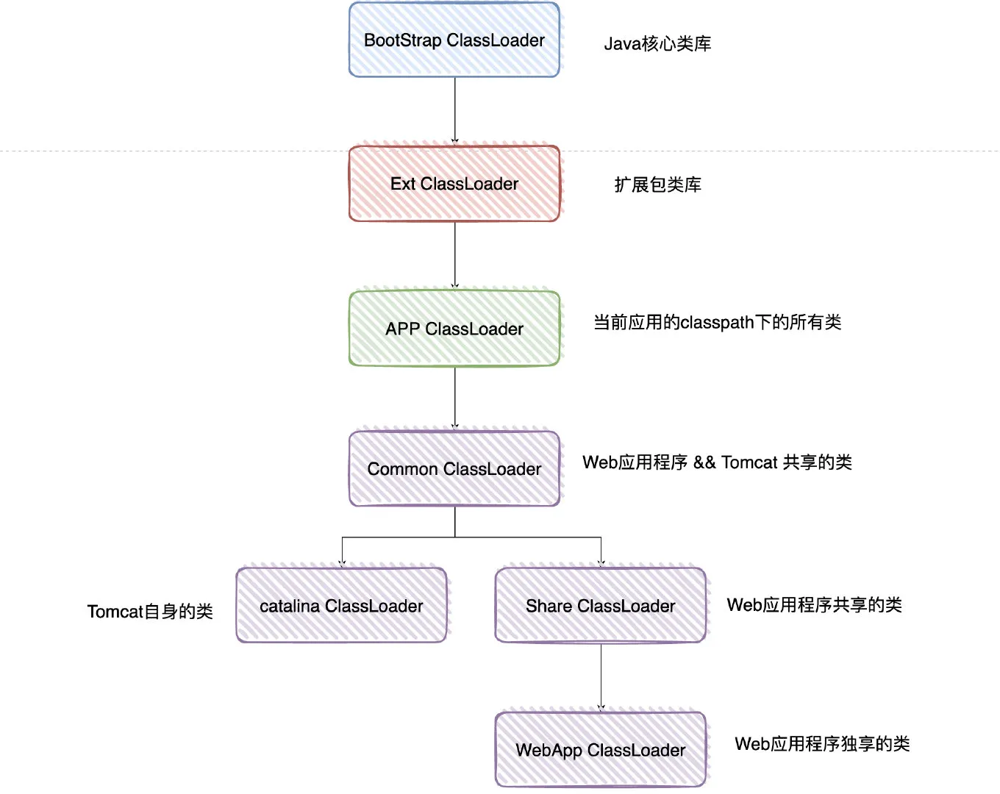

# 双亲委派机制，以及为什么要打破双亲委派机制

## 双亲委派的作用

1. 防止加载同一个.class。通过委托询问上级是否加载过该.class，如果加载过了，则不需要重新加载，保证了数据安全
2. 保证核心.class不被篡改。通过委托的方式，保证核心.class不被篡改，即使被篡改了也不会加载，即使被加载了也不会是同一个class对象，因为不同的加载器加载同一个.class也不是同一个Class对象，这样保证了Class的执行安全

## 如何打破双亲委派

> 典型的打破双亲委派模型的框架和中间件就有tomcat和osgi

双亲委派机制是可以打破的

如果我们有一个类想要通过自定义的类加载器来加载这个类，而不是通过系统默认的类加载器，说白了就是不走双亲委派那一套，而是走自定义的类加载器

我们知道**双亲委派的机制是==ClassLoader的loadClass方法实现的==，打破双亲委派，其实就是重写这个方法，用我们自己的方式来实现即可**

如果不想打破双亲委派机制，就重写ClassLoader类中的findCLass()方法即可，无法被父类加载器加载的类最终会通过这个方法被加载。

## 为什么Tomcat要打破双亲委派

Tomcat的应用场景：一个Tomcat可以运行多个Web应用程序

若此时，我现在有两个Web程序，它们都有一个类，叫做User，并且它们的全限定名都一样，比如com.yy.User，但是它们的具体实现是不一样的。

所以Tomcat为了保证两个Web程序不起冲突，则需要为每一个Web应用创建一个类加载器实例（WebAppClassLoader），该加载器重写了loadClass方法，优先加载当前应用目录下的类，从而实现了Web应用层级别的隔离

