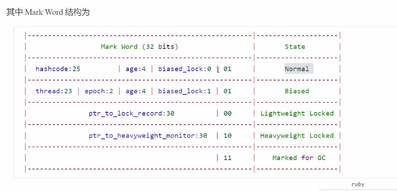

# 并发编程

## 1、进程与线程

### 进程

* 进程由指令和数据组成，但这些指令要运行，数据要读写，就必须将指令加载至CPU，数据加载至内存。在指令运行中还需要用到磁盘、网络等设备。进程就是用来加载指令、管理内存、管理IO的。
* 当一个程序被运行，从磁盘加载这个程序的代码至内存，这时就开启了一个进程。
* 进程就可以视为程序的一个实例。大部分程序可以同时运行多个实例进程（例如记事本、画图、浏览器等），也有的程序只能启动一个实例进程（例如网易云音乐、360安全卫士等）。


### 线程

* 一个进程之内可以分为一到多个线程。
* 一个线程就是一个指令流，将指令流中的一条条指令以一定的顺序交给CPU执行。
* Java中，线程作为最小调度单位，进程作为资源分配的最小单位。在windows中进程是不活动的，只是作为线程的容器。


### 应用

#### 异步

从方法调用的角度来讲，如果

* 需要等待结果返回，才能继续运行就是同步
* 不需要等待结果返回，就能继续运行就是异步

注意：同步在多线程中还有另外一层意思，是让多个线程步调一致

1）设计

多线程可以让方法执行变为异步的（即需要巴巴干等着）比如说读取磁盘文件时，假设读取操作花费了5秒钟，如果没有线程调度机制，这5秒调用者什么都做不了，其代码都得暂停...

2）结论

* 比如在项目中，视频文件需要转换格式等操作比较费时，这时开一个新线程处理视频转换，避免阻塞主线程
* tomcat的异步servlet也是类似的目的，让用户线程处理耗时较长的操作，避免阻塞tomcat的工作线程
* ui程序中，开线程进行其他操作，避免阻塞ui线程


## 2、两阶段终止模式


```java
interrupted()	判断当前线程是否被打断	会清除打断标记
isInterrupted() 判断是否被打断	不会清除打断标记
```

```java
@Slf4j(topic = "c.TwoPhaseTermination")
class TwoPhaseTermination {
    private Thread monitor;
    // 启动监控线程
    public void start() {
    	monitor = new Thread(() -> {
            while(true) {
                Thread current = Thread.currentThread();
                if(current.isInterrupted()) {
                    log.debug("料理后事");
                    break;
                }
                try {
                    Thread.sleep(1000);	// 情况1，这时interrupt的话，标记会被吞掉
                    log.debug("执行监控"); // 情况2，这时interrupt的话，标记为true
                } catch(InterruptedException e) {
                    e.printStackTrace();
                    // 重新设置打断标记
                    current.interrupt();
                }
            }
        });
        monitor.start();
    }
    // 停止监控线程
    public void stop() {
        monitor.interrupt();
    }
}
```


## 3、垃圾回收器就是一种守护线程

## 4、五种状态（操作系统）、六种状态（JVM）

* 【初始状态】仅是在语言层面创建了线程对象，还未与操作系统线程关联
* 【可运行状态】指该线程已经被创建（与操作系统线程关联），可以由CPU调度执行
* 【运行状态】指获取了CPU时间片运行中的状态
* ...


- NEW
- RUNNABLE（运行状态、可运行状态、阻塞状态(阻塞IO时，不占用CPU时间片)）
- BLOCKED
- WAITING
- TIMED_WAITING（有时间的等待）
- TERMINATED（终结）

## 5、Lock Record（栈上显式或隐式分配）对Java不可见

https://www.cnblogs.com/deltadeblog/p/9559035.html

LockRecord用于**轻量级锁优化**，当解释器执行monitorenter字节码轻度锁住一个对象时，就会在获取锁的线程的栈上显式或隐式分配一个LockRecord。这个LockRecord存储**锁对象markword的拷贝**（Displaced Mark Word），在拷贝完成后，首先挂起持有偏向锁的线程，因为要进行尝试修改锁记录指针，MarkWord会有变化，所有线程会利用CAS（乐观锁）尝试将MarkWord的锁记录指针改为指向自己（线程）的所记录，然后LockRecord的owner指向对象的markword，修改成功的线程将获得轻量级锁。失败则线程升级为重量级锁。释放时会检查markword中的LockRecord指针是否指向自己（获取锁的线程LockRecord），使用原子的CAS将Displaced Mark Word替换回对象头，如果成功，则表示没有竞争发生，如果替换失败则升级为重量级锁。整个过程中，LockRecord是一个线程内独享的存储，每一个线程都有一个可用的Minitor Record列表。



### 1）轻量级锁


#### 	锁重入


#### 锁对象的MarkWord置为当前线程的LockRecord是轻量级锁，置为该锁对象关联的Monitor的地址为重量级锁


### 2）锁膨胀


### 3）自旋优化 即多请求几次锁，在这段时间内，拿到锁，则可以避免一次上下文切换


### 4）批量重偏向 阈值一般为20

#### 对象的hashcode()是懒加载的

所以一开始的对象头里的 hashcode 为空，锁记录是001

jdk6是默认打开偏向锁，但是偏向锁有延迟加载的特性，故运行一段时间后，对象头的锁记录信息为101

```java
private static void test3() throws InterruptedException {
    Vector<Dog> list = new Vector<>();
    Thread t1 = new Thread(() -> {
        for(int i = 0; i < 30; i++) {
            Dog d = new Dog();
            list.add(d);
            synchronized (d) {
                log.debug(i + "\t" + ClassLayout.parseInstance(d).toPrintableSimple(true));
            }
        }
        synchronized (list) {
            list.notify();
        }
    }, "t1");
    t1.start();
    
    Thread t2 = new Thread(() -> {
        synchronized (list) {
            list.wait();
        }
        for(int i = 0; i < 30; i++) {
            Dog d = new Dog();
            list.add(d);
            synchronized (d) {
                log.debug(i + "\t" + ClassLayout.parseInstance(d).toPrintableSimple(true));
            }
        }
    }, "t2");
    t2.start();
}
class Dog{}
```

阈值20以前的锁，还是撤销偏向锁，升级为轻量级锁。即最后为001

20以后的锁对象，则被批量重偏向t2线程了


对于偏向锁来说，

对象调用hashcode()会撤销偏向锁，因为偏向锁的对象头的信息用来保存线程id了，没有多余的空位来存放hashcode

而对于轻量级锁来说，

（多个线程 执行 **同步代码块** 是错开的）它的hashcode信息被保存在了该线程的LockRecord中

对于重量级锁来说，

其对象的对象头的信息，则被保存在monitor中

这就是为什么可以直接访问hashcode()的原因


### 5）批量撤销

当撤销偏向锁阈值超过40次后，jvm会这样觉得，自己确实偏向错了，根本就不该偏向。于是整个类的所有对象都会变为不可偏向的，新建的对象也是不可偏向的。


### 6）锁粗化

多次循环进入同步块不如同步块内多次循环

另外JVM可能会做如下优化，把多次append的加锁粗化为一次（因为都是对同一个对象加锁，没必要重入多次）

```java
new StringBuffer().append("a").append("b").append("c");
```

### 7）锁消除 同步消除 java -XX:-EliminateLocks

JVM 会进行代码的逃逸分析，例如某个加锁对象是方法内局部变量，不会被其他线程锁访问到，这时候机会被即时编译器忽略掉所有同步操作。

```java
@Fork(1)
@BenchmarkMode(Mode.AverageTime)
@Warmup(iterations=3)
@Measurement(iterations=5)
@OutputTImeUnit(TimeUnit.NANOSECONDS)
public class MyBenchmark {
    static int x = 0;
    @Benchmark
    public void a() throws Excepiton {
        x++;
    }
    @Benchmark
    public void b() throws Exception {
        Object o = new Object();
        // 这段代码被反复执行后，被JIT 即使编译器，认为是热点代码，进行优化（逃逸分析），发现这个 o 对象，并没有逃出这个方法的作用范围（不可能被共享），故它最后不会被加锁。
        synchronized (o) {
            x++;
        }
    }
}
```


## 6、wait/notify API 介绍 存在虚假唤醒

* obj.wati() 让进入 object 监视器的线程到 waitSet 等待
* obj.notify() 在 object 上正在 waitSet 等待的线程中**挑一个唤醒**（随机）
* obj.notifyAll() 让 object 上正在 waitSet 等待的线程全部唤醒

```java
public final void wait() throws InterruptedException {
	wait(0); // 0 代表无限的等待下去
}
public final native void wait() throws InterruptedException;
```


### 虚假唤醒

对象的notify()方法，会随机唤醒一个处于waitSet的线程，故会导致错误唤醒，也叫虚假唤醒。

使用while循环判断唤醒条件，即可解决。


```java
synchronized(lock) {
    while(条件不成立) {
    	lock.wait();
	}
    // 干活
}
// 另一个线程
synchronized(lock) {
    lock.notifyAll();
}
```


## 7、sleep 和 wait 的区别

开始之前先看看

**sleep(long n) 和 wait(long n) 的区别**

1）sleep 是 Thread 方法，而 wait 是 Object 方法

2）sleep 不需要强制和 synchronized 配合使用，但 wait 需要和 synchronized 一起用

3）sleep 在睡眠的同时，不会释放对象锁的，但 wait 在等待的时候会释放对象锁。

4）它们状态都是 TIMED_WAITING（是有参数的wait()方法）


## 8、设计模式——同步模式之保护性暂停

即 Guarded Suspension，用在一个线程等待另一个线程的执行结果

要点


```java
/*
 * 产生结果和消费结果的线程一一对应
 */
class GuardedObject {
    // 结果
    private Object response;
    
    // 获取结果
    public Object get() {
        synchronized(this) {
            // 没有结果
            while(response == null) {
				try {
                    this.wait();
                } catch(InterruptedException e) {
					e.printStackTrace();
                }
            }
        }
        return response;
    }
    public void complete(Object object) {
        synchronized(this) {
            // 给结果成员变量赋值
            this.response = response;
            this.notifyAll();
        }
    }
}
```


### join底层就是使用了保护性暂停的机制

并且join()本身就是一个synchronized方法


## 9、异步模式之生产者/消费者

要点

* 与前面的保护性暂停中的 GuardObject 不同，不需要产生结果和消费结果的线程一一对应
* 消费队列可以用来平衡生产和消费的线程资源
* 生产者仅负责产生结果数据，不关心数据该如何处理，而消费者专心处理结果数据
* 消息队列是有容量限制的，满时不会再加入数据，空时不会再消耗数据
* JDK 中各种**阻塞**队列，采用的就是这种模式


```java
// 消息队列，java线程之间通信
class MessageQueue {
    // 双向队列：消息队列的集合
    private LinkedList<Messge> list = new LinkedList<>();
    // 队列容量
    private int capcity;
    
    private MessageQueue(int capcity) {
        this.capcity = capcity;
    }
    
    // 获取消息
    public Message take() {
        // 检查队列是否为空
        synchronized (list) {
            whlie(list.isEmpty()) {
            	try {
                    list.wait();
                } catch (InterruptedException e) {
                    e.printStackTrace();
                }
        	}
            // 从队列的头部获取消息并返回
            Message message = list.removeFirst();
            list.notifyAll();
            return message;
        }
    }
    // 存入消息
    public void put(Message message) {
        synchronized (list) {
            while(list.size() == capcity) {
                try {
                    list.wait();
                } catch(InterruptedException e) {
                    e.printStackTrace();
                }
            }
            // 将消息加入队列尾部
            list.addLast(message);
            list.notifyAll();
        }
    }
}
final class Message {
    private int id;
    public Object value;
    public Message(int id, Object value) {
        this.id = id;
        this.message = message;
    }
    public int getId() {
        return id;
    }
    public Object getValue() {
        return value;
    }
    @Override
    public String toString() {
        return "Message{" +
            	"id=" + id +
            	", value=" + value +
            	'}';
    }
}
```


## 10、Park & Unpark（LockSupport类的方法）

**基本使用**

它们是 LockSupport 类中的方法

```java
// 暂停当前线程
LockSupport.park();

// 恢复某个线程的运行
LockSupport.unpark(暂停线程对象);
```

先park再unpark

```java
Thread t1 = new Thread(() -> {
    log.debug("start...");
    sleep(1);
    log.debug("park...");
    LockSupport.park(); // 把调用者这个线程暂停
    log.debug("resume...");
}, "t1");
t1.start();

sleep(2);// 睡2s
LockSupport.unpark(t1);
```

注意：

<span style='color:red'>unpark可以在park之后调用，也可以在park之前调用</span>

特点:

<ul>
<li>wait,notify 和 notifyAll 必须配合 Object Monitor 一起使用，而 unpark不必</li>
<li>park & unpark 是以线程为单位来【阻塞】和【唤醒】线程，而notify只能随机唤醒一个等待线程，notifyAll是唤醒所有等待线程，就不那么【精确】</li>
<li>park & unpark 可以先 unpark，而wait & notify 不能先 notify</li>
</ul>


### <span>* 原理之park & unpark</span>

<span style='color:red'>每一个对象都对应着一个Monitor对象。每一个线程都有自己的一个Parker对象（底层是用C++实现的），由三部分组成\_counter，\_cond 和 \_mutex</span>

- 线程就想一个旅人，Parker就是他随身携带的背包，\_cond(conditional)条件变量就好比背包中的帐篷。_counter 就好比背包中的备用干粮（0为耗尽，1为充足）
- 调用park就是要看需不需要停下来休息
  - 如果备用干粮耗尽，那么钻进帐篷歇息
  - 如果备用干粮充足，那么不需要停留，继续前进
- 调用unpark，就好比干粮充足
  - 如果这时线程还在帐篷，就唤醒让他继续前进
  - 如果这时线程还在运行，那么下次他调用park时，仅是消耗备用干粮，不需停留继续前进
    - 因为背包空间有限，多次调用unpark仅会补充一份备用干粮


<div align="center">
    park
</div>


1. 当前线程调用 Unsafe.park() 方法
2. 检查\_counter，本情况为0，这是，获得\_mutex互斥锁
3. 线程进入\_cond条件变量阻塞
4. 设置\_counter=0

<div align="center">先调用park，再调用unpark</div>


1. 调用Unsafe.unpark(Thread_0)方法，设置\_counter为1
2. 唤醒\_cond条件变量中的Thread_0
3. Thread_0恢复运行
4. 设置\_counter为0

<div align="center">先调用unpark，再调用park（_counter的初始值为0）</div>


1. 调用Unsafe.unpark(Thread_0)，设置_counter为1
2. 当前线程调用Unsafe.park()方法
3. 检查_counter，本情况为1，这时线程无需阻塞，继续运行
4. 设置_counter为0


## 11、重新理解线程状态装换


- NEW：初始状态。还只是创建了一个Java线程对象，还没有与操作系统的线程相关联起来
- RUNNABLE

  - 运行状态：已经获得了CPU时间片，正在被CPU执行的状态

  - 阻塞状态：调用了与操作系统一些跟阻塞API，它会陷入阻塞，但是在Java层面看不出来

  - 可运行状态
- BOLCKED：没办法获得锁，进入EntryList
- WAITING：进去WaitSet，等待队列

  - **t线程**用synchronized(obj)获取了对象锁后
    - 调用obj.wait()，t1从 RUNNABLE-->WAITING
    - 调用obj.notify()，obj.notifyAll()，t.interrupt() 时，叫醒之后进入EntryList（调度队列）
      - 竞争锁成功，**t线程**从WAITING-->RUNNABLE
      - 竞争锁失败，**t线程**从WAITING-->BLOCKED
- TIMED_WAITING
- TERMINATED


## 12、活跃性

### 死锁 无法运行

有这样的情况：一个线程需要同时获取多把锁，这时就容易发生死锁

t1 线程 获得 A对象锁，接下来想获取 B对象锁

t2 线程 获得 B对象锁，接下来想获取 A对象锁

#### 定位死锁

- 检测死锁可以使用jconsole工具，或者使用jps定位进程id，再用jstack定位死锁
  1. 先用jps查询进程id
  2. 再用jstack 进程id 查看详细信息

### 哲学家就餐问题


```java
public class TestDeadLock {
    public static void main(String[] args) {
        Chopstic c1 = new Chopstic("1");
        Chopstic c2 = new Chopstic("2");
        Chopstic c3 = new Chopstic("3");
        Chopstic c4 = new Chopstic("4");
        Chopstic c5 = new Chopstic("5");
        new Philosopher("苏格拉底", c1, c2).start();
        new Philosopher("柏拉图", c2, c3).start();
        new Philosopher("亚里士多德", c3, c4).start();
        new Philosopher("赫拉克利特", c4, c5).start();
        new Philosopher("阿基米德", c5, c1).start();
    }
}
// 筷子类
class Chopstic {
	String name;
    public Chopstic(String name) {this.name=name;}
    @Overried
    public String toString() {return "筷子{"+ name +"}";}
}
// 哲学家类
class Philosopher extend Thread {
    Chopstic left;
    Chopstic right;
    
    public Philosopher(String name, Chopstick left, Chopstick right) {
        super(name);
        this.left = left;
        this.right = right;
    }
    @Override
    public void run() {
        while(true) {
            // 尝试获得左手筷子
            synchronized (left) {
                // 尝试获得右手筷子
                synchronized (right) {
                    eat();
                }
            }
        }
    }
    
    private void eat() {
        System.out.println("eating...");
        try {
            sleep(1000);
        } catch(InterruptedException e) {
            e.printStackTrace();
        }
    }
}
```

### 活锁 可以没有锁 但线程却得不到结束

活锁出现在两个线程互相改变对方的结束条件，最后谁也无法结束。

```java
public class TestLiveLock {
    static volatile int count = 10;
    static final Object lock = new Object();
    public static void main(String[] args) {
        new Thread(() -> {
            // 期望减到 0 退出循环
            while (count > 0) {
                sleep(0.2);
                count--;
                System.out.println("count: "+count);
            }
        }, "t1").start();
        new Thread(() -> {
            // 期望超过 20 退出循环
            while (count < 20) {
                sleep(0.2);
                count++;
                System.out.println("count: "+count);
            }
        }, "t2").start();
    }
}
```

#### 如何避免活锁

让两个线程，交错开，就可以避免活锁。

即让某一个线程多sleep一点。

### 饥饿	

#### 顺序加锁 解决死锁问题


即使顺序加锁一定解决了死锁问题，但是同时也会**造成饥饿问题**。

#### 哲学家就餐问题 -> 饥饿

```java
// 顺序加锁
public class TestDeadLock {
    public static void main(String[] args) {
        Chopstic c1 = new Chopstic("1");
        Chopstic c2 = new Chopstic("2");
        Chopstic c3 = new Chopstic("3");
        Chopstic c4 = new Chopstic("4");
        Chopstic c5 = new Chopstic("5");
        new Philosopher("苏格拉底", c1, c2).start();
        new Philosopher("柏拉图", c2, c3).start();
        new Philosopher("亚里士多德", c3, c4).start();
        new Philosopher("赫拉克利特", c4, c5).start();
        new Philosopher("阿基米德", c1, c5).start(); // 破坏循环的顺序，改为依次的顺序
    }
}
```


## 13、ReentrantLock 可重入锁

JUC 并发包下

可以解决**死锁**和**饥饿**问题


相当于 synchronized 它具备如下特点

- 可中断
- 可以设置超时时间
- 可以设置为公平锁        先到先得，**防止饥饿的现象**
- 支持多个条件变量        相当于有多个EntrySet

与synchronized一样，都支持可重入

基本语法

```java
// 获取锁
reentrantlock.lock();	// 对象
try {
    // 临界区
} finally {
    // 释放锁
    reentrantlock.unlock();
}
```


### *可重入

可重入是指同一个线程如果首次获得了这把锁，那么因为它是这把锁的拥有者，因此有权利再次获取这把锁

如果是不可重入锁，那么第二次获得锁时，自己也会被锁挡住

```java
import java.util.concurrent.locks.ReentrantLock;
public class Test22 {
    private static ReentrantLock lock = new ReentrantLock();
    public static void main(String[] args) {
        
        lock.lock();
        try {
            System.out.println("main");
            m1();
        } finally {
            lock.unlock();
        }
    }
    public static void m1() {
        
        lock.lock();
        try {
            System.out.println("m1");
            m2();
        } finally {
            lock.unlock();
        }
    }
    public static void m2() {
        
        lock.lock();
        try {
            System.out.println("m2");
        } finally {
            lock.unlock();
        }
    }
}
```

### *可打断 （lockInterruptibly()，被动）被别的线程打断，就不等了，避免产生死锁

#### ReentrantLock 可打断锁和synchronized的区别

这里的获取可打断锁，最好使用两个try/catch/finally块，一个用来捕获异常，一个用来释放锁。

因为如果发生了异常，没有获得锁，那么释放锁就会发生异常。

```java
RenntrantLock lock = new ReentrantLock();
try {
    // 如果没有竞争，那么此方法就会获取 lock 对象锁
    // 如果有竞争就进入阻塞队列，可以被其他线程用 interrupt 方法打断
    lock.lockInterruptibly();// 获得可打断锁
} catch (InterruptedException e) {
    e.printStackTrance();
    return;	// 没有获得锁，所以不应该向下执行
    	// 在这里return是不会执行finally块中的内容的
    // 因为它们属于不同的try/catch/finally的内容
}
try {
    log.debug("获取到锁");
} finally {
    lock.unlock();
}
```

这里的lock.lockInterruptibly()可打断锁：

- 是指该对象在阻塞队列中（此时还未获得锁），被打断了，就不继续等待锁了（进入InterruptedException块中）。

- 可以打断阻塞队列中的线程

而synchronized锁：

- 是指该线程获得了synchronized对象锁之后，调用了wait方法（进入WaitSet队列），等待的时候，被别人打断进入（InterruptedException块中），此时对象是拿到锁了。也就是拿到了锁，才能被打断。


- 也就是说，如果这个时候有一个线程拿到了该线程所需要的锁对象，此时等待的线程也无法被打断。
- 只能打断onwer线程

```java
public class SleepAndWait {
    public static void main(String[] args) {
        Object o = new Object();
        Thread t1 = new Thread("t1") {
            @Override
            public void run() {
                synchronized (o) {
                    while (!isInterrupted()) {
                        try {
                            System.out.println("["+getName()+"] 等待");
                            o.wait();   // 无法被打断
                        } catch (InterruptedException e) {
                            System.out.println("["+getName()+"] 异常");
                            interrupt();
//                            Thread.interrupted();
                        }
                    }
                    System.out.println("["+getName()+"] 结束");
                }
            }
        };
        t1.start();

        new Thread("t2"){
            @Override
            public void run() {
                try {
                    sleep(1000);    // 睡1s
                } catch (InterruptedException e) {
                    e.printStackTrace();
                }
                synchronized (o) {
                    System.out.println("["+getName()+"] 拿到锁了");
                    while(true) {
                        // ...
                    }
                }
            }
        }.start();

        try {
            Thread.sleep(2000);
        } catch (InterruptedException e) {
            e.printStackTrace();
        }
        System.out.println("["+Thread.currentThread().getName()+"] interrupt t1");
        t1.interrupt();
//        synchronized (o) {
//            System.out.println("["+Thread.currentThread().getName()+"] notify t1");
//            o.notifyAll();
//        }
    }
}
```

### **锁超时 （tryLock()，主动）等待一定时间就不等待锁了

boolean tryLock() 方法：

- 尝试获得锁
  - 如果成功了，那么可以获得锁
  - 如果失败了，就可以不用进入阻塞队列等待，就走了

- 有返回值，true 获得锁，false 没有获得锁

立刻失败

```java
ReentrantLock lock = new ReentrantLock();
Thread t1 = new Thread(() -> {
    log.debug("启动...");
    if( !lock.tryLock()) { // lock.tryLock("超时时间","时间单位")
        log.debug("获取立刻失败，返回");
        return;
    }
    try {
        log.debug("获得了锁");
    } finally {
        lock.unlock();
    }
}, "t1");

lock.lock();
log.debug("获得了锁");
t1.start();
try {
    sleep(2);
} finally {
	lock.unlock();
}
```

<div>
&nbsp;|<br>
&nbsp;|<br>
\&nbsp;/<br>
</div>

有等待时间：

```java
Thread t1 = new Thread(() -> {
    log.debug("启动...");
    try {
        if( !lock.tryLock(/*timeout*/1, TimeUnit.SECONDS)) { // lock.tryLock("超时时间","时间单位")
            log.debug("获取立刻失败，返回");
            return;
        }
    } catch (InterruptedException e) {
        e.printStackTrace();
    }
    try {
        log.debug("获得了锁");
    } finally {
        lock.unlock();
    }
}, "t1");
```

#### 锁超时-解决哲学家就餐问题

```java
// 筷子类
class Chopstic extends ReentrantLock{ // !!!
	String name;
    public Chopstic(String name) {this.name=name;}
    @Overried
    public String toString() {return "筷子{"+ name +"}";}
}
```

```java
@Override
public void run() {
    while(true) {
        // 尝试获得左手筷子
        if(left.tryLock()) {
            try {
                // 尝试获得右手筷子
                if(right.tryLock()) {
                    try {
                        eat();
                    } finally {
                        right.unlock();
                    }
                }
            } finally {
                left.unlock();	// 释放自己手里的筷子
            }
        }
    }
}
```


### 公平锁 monitor锁属于不公平锁 缺点会降低并发度

#### <span style='color:red'>ReentarntLock默认是不公平的</span>

```java
public class ReentrantLock implements Lock, java.io.Serializable {
    private static final long serialVersionUID = 7373984872572414699L;
    private final Sync sync;
    public ReentrantLock() {
        sync = new NonfairSync();
    }

    /**
     * Creates an instance of {@code ReentrantLock} with the
     * given fairness policy.
     *
     * @param fair {@code true} if this lock should use a fair ordering policy
     */
    public ReentrantLock(boolean fair) { // fair公平性，true表示公平性
        						// 所谓公平性，就是保证将来争抢锁时，进入阻塞队列的顺序拿到锁
        sync = fair ? new FairSync() : new NonfairSync();
    }
```

公平锁一般没有必要，会降低并发度，后面分析原理时会讲解


### *条件变量 Condition waitQueue = lock.newCondition();

synchronized 中也有条件变量，就是我们将原理时那个 waitSet 休息室，当条件不满足时进入 waitSet 等待

ReentrantLock 的条件变量比 synchronized 强大之处在于，它是支持多个条件变量的，这就好比

- synchronized 是那些不满足条件的线程都在一间休息室等消息
- 而 ReentrantLock 支持多件休息室，有专门等烟的休息室、专门等早餐的休息室、唤醒时也是按休息室来唤醒

使用流程

- await 前需要获得锁
- await 执行后，会释放锁，进入 conditionObject 等待
- await 的线程被唤醒（或打断、或超时）去重新竞争 lock 锁
- 竞争 lock 锁成功后，从 await 后继续执行

```java
static ReentrantLock lock = new ReentrantLock();
public static void main(String[] args) {
    // 创建一个新的条件变量（休息室）
    Condition condition1 = lock.newCondition();
    Condition condition2 = lock.newCondition();
    
    lock.lock(); // 先获得锁，才能进入休息室（才能await)
    // 进入休息室等待
    /*try {
        condition1.await();
    } */
    
    condition1.signal();
}
```


## 14、同步模式之顺序控制

### 固定运行顺序

比如，必须先2后1打印

#### Wati notify版

```java
static final Object lock = new Object();
// 表示t2是否运行过
static boolean t2runned = false;
public static void main(String[] args) {
    Thread t1 = new Thread(() -> {
        synchronized(lock) {
            while(!t2runned) {
				try {
                    lock.wait();
                } catch(InterruptedException e) {
                    e.printStackTrace();
                }
            }
            System.out.println('1');
        }
    },"t1");
    Thread t2 = new Thread(() -> {
        synchronized(lock) {
            System.out.println('2');
            t2runned = true;
            lock.notify();
        }
    },"t2");
}
```

### 交替输出 abcabcabc

#### 等待标记 1,2,3 wait/notify方式

```java
package cn.itcast;

public class ABCThreeTimes {
    public static void main(String[] args) {
        WaitNotify wn = new WaitNotify(1,5);
        new Thread(()->{
            wn.print("a",1,2);
        }).start();
        new Thread(()->{
            wn.print("b",2,3);
        }).start();
        new Thread(()->{
            wn.print("c",3,1);
        }).start();
    }
}
/**
 * 输出内容     等待标记    下一个标记
 * a            1           2
 * b            2           3
 * c            3           1
 */
class WaitNotify {
    // 打印
    public void print(String str, int waitFlag, int nextFlag) {
        for (int i = 0; i < loopNumber; i++) {
            synchronized (this) {
                while(flag!=waitFlag) {
                    try {
                        this.wait();
                    } catch (InterruptedException e) {
                        e.printStackTrace();
                    }
                }
                System.out.print(str);
                flag = nextFlag;
                this.notifyAll();
            }
        }
    }

    // 等待标记
    private int flag; // 1
    // 循环次数
    private int loopNumber;

    public WaitNotify(int flag, int loopNumber) {
        this.flag = flag;
        this.loopNumber = loopNumber;
    }
}
```

#### ReentrantLock方式

```java
class AwaitSignal extends ReentrantLock {
    private int loopNumber;

    public AwaitSignal(int loopNumber) {
        this.loopNumber = loopNumber;
    }

    /**
     * @param str 打印内容
     * @param current 进入哪一间休息室
     * @param next 下一件休息室
     */
    public void print(String str, Condition current, Condition next) {
        for (int i = 0; i < loopNumber; i++) {
            lock();
            try {
                current.await();
                System.out.print(str);
                next.signal();
            } catch (InterruptedException e) {
                e.printStackTrace();
            } finally {
                unlock();
            }
        }
    }
}
```

```java
@Test
public void test_2() {
    AwaitSignal awaitSignal = new AwaitSignal(5);
    Condition a = awaitSignal.newCondition();
    Condition b = awaitSignal.newCondition();
    Condition c = awaitSignal.newCondition();

    new Thread(()->{
        awaitSignal.print("a",a, b);
    }).start();
    new Thread(()->{
        awaitSignal.print("b",b,c);
    }).start();
    new Thread(()->{
        awaitSignal.print("c",c,a);
    }).start();
    Thread.sleep(1000);
    awaitSignal.lock();
    try {
        System.out.println("开始...");
        a.signal();
    } finally {
        awaitSignal.unlock();
    }
}
```

## 15、本章小结

本章我们需要重点掌握的是

- 分析多线程访问共享资源时，哪些代码片段是属于==临界区==
- 使用synchronized互斥解决临界区的线程安全问题
  - 掌握synchronized锁对象语法
  - 掌握synchronized加载成员方法和静态方法语法
  - 掌握wait/notify同步方法
- 使用lock互斥解决临界区的线程安全问题
  - 掌握lock的使用细节：可打断、锁超时、公平锁、条件变量
- 学会分析变量的线程安全性、掌握常见线程安全类的使用
- 了解线程活跃性问题：死锁、活锁、饥饿
- <font color='green'>应用方面</font>
  - 互斥：使用synchronized或Lock达到共享资源互斥效果
  - 同步：使用wait/notify或Lock条件变量来达到线程间通信效果
- <font color='blue'>原理方面</font>
  - monitor（共享模型之管程，JVM层面 C++，而Java的ReentrantLock参照了Monitor的实现）、synchronized、wait/notify原理
  - synchronized 进阶原理
  - park & unpark 原理
- <font color='yellow'>模式方面</font>
  - 同步模式之间保护性暂停
  - 异步模式之生产者消费者
  - 同步模式之顺序控制
