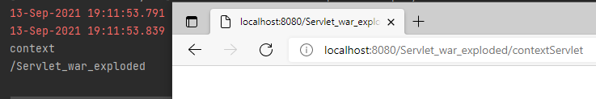
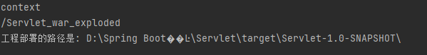

## Servlet 技术

### 1、什么是 Servlet

​	（1）、Servlet 是 JavaEE 规范之一。规范就是接口。

​	（2）、Servlet 是 JavaWeb 三大组件之一。三大组件分别是：Servlet 程序、Filter 过滤器、Listener 监听器。

​	（3）、Servlet 是运行在服务器上的一个 java 小程序，它可以接受客户端发送过来的请求，并响应数据给客户端。

### 2、手动实现 Servlet 程序

​	（1）、编写一个类去实现 Servlet 接口

```java
package com.atguitu.Servlet;


import javax.servlet.*;
import java.io.IOException;

public class HelloServlet implements Servlet {

    @Override
    public void init(ServletConfig servletConfig) throws ServletException {

    }

    @Override
    public ServletConfig getServletConfig() {
        return null;
    }

    /**
    * service 方法是专门用来处理请求和响应的
    */
    @Override
    public void service(ServletRequest servletRequest, ServletResponse servletResponse) throws ServletException, IOException {
        System.out.println("Hello Servlet 被访问了");
    }

    @Override
    public String getServletInfo() {
        return null;
    }

    @Override
    public void destroy() {

    }
}
```


​	（2）、实现 service 方法，处理请求，并响应数据

```java
 /**
    * service 方法是专门用来处理请求和响应的
    */
    @Override
    public void service(ServletRequest servletRequest, ServletResponse servletResponse) throws ServletException, IOException {
        System.out.println("Hello Servlet 被访问了");
    }
```


​	（3）、到 web.xml 中去配置 servlet 程序的访问地址

```xml
<?xml version="1.0" encoding="UTF-8"?>
<web-app xmlns="http://xmlns.jcp.org/xml/ns/javaee"
         xmlns:xsi="http://www.w3.org/2001/XMLSchema-instance"
         xsi:schemaLocation="http://xmlns.jcp.org/xml/ns/javaee http://xmlns.jcp.org/xml/ns/javaee/web-app_4_0.xsd"
         version="4.0">

    <!-- servlet标签给Tomcat配置Servlet程序 -->
    <servlet>
        <!-- servlet-name标签 Servlet程序取一个别名（一般是类名） -->
        <servlet-name>HelloServlet</servlet-name>
        <!-- servlet-class是 Servlet程序的全类名 -->
        <servlet-class>com.atguitu.Servlet.HelloServlet</servlet-class>
    </servlet>

    <!-- servlet-mapping标签给Servlet程序配置访问地址 -->
    <servlet-mapping>
        <!-- servlet-name标签的作用是告诉服务器，我当前配置的地址是给哪个Servlet程序使用 -->
        <servlet-name>HelloServlet</servlet-name>
        <!-- url-pattern标签配置访问地址
            / 斜杠在服务器解析的时候，表示地址为http://ip:port/工程路径
            /hello
         -->
        <url-pattern>/hello</url-pattern>
    </servlet-mapping>

</web-app>
```


### 3、Servlet 的生命周期

​	（1）、执行 Servlet 构造器方法

​	（2）、执行 init 初始化方法

​	（3）、执行 service 方法

​	（4）、执行 destroy 销毁方法


​	第一、二步，是在第一次访问的时候，创建 servlet 程序会调用

​	第三步，每次访问都会调用

​	第四步，在 web 工程停止的时候调用


### 4、GET 和 POST 请求的分发处理

```java
package com.atguitu.Servlet;


import javax.servlet.*;
import javax.servlet.http.HttpServletRequest;
import java.io.IOException;

public class HelloServlet implements Servlet {
    public HelloServlet() {
        System.out.println("1 构造器方法");
    }

    @Override
    public void init(ServletConfig servletConfig) throws ServletException {
        System.out.println("2 init初始化");
    }

    @Override
    public ServletConfig getServletConfig() {
        return null;
    }

    @Override
    public void service(ServletRequest servletRequest, ServletResponse servletResponse) throws ServletException, IOException {
        System.out.println("3 service === Hello Servlet 被访问了");

        // HttpServletRequest 可以得到请求方式
        HttpServletRequest httpServletRequest = (HttpServletRequest) servletRequest;
        // 获取请求的方式
        String method = httpServletRequest.getMethod();

        System.out.println(method);
    }

    @Override
    public String getServletInfo() {
        return null;
    }

    @Override
    public void destroy() {
        System.out.println("4 destroy销毁方法");
    }
}
```


### 5、通过继承 HttpServlet 实现 Servlet 程序

​	一般在实际项目开发中，都是使用继承 HttpServlet 类的方式去实现 Servlet程序。

​	（1）、编写一个类去继承 HttpServlet 类

​	（2）、根据业务需要重写 doGet 或 doPost 方法

​	（3）、到 web.xml 中去配置 Servlet 程序的访问地址


## ServletConfig 类

ServletConfig 类从类名上来看，就知道是 Servlet 程序的配置信息类。

Servlet 程序和 ServletConfig 对象都是由 Tomcat 负责创建，我们负责使用。

Servlet 程序默认是第一次访问的时候创建，**Servlet 程序创建时，就创建一个对应的ServletConfig对象**。

### 1、ServletConfig 类的三大作用

​	（1）、可以获取 Servlet 程序的别名 servlet-name 的值

​	（2）、获取初始化参数 int-param

​	（3）、获取 ServletContext 对象

```java
package com.atguitu.Servlet;


import javax.servlet.*;
import javax.servlet.http.HttpServletRequest;
import java.io.IOException;

public class HelloServlet implements Servlet {
    public HelloServlet() {
        System.out.println("1 构造器方法");
    }

    @Override
    public void init(ServletConfig servletConfig) throws ServletException {
        System.out.println("2 init初始化");

        //（1）、可以获取 Servlet 程序的别名 servlet-name 的值
        System.out.println("HelloServlet 程序的别名是: "+servletConfig.getServletName());
        //2）、获取初始化参数 int-param
        System.out.println("初始化参数 uername 的值是: "+servletConfig.getInitParameter("username"));
        //（3）、获取 ServletContext 对象
        System.out.println(servletConfig.getServletContext());
    }

```

```xml
<servlet>
        <!-- servlet-name标签 Servlet程序取一个别名（一般是类名） -->
        <servlet-name>HelloServlet</servlet-name>
        <!-- servlet-class是 Servlet程序的全类名 -->
        <servlet-class>com.atguitu.Servlet.HelloServlet</servlet-class>
        <!-- init-param 是初始化参数 -->
        <init-param>
            <!-- 参数名 -->
            <param-name>username</param-name>
            <!-- 参数值 -->
            <param-value>root</param-value>
        </init-param>
    </servlet>
```


## ServletContext 类

### 1、什么是 ServletContext？

​	（1）、ServletContext 是一个接口，它表示 Servlet 上下文对象

​	（2）、**一个 web 工程，只有一个 ServletContext 对象实例**

​	（3）、ServletContext 对象是一个域对象


​	什么是域对象？

​	域对象，是可以像 Map 一样存取数据的对象，叫域对象。

​	这里的域指的是存取数据的操作范围

​									存数据						取数据					删除数据

Map							put()							get()						remove()

域对象					setAttribute()			getAttribute()		removeAttribute()


### 2、ServletContext 类的四个作用

```java
package com.atguitu.Servlet;

import javax.servlet.*;
import javax.servlet.http.*;
import java.io.IOException;

public class ContextServlet extends HttpServlet {
    @Override
    protected void doGet(HttpServletRequest request, HttpServletResponse response) throws ServletException, IOException {
//​	（1）、获取 web.xml 中配置的上下文参数 context-param
        ServletContext servletContext = getServletConfig().getServletContext();

        String username = servletContext.getInitParameter("username");
        System.out.println(username);
//​	（2）、获取当前的工程路劲，格式：/工程路径
        String contextPath = servletContext.getContextPath();
        System.out.println(contextPath);
//​	（3）、获取工程部署后在服务器磁盘上的绝对路径

        // / 斜杠 被服务器解析地址为: http://ip:port/工程名/
        System.out.println("工程部署的路径是: "+servletContext.getRealPath("/"));
        // 得到结果：工程部署的路径是: D:\Spring Boot��Ŀ\Servlet\target\Servlet-1.0-SNAPSHOT\
    }

    @Override
    protected void doPost(HttpServletRequest request, HttpServletResponse response) throws ServletException, IOException {

    }
}

```


​	（1）、获取 web.xml 中配置的上下文参数 context-param

```xml
<?xml version="1.0" encoding="UTF-8"?>
<web-app xmlns="http://xmlns.jcp.org/xml/ns/javaee"
         xmlns:xsi="http://www.w3.org/2001/XMLSchema-instance"
         xsi:schemaLocation="http://xmlns.jcp.org/xml/ns/javaee http://xmlns.jcp.org/xml/ns/javaee/web-app_4_0.xsd"
         version="4.0">

    <!-- context-param是上下文参数，但是它是属于整个 web 工程 -->
    <context-param>
        <param-name>username</param-name>
        <param-value>context</param-value>
    </context-param>
```

​	（2）、获取当前的工程路劲，格式：/工程路径

​	/Servlet_war_exploded：工程路径



​	（3）、获取工程部署后在服务器磁盘上的绝对路径

​		

​	（4）、像 map 一样存储数据


## Http相应头

### 1、常用响应码说明

​	200				表示请求成功

​	302				表示请求重定向

​	404				表示请求服务器已经收到了，但是你要的数据不在（请求地址错误）

​	500				表示服务器已经收到请求了，但是服务器内部错误（代码错误）

### 2、MIME 类型说明

​	MIME 是 HTTP 协议中数据类型

​	MIME 的英文全称是"Multipurpose Internet Mail Extensions" 多功能 Internet 邮件扩充服务。MIME 类型的格式是"大类型/小类型"，并与某一种文件的拓展名对应。


## HttpServeltRequest 类

### 1、HttpServletRequest 类有什么用

​	每次只要有请求进入 Tomcat 服务器，Tomcat 服务器就会把请求过来的 HTTP 协议信息解析好封装到 Request 对象中，然后传递到 service 方法（doGet 和 doPost）中给我们使用。我们可以通过 HttpServeltRequest 对象，获取到所有请求的信息。

### 2、HttpServletRequest 类的常用方法

​	getRequestURI()							获取请求的资源路径

​	getRequestURL()							获取请求的统一资源定位符（绝对路径）

### 3、如何获取请求参数

```xml
	<servlet>
        <servlet-name>ParameterServlet</servlet-name>
        <servlet-class>com.atguitu.Servlet.ParameterServlet</servlet-class>
    </servlet>

    <servlet-mapping>
        <servlet-name>ParameterServlet</servlet-name>
        <url-pattern>/parameterServlet</url-pattern>
    </servlet-mapping>
```

```html
<!DOCTYPE html>
<html lang="en">
<head>
    <meta charset="UTF-8">
    <title>Title</title>
</head>
<body>

    <form action="http://localhost:8080/Servlet_war_exploded/parameterServlet" method="get">
        用户名: <input type="text" name="username"><br>
        密码: <input type="password" name="password"><br>
        兴趣爱好: <input type="checkbox" name="hobby" value="cpp">c++
        <input type="checkbox" name="hobby" value="java">Java
        <input type="checkbox" name="hobby" value="js">JavaScript<br>
        <input type="submit">
    </form>
</body>
</html>
```

```java
package com.atguitu.Servlet;

import javax.servlet.*;
import javax.servlet.http.*;
import javax.servlet.annotation.*;
import java.io.IOException;

@WebServlet(name = "Servlet", value = "/Servlet")
public class ParameterServlet extends HttpServlet {
    @Override
    protected void doGet(HttpServletRequest request, HttpServletResponse response) throws ServletException, IOException {
        // 获取请求参数
        String username = request.getParameter("username");
        String password = request.getParameter("password");
        String hobby = request.getParameter("hobby");
        // 获取多个值
//        String[] hobbies = request.getParameterValues("hobby");
        System.out.println(username);
        System.out.println(password);
        System.out.println(hobby);
    }

    @Override
    protected void doPost(HttpServletRequest request, HttpServletResponse response) throws ServletException, IOException {

    }
}

```

### 4、请求的转发

什么是请求的转发？

请求转发是指，服务器收到请求后，从一个资源跳转到另一个资源的操作叫请求转发。

```xml
	<servlet>
        <servlet-name>Servlet1</servlet-name>
        <servlet-class>com.atguitu.Servlet.Servlet1</servlet-class>
    </servlet>

    <servlet>
        <servlet-name>Servlet2</servlet-name>
        <servlet-class>com.atguitu.Servlet.Servlet2</servlet-class>
    </servlet>
	<servlet-mapping>
        <servlet-name>Servlet1</servlet-name>
        <url-pattern>/servlet1</url-pattern>
    </servlet-mapping>
    <servlet-mapping>
        <servlet-name>Servlet2</servlet-name>
        <url-pattern>/servlet2</url-pattern>
    </servlet-mapping>
```

```java
package com.atguitu.Servlet;

import javax.servlet.RequestDispatcher;
import javax.servlet.ServletException;
import javax.servlet.http.HttpServlet;
import javax.servlet.http.HttpServletRequest;
import javax.servlet.http.HttpServletResponse;
import java.io.IOException;

public class Servlet1 extends HttpServlet {
    @Override
    protected void doGet(HttpServletRequest req, HttpServletResponse resp) throws ServletException, IOException {
        // 获取请求的参数（办事的材料）查看
        String username = req.getParameter("username");
        System.out.println("在Servlet1（柜台1）中查看参数（材料）："+username);

        // 给材料 盖一个章，并传递到 Servlet2（柜台2）去查看
        req.setAttribute("key","柜台1的章");

        // 问路：Servlet2（柜台2）怎么走
        // Dispatcher: 调度员，转发，[计]分配器
        /**
         * 请求转发必须要以斜杠(/)打头，斜杠表示地址为：http://ip:port/工程名/，映射到IDEA代码的web目录<br/>
         */
        RequestDispatcher requestDispatcher = req.getRequestDispatcher("/servlet2");

        // 走向Servlet2（柜台2）
        requestDispatcher.forward(req,resp);
    }
}

```

```java
package com.atguitu.Servlet;

import javax.servlet.ServletException;
import javax.servlet.http.HttpServlet;
import javax.servlet.http.HttpServletRequest;
import javax.servlet.http.HttpServletResponse;
import java.io.IOException;

public class Servlet2 extends HttpServlet {
    @Override
    protected void doGet(HttpServletRequest req, HttpServletResponse resp) throws ServletException, IOException {
        // 获取请求的参数（办事的材料）查看
        String username = req.getParameter("username");
        System.out.println("在Servlet2（柜台2）中查看参数（材料）："+username);

        // 查看 柜台1 是否有盖章
        Object key = req.getAttribute("key");
        System.out.println("柜台1是否有章: "+key);

        // 处理自己的业务
        System.out.println("Servlet2处理自己的业务");
    }
}

```

### 5、Web 中 / 斜杠的不同意义

​	在 web 中 / 斜杠 是一种绝对路径

​	/ 斜杠 如果被浏览器解析，得到的地址是: http://ip:port/

​	/ 斜杠 如果被服务器解析，得到的地址是: http://ip:port/工程路径/

### 6、请求重定向

#### 第一种方案：

```java
import javax.servlet.http.HttpServlet;

public class Response1 extends HttpServlet{
    
    @Override
    protected void doGet(HttpServletRequest req, HttpServletResponse resp) throw ServletException, IOException {
        System.out.println("到此一游 response1");
        
        // 所有设置给客户端的东西都是通过response来调用\
        // 设置响应状态码 302，表示重定向（已搬迁）
        resp.setStatus(302);
        // 设置响应头，说明 新的地址在哪里
        resp.setHeader("Location","http://localhost:8080/07_servlet/response02");
    }
}
```

```java
import javax.servlet.http.HttpServlet;

public class Response2 extends HttpServlet{
    
    @Override
    protected void doGet(HttpServletRequest req, HttpServletResponse resp) throw ServletException, IOException {
        resp.getWriter().write("response2's result!");
    }
}
```

#### 请求重定向特点

​	（1）、浏览器地址栏会发生变化

​	（2）、两次请求

​	（3）、不共享Request域中的数据，即在 HttpServletRequest req里设置的属性不共享


#### 第二种方案（推荐使用）：

```java
resp.sendRedirect("http://localhost:8080")
```

