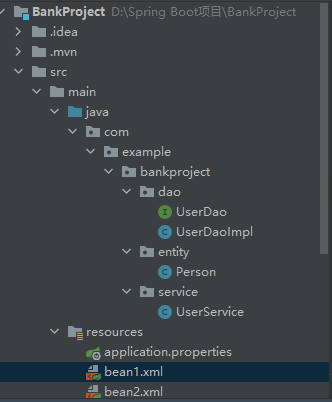
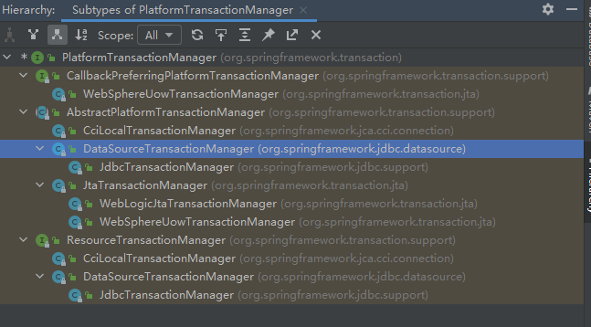
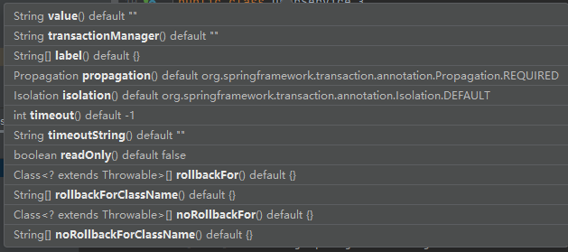

## 事务

1、什么是事务

​	（1）事务是数据库操作最基本单元，逻辑上一组操作，要么都成功，如果有一个失败所有操作都失败

​	（2）典型场景：银行转账

2、事务四大特征（ACID）

​	（1）原子性

​	（2）一致性

​	（3）隔离性：多事务之间，不会影响

​	（4）持久性：事务发生后，表中数据真正发生改变


## 事务操作（搭建事务操作环境）

```xml
<?xml version="1.0" encoding="UTF-8"?>
<beans xmlns="http://www.springframework.org/schema/beans"
       xmlns:xsi="http://www.w3.org/2001/XMLSchema-instance"
       xmlns:context="http://www.springframework.org/schema/context"
       xsi:schemaLocation="http://www.springframework.org/schema/beans
                        http://www.springframework.org/schema/beans/spring-beans.xsd
                        http://www.springframework.org/schema/context
                        http://www.springframework.org/schema/context/spring-context.xsd">

    <!-- 组件扫描 -->
    <context:component-scan base-package="com.example"></context:component-scan>

    <!-- 数据库连接池 -->
    <bean id="dataSource" class="com.alibaba.druid.pool.DruidDataSource"
          destroy-method="close">
        <property name="url" value="jdbc:mysql://localhost:3306/userdb"></property>
        <property name="username" value="root"></property>
        <property name="password" value="123456"></property>
        <property name="driverClassName" value="com.mysql.cj.jdbc.Driver"></property>
    </bean>

    <!-- JdbcTemplate队形 -->
    <bean id="jdbcTemplate" class="org.springframework.jdbc.core.JdbcTemplate">
        <!-- 注入dataSource -->
        <property name="dataSource" ref="dataSource"></property>
    </bean>
</beans>
```



### **事务的引入**

```java
package com.example.bankproject.service;

import com.example.bankproject.dao.UserDao;
import org.springframework.beans.factory.annotation.Autowired;
import org.springframework.stereotype.Service;

@Service
public class UserService {
    // 注入dao
    @Autowired
    private UserDao userDao;
    // 转账
    public void accountMoney() {
        // lucy少100
        userDao.reduceMoney();

        // 模拟异常
        int i = 1/0;

        // mary多100
        userDao.addMoney();
    }
}

```


### 解决以上问题

1、开启事务

2、进行业务操作

3、**没有发生异常，提交事务**

​	  **出现异常，事务回滚**


（1）事务一般加在Service层（业务逻辑层），因为在Service层中要调用多个Dao操作


（2）在Spring进行事务管理操作：

​		有两种方式：1、编程式事务管理；2、**声明式事务管理**（使用）。

编程式事务管理（可以使用 try/catch）

```java
package com.example.bankproject.service;

import com.example.bankproject.dao.UserDao;
import org.springframework.beans.factory.annotation.Autowired;
import org.springframework.stereotype.Service;

@Service
public class UserService {
    // 注入dao
    @Autowired
    private UserDao userDao;
    // 转账
    public void accountMoney() {
        try{
            // 第一步 开启事务

            // 第二部 进行业务操作
            // lucy少100
            userDao.reduceMoney();

            // 模拟异常
            int i = 1/0;

            // mary多100
            userDao.addMoney();

            // 第三步 没有发生异常，提交事务
        }catch (Exception e) {
            // 第四步 出现异常，事务回滚

        }

    }
}

```


（3）声明式事务管理：

​		1、**基于注解方式**

​		2、基于xml配置文件方式


（4）**在Spring进行声明式事务管理，底层使用AOP原理**


（5）Spring事务管理API

​		1、提供一个接口，代表事务管理器，这个接口针对不同的框架提供不同的实现类。




## *事务操作（注解声明式事务管理）

1、在Spring配置文件配置事务管理器

```xml
<!-- 创建事务管理器 -->
<bean id="transactionManager" class="org.springframework.jdbc.datasource.DataSourceTransactionManager">
    <property name="dataSource" ref="dataSource"></property>
</bean>
```

2、在Spring配置文件中，开启事务注解

（1）在Spring配置文件中引入名称空间tx

```xml
<beans xmlns="http://www.springframework.org/schema/beans"
       xmlns:xsi="http://www.w3.org/2001/XMLSchema-instance"
       xmlns:tx="http://www.springframework.org/schema/tx"
       xsi:schemaLocation="http://www.springframework.org/schema/beans
                        http://www.springframework.org/schema/beans/spring-beans.xsd
                        http://www.springframework.org/schema/tx
                        http://www.springframework.org/schema/tx/spring-tx.xsd">
</beans>
```

（2）开启事务注解

```xml
<!-- 开启事务注解 -->
<tx:annotation-driven transaction-manager="transactionManager"></tx:annotation-driven>
```

**3、在Service类上面（获取Service类里面方法上面）添加事务注解**

1、@Transactional 这个注解添加到类上面，也可以添加到方法上面

2、如果把这个注解添加类上，则表示这个类所有的方法都添加事务

3、如果把这个注解添加到方法上面，为这个方法添加事务

```java
package com.example.bankproject.service;

import com.example.bankproject.dao.UserDao;
import org.springframework.beans.factory.annotation.Autowired;
import org.springframework.stereotype.Service;
import org.springframework.transaction.annotation.Transactional;

@Service
@Transactional  // 事务的注解，可以加在类上、可以加在方法上
public class UserService {
    // 注入dao
    @Autowired
    private UserDao userDao;
    // 转账
    public void accountMoney() {
        // 第一步 开启事务

        // 第二部 进行业务操作
        // lucy少100
        userDao.reduceMoney();

        // 模拟异常
        int i = 1/0;

        // mary多100
        userDao.addMoney();

        // 第三步 没有发生异常，提交事务
        // 第四步 出现异常，事务回滚
    }
}

```


## 事务操作（声明式事务管理参数配置）

#### 1、在Service类上面添加注解@Transactional，在这个注解里面可以配置事务管理相关参数



#### **2、propagation：事务传播行为**

**@Transaction(propagation = Propagation.REQUIRED)**

（1）多事物方法之间直接进行调用，这个过程中事务是如何进行管理的

​		事务方法：对数据表数据进行变化的操作

```java
@Transactional
public void add() {
    // 调用 update 方法
    update();
}

public void update() {
    
}
```


​		Spring框架事务传播行为有7中：

​			required（默认）	如果有事务在运行，当前的方法就在这个事务内运行，否则，就地洞一个新的事务，并在自己的事务内运行

​			required_new	当前的方法必须启动新事务，并在它自己的事务内运行，如果有事务正在运行，应该将它挂起

​			supports	如果有事务正在运行，当前的方法就在这个事务内运行，否则它可以不运行在事务中

​			not_supports	当前的方法不应该运行在事务中，如果有运行的事务，将它挂起

​			mandatory	当前的方法必须运行在事务内部，如果没有正在运行的事务，就抛出异常

​			never	当前的方法不应该运行在事务中，如果有运行的事务，就抛出异常

​			nested	如果有事务在运行，当前的方法就应该在这个事务的嵌套事务内运行，否则，就启动一个新的事务，并在它自己的事务运行

#### **3、isolation：事务隔离级别**

​	（1）事务中有一个特性：隔离性，多事物操作之间不会产生影响。不考虑隔离性会产生很多问题。

##### 	（2）有三个读问题：脏堵、不可重复读、虚（幻）读

​			脏堵：一个未提交的事务 读取到了 另一个未提交的事务中的数据

​			不可重复读：一个未提交的事务 读取到了 另一个提交事务的修改数据（即，一个事务，前后读取的数据不一）

​			虚（幻）读：一个未提交的事务 读取到了 另一个提交事务增加的数据（即，一个事物，前后读取数据库时，发现表中的列行不一，插入或删除了一条记录）

##### 	（3）、解决：通过设置事务隔离级别，解决问题

|                              | 脏读 | 不可重复读 | 幻读 |
| ---------------------------- | ---- | ---------- | ---- |
| READ UNCOMMITTED（读未提交） | 有   | 有         | 有   |
| READ COMMITTED（读已提交）   | 无   | 有         | 有   |
| REPEATABLE READ（可重复读）  | 无   | 无         | 有   |
| SERIALABLE（串行化）         | 无   | 无         | 无   |

mysql中的默认隔离级别是：REPEATABLE READ

#### 4、timeout：超时时间

​	（1）事务需要在一定时间内进行提交，如果不提交进行回滚

​	（2）默认值是-1，设置时间以秒为单位进行计算

#### 5、readOnly：是否只读

​	（1）读：查询操作，写：添加修改删除操作

​	（2）readOnly 默认值 false，表示可以查询，可以添加删除修改操作

​	（3）设置 readOnly 值是 true，设置 true 之后，只能查询

#### 6、rollbackFor：回滚

​	**（1）设置出现哪些异常进行事务回滚**

#### 7、noRollbackFor：不回滚

​	**（1）设置出现哪些异常不进行事务回滚**


