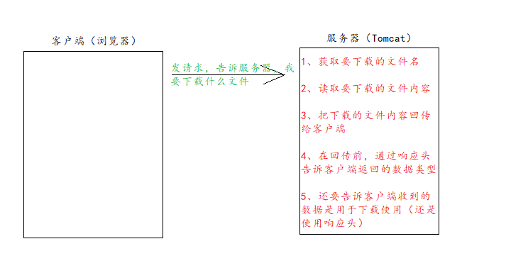

## 文件的上传和下载

文件的上传和下载，是非常常见的功能。很多的系统中，或者软件中都经常使用文件的上传和下载。

比如：QQ头像，就使用了上传。

邮箱找那个也有附件的上传和下载功能。

OA系统中审批有附件材料的上传。


## 文件上传

### 1、文件的上传介绍（重点）

​	（1）、要有一个form标签，method=post请求

​	（2）、form标签的encType属性值必须为multipart/form-data值

​	（3）、在form标签中使用input type=file添加上传的文件

```jsp
<%--
  Created by IntelliJ IDEA.
  User: 82754
  Date: 2021/9/16
  Time: 12:51
  To change this template use File | Settings | File Templates.
--%>
<%@ page contentType="text/html;charset=UTF-8" language="java" %>
<html>
<head>
    <title>Title</title>
</head>
<body>
    <form action="" method="post" enctype="multipart/form-data">
        用户名: <input type="text" name="username"><br>
        头像: <input type="file" name="photo"><br>
        <input type="submit" value="上传">

    </form>
</body>
</html>

```

​	encType=multipart/form-data 表示提交的代码，以多段（每一个表单一个数据段）的形式进行拼接，然后以**二进制流**的形式**发送给服务器**。

​	**既然客户端以流的形式发送给服务器，那么服务器也得用流的形式接受客户端的数据。**

​	（4）、编写服务器代码（Servlet）接收，处理上传的数据

```java
package com.study.fileio.servlet;

import javax.servlet.ServletException;
import javax.servlet.ServletInputStream;
import javax.servlet.http.HttpServlet;
import javax.servlet.http.HttpServletRequest;
import javax.servlet.http.HttpServletResponse;
import java.io.IOException;

public class UploadServlet extends HttpServlet {

    @Override
    protected void doPost(HttpServletRequest req, HttpServletResponse resp) throws ServletException, IOException {
//        System.out.println("文件过来了");
        // enctype=multipart/data-form 表示客户端以二进制流的形式发送数据给服务器
        // 既然客户端以流的形式发送给服务器，那么服务器也得用流的形式接受客户端的数据

//        System.out.println(req.getParameter("username"));//null
//        System.out.println(req.getParameter("photo"));//null

        ServletInputStream inputStream = req.getInputStream();


        byte[] buffer=new byte[1024*1000];
        int read = inputStream.read(buffer);
        System.out.println(new String(buffer,0,read));
    }

}

```

### 2、commons-fileupload.jar 常用API介绍说明--Apache

​	commons-fileupload.jar 需要依赖 commons.jar 这个包，所以两个包我们都要引入。

​	

​	ServletFileUpload类，用于解析上传的数据。

​		static boolean isMultipartContent(HttpServletRequest request); 判断当前上传的数据格式是否多段的格式。

​		List<FileItem> parseRequest(HttpServletRequest request); 解析上传的数据。

​	FileItem类，表示每一个表单项

​		boolean isFormField(); 判断当前这个表单项，是否是普通的表单项。还是上传的文件类型。

​		String getFileName(); 获取表单项的 name 属性值。

​		String getString(); 获取当前表单项的值。

​		String getName(); 获取上传的文件名。

​		void write(file); 将上传的文件写到 参数 file 所指向磁盘的位置。

```java
package com.study.fileio.servlet;

import org.apache.commons.fileupload.FileItem;
import org.apache.commons.fileupload.FileItemFactory;
import org.apache.commons.fileupload.FileUploadException;
import org.apache.commons.fileupload.disk.DiskFileItemFactory;
import org.apache.commons.fileupload.servlet.ServletFileUpload;

import javax.servlet.ServletException;
import javax.servlet.http.HttpServlet;
import javax.servlet.http.HttpServletRequest;
import javax.servlet.http.HttpServletResponse;
import java.io.File;
import java.io.IOException;
import java.util.List;

public class UploadServlet extends HttpServlet {

    @Override
    protected void doPost(HttpServletRequest req, HttpServletResponse resp) throws ServletException, IOException {

        // 1 先判断上传的数据是否是多段的数据（只有多段的数据，才是文件上传）
        if(ServletFileUpload.isMultipartContent(req)) {
            // 创建 FileItemFactory 工厂实现类
            FileItemFactory fileItemFactory = new DiskFileItemFactory();
            // 创建用于解析上传数据的工具类 ServletFileUpload 类
            ServletFileUpload servletFileUpload = new ServletFileUpload(fileItemFactory);
            try {
                // 解析上传的数据，得到每一个表单项 FileItem
                List<FileItem> fileItems = servletFileUpload.parseRequest(req);
                // 循环判断，每一个表单项，是普通类型，还是上传的文件
                for (FileItem fileItem : fileItems) {
                    if(fileItem.isFormField()) {
                        // 普通表单项

                        System.out.println("表单项的name属性值: "+fileItem.getFieldName());
                        // 参数UTF-8解决乱码问题
                        System.out.println("表单项的value属性值: "+fileItem.getString("UTF-8"));
                    } else{
                        // 上传的文件
                        System.out.println("表单项的name属性值: "+fileItem.getFieldName());
                        System.out.println("上传的文件名: "+fileItem.getName());

                        fileItem.write(new File("D:\\MyWorld\\"+fileItem.getName()));
                    }
                }
            } catch (Exception e) {
                e.printStackTrace();
            }
        }
    }

}

```


## 文件下载



### 方案一：URLEncoder 解决 IE 和谷歌浏览器的附件中文名问题。

```java
package com.study.fileio.servlet;

import org.apache.commons.io.IOUtils;

import javax.servlet.ServletContext;
import javax.servlet.ServletException;
import javax.servlet.http.HttpServlet;
import javax.servlet.http.HttpServletRequest;
import javax.servlet.http.HttpServletResponse;
import java.io.IOException;
import java.io.InputStream;
import java.io.OutputStream;
import java.net.URLEncoder;

public class Download extends HttpServlet {

    @Override
    protected void doGet(HttpServletRequest req, HttpServletResponse resp) throws ServletException, IOException {
        // 1 获取要下载的文件名
        String downloadFileName = "2.jpg";
        // 2 读取要下载的文件内容（通过 ServletContext 对象可以读取）
        ServletContext servletContext = getServletContext();
        // 获取要下载的文件类型
        String mimeType = servletContext.getMimeType("/file/" + downloadFileName);
        System.out.println("下载的文件类型: "+mimeType);
        // 4 在回传前，通过响应头告诉客户端返回的数据类型
        resp.setContentType(mimeType);
        // 5 还要告诉客户端收到的数据是用于下载使用（还是使用响应头）
        // Content-Disposition 响应头，表示收到的数据怎么处理
        // attachment 表示附件，表示下载使用
        // filename= 表示指定下载的文件名
//        resp.setHeader("Content-Disposition","attachment;filename="+downloadFileName);
//        resp.setHeader("Content-Disposition","attachment;filename=22.jpg"); // 下载的文件名可以不同
        resp.setHeader("Content-Disposition","attachment;filename="+ URLEncoder.encode("中国.jpg","UTF-8")); // url 编码是把汉字转化成xx%xx的格式(也就是16进制的格式)
        /**
         * / 斜杠 被服务器解析表示地址http://ip:port/工程名/ 映射到代码的 web 目录中
         */
        InputStream resourceAsStream = servletContext.getResourceAsStream("/file/" + downloadFileName);
        // 获取相应的输出流
        OutputStream outputStream = resp.getOutputStream();
        // 3 把下载的文件内容回传给客户端
        // 读取输入流中全部的数据，复制给输出流，输出给客户端
        IOUtils.copy(resourceAsStream,outputStream);

    }
}

```

#### 重点：

```java
		// 4 在回传前，通过响应头告诉客户端返回的数据类型
        resp.setContentType(mimeType);
        // 5 还要告诉客户端收到的数据是用于下载使用（还是使用响应头）
        // Content-Disposition 响应头，表示收到的数据怎么处理
        // attachment 表示附件，表示下载使用
        // filename= 表示指定下载的文件名
//        resp.setHeader("Content-Disposition","attachment;filename="+downloadFileName);
//        resp.setHeader("Content-Disposition","attachment;filename=22.jpg"); // 下载的文件名可以不同
        resp.setHeader("Content-Disposition","attachment;filename="+ URLEncoder.encode("中国.jpg","UTF-8")); // url 编码是把汉字转化成xx%xx的格式(也就是16进制的格式)
```


### 方案二：BASE64 编码解决火狐浏览器的附件中文名问题

​	这时候需要把请求头 Content-Disposition: attachment; filename=中文名

​	编码成为: Content-Disposition: attachment; filename==?charset?B?xxxxx?=

​	

​	=?charset?B?xxxxx?= 现在我们对这段内容进行一下说明

​	=?						  表示编码内容的开始

​	charset				 表示字符集（如：UTF-8）

​	B							表示BASE64编码
​	xxxxx					表示文件名 BASE64 编码后的内容

​	?=						  表示编码内容的结束

```java
package com.study.fileio;

import org.junit.jupiter.api.Test;
import org.springframework.boot.test.context.SpringBootTest;
import sun.misc.BASE64Decoder;
import sun.misc.BASE64Encoder;

import java.io.UnsupportedEncodingException;

@SpringBootTest
class FileIoApplicationTests {

    @Test
    void contextLoads() throws Exception{
        String content = "这是需要BASE64编码的内容";
        // 创建一个Base64编码器
        BASE64Encoder base64Encoder = new BASE64Encoder();
        // 执行Base64编码操作
        String encode = base64Encoder.encode(content.getBytes("UTF-8"));
        System.out.println(encode);
        // 创建Base64解码器
        BASE64Decoder base64Decoder = new BASE64Decoder();
        // 解码操作
        byte[] bytes = base64Decoder.decodeBuffer(encode);
        System.out.println(new String(bytes, "UTF-8"));
    }

}

```


## Cookie 和 Session

### Cookie 饼干

​	Cookie是保存在客户端

### Session 会话

#### 什么是 Session 会话？

​	1、Session 就是一个接口（HttpSession）

​	2、Session 就是会话，它是用来维护一个客户端和服务器之间关联的一种技术

​	3、每个客户端都有自己的一个Session会话

​	4、Session会话中，我们经常用来保存用户登录之后的信息


#### 如何创建 Session 和获取（id号，是否为新）

​	如果创建和获取 Session。它们的API是一样的。

​	request.getSession() 

​		第一次调用是：创建 Session 会话

​		之后调用的都是：获取前面创建好的 Session 会话对象

​	isNew()

​		判断到底是不是刚创建出来的（新的）Session 对象

​		true 表示刚创建

​		false 表示获取之前创建


​	**每个会话都有一个身份证号。也就是 ID 值。而且这个 ID 是唯一的**

​	getID()：得到 Session 的会话id值
