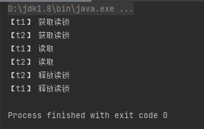

# 读写锁

```java
package cn.itcast.jvm;

import java.util.concurrent.locks.ReentrantReadWriteLock;

public class TestReadWriteLock {
    public static void main(String[] args) {
        DataContainer dataContainer = new DataContainer();
        new Thread(()->{
            dataContainer.read();
        }, "t1").start();
        new Thread(()->{
            dataContainer.read();
        }, "t2").start();
    }
}
class DataContainer {
    private Object data;
    // 读写锁
    private ReentrantReadWriteLock rw = new ReentrantReadWriteLock();
    // 读锁
    private ReentrantReadWriteLock.ReadLock r = rw.readLock();
    // 写锁
    private ReentrantReadWriteLock.WriteLock w = rw.writeLock();

    public Object read() {
        String name = Thread.currentThread().getName();
        System.out.println("【"+name+"】 获取读锁");
        r.lock();
        try {
            System.out.println("【"+name+"】 读取");
            try {
                Thread.sleep(1000);
            } catch (InterruptedException e) {
                e.printStackTrace();
            }
            return data;
        } finally {
            System.out.println("【"+name+"】 释放读锁");
            r.unlock();
        }
    }

    public void write() {
        String name = Thread.currentThread().getName();
        System.out.println("【"+name+"】 获取读锁");
        w.lock();
        try {
            System.out.println("【"+name+"】 写入");
        } finally {
            System.out.println("【"+name+"】 释放读锁");
            w.unlock();
        }
    }
}
```

