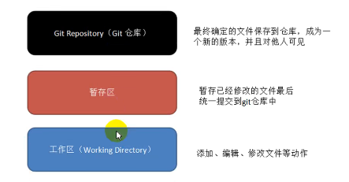
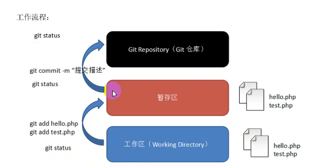
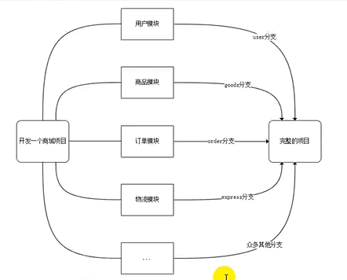
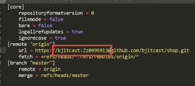
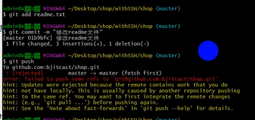
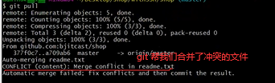

# Git 的使用

## 本地仓库

### 工作流程

Git 本地操作的三个区域：



工作流程：



## 本次仓库操作

1. 在安装好后首次使用需要先进行全局配置

   ```bash
   # 修改用户名
   git config --global user.name "用户名"
   # 查看用户名
   git config --global user.name
   # 修改邮箱地址
   git config --global user.email "邮箱地址"
   # 查看邮箱地址
   git config --global user.email
   ```

2. 初始化

   ```bash
   git init
   ```

3. 查看当前状态

   ```bash
   git status
   ```

4. 添加到暂存区

   ```bash
   git add 文件名
   git add 文件名 1 文件名 2 文件名 3...
   git add .
   ```

5. 提交至版本库

   ```bash
   git commit -m "注释内容"
   ```

6. 版本回退

   1. 查看版本，确定需要回到的时刻点

      > <font color='crimson'>注意 git 只能查看当前版本之前的版本号，而无法显示之后的版本号</font>

      ```bash
      git log
      git log --pretty=oneline # 一行显示
      ```

   2. 回退

      ```bash
      git reset --hard 版本号
      ```

   <font color='crimson'>注意：回到过去之后，想要再回到之前最新的版本的时候，则需要使用指令去查看历史操作，以得到最新的 commit id</font>

7. 查看历史操作

   ```bash
   git reflog # 得到历史所有的 commit id，就可以配合使用 git reset 返回未来
   ```

小结：

- 要想回到过去，必须先得到 commit id，然后通过 git reset --hard 进行回退
- 要想回到未来，需要使用 git reflog 进行历史操作查看，得到最新的 commit id
- <font color='crimson'>在写回退指令的时候，commit id 可以不用写全，git 会自动识别，但是也不能太少，至少需要写前 4 位字符</font>

## 分支操作

### 什么是分支？



​	在版本回退的章节里，每次提交后都会有记录，Git 把它们串成时间线，形成类似于时间轴的东西，这个时间轴就是一个分支，我们称之为 master 分支。

​	<font color='crimson'>在开发的时候往往是团队协作，多人进行开发，因此光有一个分支是无法满足多人同时开发的需求的，**并且在分支上工作并不影响其他分支的正常使用**，会更加安全，Git 鼓励开发者使用分支去完成一些开发任务。</font>

### 指令

```bash
git branch # 查看分支
git branch 分支名 # 创建分支
git checkout 分支名 # 切换分支
git branch -d 分支名 # 删除分支
git merge 被合并的分支名 # 合并分支
```

## 创建 SSH 公钥

在 git bash 里输入：

```bash
ssh-keygen -t rsa -C
```

公钥的默认路径为：C/User/admin/.ssh/id_rsa

## 提醒

​	<font color='crimson'>在每天工作的第一件事就是先 git pull 拉取线上最新的版本；每天下班前要做的事是 git push，将本地代码提交到线上仓库。</font>

## 常见问题

1. git push 出现 403 致命错误

   fatal: unable to access 'https://github.com/itcast/shop.git': The requested URL returned error: 403

   <font color='crimson'>解决方法：</font>

   - <font color='crimson'>修改 .git/config 文件内容，将自己的账号和密码告知对方</font>

   

2. <font color='crimson'>冲突的产生与解决</font>

   1. 案例：同事修改我了线上仓库的代码 —— <font color='crimson'>即本地仓库和线上仓库内容不一致</font>

      

      解决冲突：

      1. git pull —— <font color='crimson'>此时 git 会帮助我们帮冲突的文件进行合并（合并冲突）</font>

         

      2. 需要和同事（谁先提交的）进行商量，看代码如何保留，将改好的文件再次提交即可

         - 删除 git 产生的标记，如 HEAD/=/=/=/=/=====/= 等
         - 再重新 git add 和 git commit
         - 最后 git push 即可
