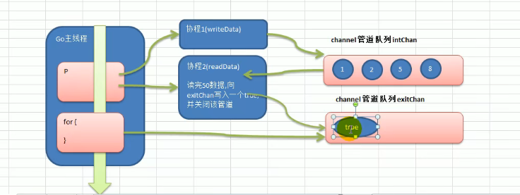

# Go

> 官网：[Go 编程语言 (go-zh.org)](https://go-zh.org/)
>
> API 文档：[Go语言标准库文档中文版 | Go语言中文网 | Golang中文社区 | Golang中国 (studygolang.com)](https://studygolang.com/pkgdoc)

## 变量声明

1、指定变量类型，声明后若不赋值，则使用默认值

```go
var i int
```

2、根据值自行判定变量类型**（类型推导）**

```go
var num = 10.11
```

3、省略 var，注意 := 左侧的变量不应该是已经声明过，否则会导致编译错误

```go
name := "tom" // 等价于 var name string = "tom"
```

4、一次性声明多个变量

```go
var n1, n2, n3 = 100, "tom", 888 // n1, n2, n3 := 100, "tom", 888
var m1, m2, m3 int
```

## Map

### 基本语法

```go
var 变量名 map[keytype]valuetype
```

keytype：指 key 的数据类型

valuetype：指 value 的数据类型

### 举例

```go
var a map[string]string
var a map[string]int
var a map[int]string
var a map[string]map[string]string
```

> <font color='crimson'><b>注意：</b></font>声明是不会分配内存的，初始化需要 make，分配内存后才能赋值和使用

```go
a = make(map[string]string, 10) // make(数据类型, 大小)
```

### 使用方式

方式一

```go
// 声明, 此时 map 是 nil
var cities map[string]string
// make 分配空间
cities = make(map[string]string, 10)
```

方式二

```go
// 声明, 直接 make
var cities = make(map[string]string)
```

方式三

```go
// 声明, 直接赋值
var cities map[string]string = map[string]string {
    "no4": "成都",
    "no2": "天津",
}
cities["no1"] = "北京"
```

### CURD(增删改查)

#### map 增加和更新

```go
map["key"] = value // 如果 key 还没有就是增加，如果 key 存在就是修改
```

#### map 删除

> <font color='crimson'>**说明：**</font>delete 是一个内置函数，如果 key 存在，就删除该 key-value，如果 key 不存在，不操作也不会报错

```go
delete(map, "key")
```

 <font color='crimson'>**小tips：**</font>

（1）如果我们要删除 map 的所有 key，没有一个专门的方法一次性删除，所以需要遍历 key 逐个删除

（2）或者 map = make(...)，make 一个新的，使原来的成为垃圾，被 gc 回收

#### map 查询

案例演示：

```go
var heroes map[string] string
heroes = make(map[string]string, 10)
heroes["no1"] = "宋江"
heroes["no2"] = "卢俊义"

val, findRes = heroes["no1"]
if findRes {
    fmt.Println("找到 val =", val)
} else {
    fmt.Println("没有 no1 这个 key")
}
```

<font color='crimson'>**说明：如果 heroes 这个 map 中存在 “no1"，那么 findRes 返回 true 否则返回 false**</font>

### map 遍历

> map 的遍历使用 for-range 的结构遍历

```go
// 使用 for-range 遍历 map
for k, v := range heroes {
    fmt.Printf("key = %v, value = %v\n", k, v)
}
```

### map 的长度

案例演示：

```go
fmt.Println(len(map))
```

### map 切片

<font color='crimson'>基本介绍：</font>切片的数据类型如果是 map，则我们称之为 slice of map，map 切片，这样使用则 map 个数就可以动态变化了

<font color='crimson'>案例演示：</font>

```go
var monsters []map[string]string
monsters = make([]map[string]string, 2)
```

```go
monsters := make([]map[string]string, 2) // 初始容量为 2, 后面可以动态增加

if monsters[0] == nil {
    // map 需要分配内存
	monsters[0] = make(map[string]string)
    monsters[0]["name"] = "牛魔王"
    monsters[0]["age"] = "500"
}

if monsters[1] == nil {
    // map 需要分配内存
    monsters[1] = make(map[string]string)
    monsters[1]["name"] = "玉兔精"
    monsters[1]["age"] = "400"
}

fmt.Println(monsters, len(monsters), cap(monsters))

// 动态增加！！！
newMonster := map[string]string {
    "name": "新的妖怪",
    "age": "200"
}

monsters = append(newMonster, monsters) // 容量翻倍

fmt.Println(monsters, len(monsters), cap(monsters))
```

### map 排序

```go
// map 的排序
nums := make(map[int]int, 10)
nums[10] = 100
nums[1] = 13
nums[4] = 56
nums[8] = 90

fmt.Println(nums)

// 如果按照 map 的 key 的顺序进行排序
// 1. 先将 map 的 key 放入到切片中
// 2. 对切片排序
// 3. 遍历切片，然后按照 key 来输出 map 的值

var keys []int
for k, _ := range nums {
    keys = append(keys, k)
}

// 排序
sort.Ints(keys) // Ints 接受一个切片，按照增序排序

fmt.Println(keys)
```

## 结构体 Struct

```go
// 声明结构体
type Person struct {
    Name string
    Age int
}
```

创建结构体的几种方式：

方式一：

```go
var person Person
```

方式二：

```go
var person Person = Person{"marry", 20}
// var person Person = Person{}
```

方式三：

```go
var person *Person = new(Person)
// 给 Person指针 赋值
// (*person).Name = "smith"
// (*person).Age = 30
// 上面的写法比较啰嗦, go 的设计者做了以下优化
person.Name = "smith"
person.Age = 30 // 这两行代码会在底层加上 *
```

  方式四：

```go
var person *Person = &Person{}
```

##  Go 编译器底层优化

（1）指针 *

```go
type Circle struct{
    Radius float64
}
// func (c Circle) area() float64 {
    // return 3.14 * (*c).radius * (*c).radius
//}
// 等价于以下写法
func (c Circle) area() float64 {
    return 3.14 * c.radius * c.radius
}
```

（2）取地址符 &

```go
type Circle struct{
    Radius float64
}
// 等价于以下写法
func (c *Circle) area() float64 {
    return 3.14 * c.radius * c.radius
}
func main() {
    var c Circle
    c.radius = 5.0
    // res := (&c).area()
    // 等价于以下写法
    res := c.area();
}
```

## Channel 管道

### Channel 的关闭

> 使用<font color='crimson'><strong>内置函数</strong> close 可以关闭 channel</font>，当 channel 关闭后，就不能<font color='crimson'>向 channel 写数据了，但是仍然可以从该 channel 读取数据。</font>

### Channel 的遍历

channel 支持 for-range 的方式进行遍历，请注意两个细节

（1）在遍历时，如果 channel 没有关闭，则会出现 deadlock 的错误

（2）在遍历时，如果 channel 已经关闭，则会正常遍历数据，遍历完后，就会退出遍历

### Channel 遍历和关闭的案例演示

```go
package "main"
import (
	"fmt"
)
func main() {
    intChan := make(chan int, 100)
    for i := 0; i < 100; i++ {
        intChan<- i * 2 // 放入 100 哥数据到管道
    }
    // 遍历一 => 错误遍历, 只能取出 50 个元素, 同理容量
    /*for i := 0; i < len(intChan); i++ {
        fmt.Println(<-intChan)
    }*/
    // 遍历二
    close(intChan) // 遍历的前提, 否则会报错
    for v := range intChan { // for-range 不返回 intChan 的下标
        fmt.Println("v =", v)
    }
}
```

### Channel 使用细节和注意事项

（1）channel 可以声明为只读，或者只写性质

```go
// 1. 默认情况下，管道是双向的
var channel chan int
// 2. 声明为只写
var channel chan<- int
channel = make(chan int, 3)
// 3. 声明为只读
var channel <-chan int
channel = make(chan int, 3)
```

【案例演示】

```go
func main() {
    ch := make(chan int, 10)
    exitChan := make(chan struct{}, 2)
    go send(ch, exitChan)
    go recv(ch, exitChan)
    
    var total = 0
    for _ = range exitChan {
        total++
        if total == 2 {
            break
        }
    }
    fmt.Println("结束...")
}
```

```go
// ch chan<- int, 这样 ch 就只能写操作了(可以避免误操作)
func send(ch chan<- int, exitChan chan struct{}) {
    for i := 0; i < 10; i++ {
        ch<- i
    }
    close(ch)
    var a struct{}
    exitChan<- a
}
```

```go
// ch <-chan int, 这样 ch 就只能读操作了
func recv(ch <-chan int, exitChan chan struct{}) {
    for {
        v, ok := <-ch
        if !ok {
            break
        }
        fmt.Println(v)
    }
    var a struct{}
    exitChan <- a
}
```

（2）使用 select 可以解决从管道取数据的阻塞问题

【案例演示】

```go
func main() {
    // 1. 定义一个管道 10 个数据 int
    intChan := make(chan int, 10)
    for i := 0; i < 10; i++ {
        intChan<- i
    }
    // 2. 定义一个管道 5 个数据 string
    stringChan := make(chan string, 5)
    for i:= 0; i < 5; i++ {
        stringChan<- "hello" + fmt.Sprintf("%d", i)
    }
    
    // 传统的方法在遍历管道时，如果不关闭会阻塞而导致 deadlock
    // 问题是：在实际开发过程中，可能我们不好确定什么时候关闭该管道 => 使用 select 方式解决
    label:
    for {
        select {
            case v := <-intChan: // 注意：这里，如果 intChan 一直没有关闭，不会一直阻塞 deadlock
            	fmt.Println("从 intChan 读取数据 %d\n", v)
            case v := <-stringChan: 
            	fmt.Println("从 stringChan 读取数据 %s\n", v)
            default:
            	fmt.Println("都取不到，不玩了，程序员可以加入其他逻辑")
            	// return
            	break label
        }
    }
}
```

（3）goroutine 中使用 recover，解决协程中出现 panic，导致程序崩溃问题

> <font color='crimson'>说明：</font>如果我们起了一个协程，但是这个协程出现了 panic，<font color='crimson'><b>如果我们没有捕获这个 panic，就会造成整个程序崩溃。</b></font>这时我们可以在 goroutine 中使用 recover 来捕获 panic 进行处理，<font color='crimson'>这样即使这个协程发生的问题，但是主线程仍然不受影响。</font>

【案例演示】

```go
func main() {
    go sayHello()
    go test()
    
    for i := 10; i < 10; i++ {
        fmt.Println("main() ok")
        time.Sleep(time.second)
    }
}
```

```go
func sayHello() {
    for i := 0; i < 10; i++ {
        fmt.Println("sayHello() ok")
        time.Sleep(time.second)
    }
}
```

```go
func test() {
    // 这里可以使用 defer + recover 解决
    defer func() {
        // 捕获 test 抛出的 panic
        if err := recover(); err != nil {
            fmt.Println("test() 发生错误", err)
        }
    }()
    // 定义了一个 map
    var myMap map[int]string
    myMap[0] = "golang" // error，使用前没有 make
}
```

## goroutiine 和 channel 结合

### 应用实例

> 请完成 goroutine 和 channel 协同工作的案例，具体要求：
>
> （1）开启一个 writeData 协程，向管道 intChan 中写入 50 个整数
>
> （2）开启一个 readData 协程，从管道 intChan 中读取 writeData 写入数据
>
> （3）注意：writeData 和 readData 操作的是同一个管道
>
> （4）主线程需要等待 writeData 和 readData 协程都完成工作才退出

代码思路：



代码演示：

```go
package "main"
import (
	"fmt"
    _ "time"
)
// write Data
func wirteData(intChan chan int) {
    for i := 1; i <= 50; i++ {
        // 放入数据
       	intChan<- i
    }
    close(intChan) // 关闭
}
// read Data
func readData(intChan chan int, exitChan chan bool) {
    for {
        v, ok := <-intChan
        if !ok {
            break
        }
        fmt.Printf("readData 读到数据 %v\n", v)
    }
    // readData 读取完数据后，即任务完成
    exitChan<- true
    close(exitChan)
}
func main() {
     // 创建两个管道
    intChan := make(chan int, 50)
    exitChan := make(chan bool, 1)
    
    go writeData(intChan)
    go readData(i  ntChan, exitChan)
    
    // time.Sleep(time.Second * 10)
    for {
        _, ok := <-exitChan
        if !ok {
            break
        }
    }
}
```

### 管道阻塞的机制

> <font color='crimson'>如果只是向管道写入数据，而没有读取，就会出现阻塞而 dead lock</font>，原因是 intChan 容量是 10 而 writeData 要写入 50 个数据。
>
> 但如果有 readData 后，则 intChan 只会阻塞在哪而不会死锁。<font color='crimson'>（编译器会去分析 intChan 有没有流动）</font>

## 反射

> 编写 "框架" => 非常关键！！

```go
import "reflect" // 使用反射需要引入的包
```

> Go 官方文档给的说明：

reflect 包实现了运行时反射，允许程序操作任意类型的对象，典型用法是用静态类型 interface{} 保存一个值后：

（1）调用 <font color='crimson'>TypeOf</font> 获取其动态类型信息，该函数返回一个 Type 类型值。

（2）调用 <font color='crimson'>ValueOf</font> 返回一个 Value 类型值，该值代表运行时的数据。