# 24届北京邮电大学智能科学与技术复试

> 复试科目：
>
> 1. 《编译原理与技术》
> 2. 《计算机系统结构》
> 3. 《数据库系统原理》
> 4. 《软件工程》
> 5. 《通信原理》
> 6. 《人工智能》

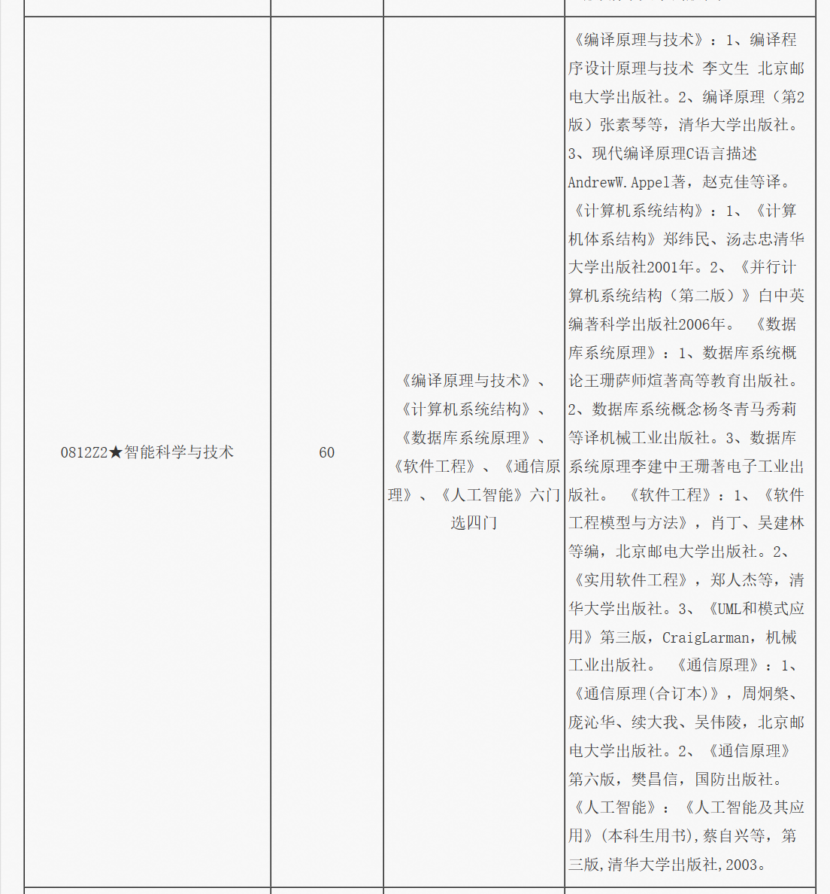

## 编译原理

### 文法的形式化定理

G = (V~T~, V~N~, P, S)，注意：$V_T \cap V_N = \emptyset$，$V_T \cup V_N : 文法符号集$

- V~T~：终结符集合

  ​	终结符（terminal symbol）是文法所定义的语言的**基本符号**，有时也称为token

  ​	例，V~T~ = {apple, boy, eat, little}

- V~N~：非终结符结合

  ​	非终结符集合（non terminal）是用来表示语法成分的符号，有时也称为“语法变量”

  ​	例，V~N~ = {<句子>, <名词短语>, <动词短语>, <名词>, … }
  
- P：产生式集合

  ​	产生式（production）描述了将终结符和非终结符组合成串的方法

  ​	产生式的一般形式：
  $$
  \alpha \rightarrow \beta
  $$
  ​	读作：$\alpha$ 定义为 $\beta$

  - $\alpha \in (V_T \cup V_N)^+$，且 $\alpha$ 中至少包含 V~N~ 中的一个元素：称为产生式的头部（head）或左部（left side）
  - $\beta \in (V_T \cup V_N)^*$：称为产生式的体（body）或右部（right side）

- S：开始符号

  ​	$S \in V_N$：开始符号（start symbol）表示的是该文法中最大的语法成分

  ​	例，S = <句子>

文法的具体示例：

​	G = ( {id, +, *, (, )}, {E}, P, E)，E 表示为表达式（Expression）

​	P = {E $\rightarrow$ E + E,

​			 E $\rightarrow$ E * E,

​			 E $\rightarrow$ ( E ),

​			 E $\rightarrow$ id}

### 产生式的简写

对一组有**相同左部**的$\alpha$产生式
$$
\alpha \rightarrow \beta_1, \alpha \rightarrow \beta_2, ... , \alpha \rightarrow \beta_n
$$
可以简记为：
$$
\alpha \rightarrow \beta_1|\beta_2|...|\beta_n
$$
读作：$\alpha$定义为$\beta_1$，或者$\beta_2$，…，或者$\beta_n$

$\beta_1，\beta_2，…，、\beta_n$称为$\alpha$的候选式（Candidate）

例，
$$
\begin{array}{l}E \rightarrow E + E \\
E \rightarrow E * E \\
E \rightarrow ( E ) \\
E \rightarrow id \end{array}\ \space = \space E \rightarrow E + E|E * E|( E )|id
$$

### 符号约定

- 下述符号是终结符
  1. 字母表中**排在前面的小写字母**，如a、b、c
  2. **运算符**，如+、*等
  3. **标点符号**，如括号、逗号等
  4. **数字**0、1、…、9
  5. **粗体字符串**，如id、if等

- 下述符号是非终结符
  1. 字母表中**排在前面的大写字母**，如A、B、C
  2. 字母S，通常表示开始符号
  3. **小写、斜体的名字**，如expr、stmt等
  4. **代表程序构造的大写字母**，如E（表达式）、T（项）和F（因子）

- 字母表中**排在后面的大写字母**（如X、Y、Z）表示文法符号（即终结符和非终结符）

- 字母表中**排在后面的小写字母**（主要是u、v、…、z）表示终结符空串（包括**空串**）

- **小写的希腊字母**，如$\alpha$、$\beta$、$\gamma$表示文法字符串（包括**空串**）
- 除非特别说明，**第一个产生式的左部**就是**开始符号**

### 推导（Derivations）和归约（Reductions）

给定文法G=(V~T~, V~N~, P, S)，如果$\alpha \rightarrow \beta \in P$，那么可以将符号串$\gamma\alpha\delta$中的$\alpha$替换成$\beta$，也就是说，将$\gamma\alpha\delta$**重写**（rewrite）为$\gamma\beta\delta$，记作$\gamma\alpha\delta \rightarrow \gamma\beta\delta$。此时，称文法中的符号串$\gamma\alpha\delta$直接推导（directly derive）出$\gamma\beta\delta$

简而言之，就是**用产生式的右部替换产生式的左部**

例如：

如果 $\alpha \rightarrow \alpha_1, \alpha_1 \rightarrow \alpha_2, ..., \alpha_{n-1} \rightarrow \alpha_n$，则可以记作$\alpha_0 \rightarrow \alpha_1 \rightarrow \alpha_2 \rightarrow \alpha_3 \rightarrow ... \rightarrow \alpha_n$，称符号串$\alpha_0$经过n步推导出$\alpha_n$，可简记为$\alpha_0 \rightarrow^n \alpha_n$

记作，$\alpha \rightarrow^0 \alpha$，$\rightarrow^+$表示“经过正数步推导”，$\rightarrow^*$表示经过若干（可以是0）推导

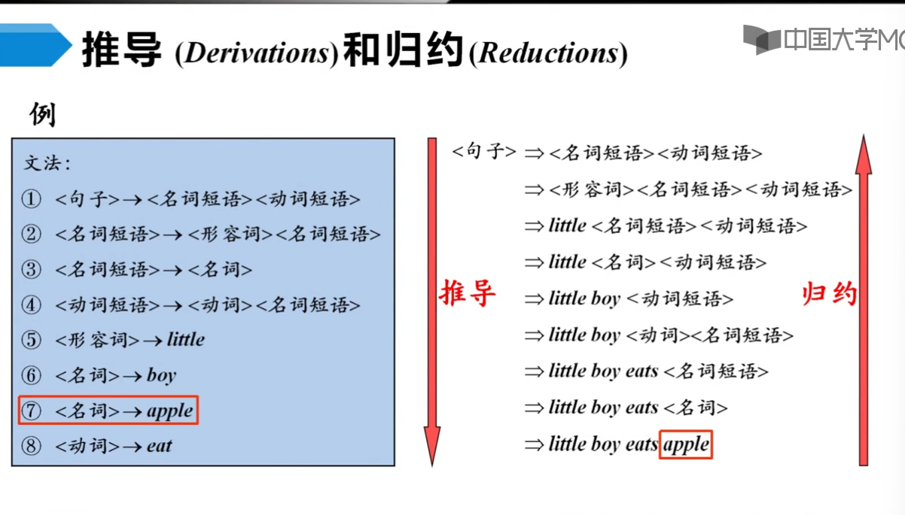

有了文法（语言规则），如何判定某一词串是否是该语言的句子？

- 句子的**推导**（派生）：从**生成**语言的角度
- 句子的**归约**：从**识别**语言的角度

### 句型和句子

- 如果$ S \rightarrow^* \alpha, \alpha \in (V_T \cup V_N)^*$，则称$\alpha$是G的一个句型（sentential form）
  - 一个句型中既可以包含**终结符**，又可以包含**非终结符**，也可能是**空串**

- 如果$S \rightarrow^* w, w\in V_T^*$，则称$w$是$G$的一个句子（sentence）
  - 句子是**不包含非终结符**的**句型**

> 也就是说，句子是推导过程的最后一步，全是**终结符**

由文法GF的开始符号S推导出的所有句子构成的集合称为<u>文法G生成的语言</u>，记为L(G)。

即，$L(G) = \{w | S \rightarrow^* w, w \in V_T^*\}$

### Chomsky 文法分类体系

$$
\alpha \rightarrow \beta
$$

#### 0型文法（Type-0 Grammar）

无限制文法（Unrestricted Grammar）或称之为短语结构文法（Phrase Structure Grammar，PSG）

$\forall\alpha \rightarrow \beta \in P，\alpha 中至少包含 1 个非终结符$

#### 1型文法（Type-1 Grammar）

上下文有关文法（Context-Sensitive Grammar，CSG）

$\forall\alpha \rightarrow \beta \in P，|\alpha| \le |\beta|$

> CSG中不包含$\varepsilon-产生式$

例如，产生式的一般形式为：$\alpha_1A\alpha_2\rightarrow\alpha_1\beta\alpha_2 (\beta\ne\varepsilon)$

#### 2型文法（Type-2 Grammar）

上下文无关文法（Context-Free Grammar，CFG）

$\forall\alpha \rightarrow \beta \in P，\alpha \in V_N$

例如，产生式的一般形式为：$A\rightarrow\beta$

#### 3型文法（Type-3 Grammar）

正则文法（Regular Grammar，RG）

- 右线性（RIght Linear）：$A \rightarrow wB$  或 $A \rightarrow w$，表示在终结符的右边进行限制，添加一个非终结符
- 左线性（Left Linear）文法：$A \rightarrow Bw$ 或 $A \rightarrow w$，表示在终结符的左边进行限制，添加一个非终结符
- 左线性文法和右线性文法都是正则文法

> 注意正则文法能描述程序设计语言的多数单词

#### 四种文法之间的关系

逐级限制

- 0型文法：$\alpha$中至少包含1个非终结符
- 1型文法：$|\alpha| \le |\beta|$，即CSG中不包含$\varepsilon-产生式$
- 2型文法：$\alpha \in V_N$
- 3型文法：$A \rightarrow wB$ 或 $A \rightarrow w$（$A \rightarrow Bw$ 或 $A \rightarrow w$）

逐级包含

$3型文法文法集合 \in 2型文法集合 \in 1型文法集合 \in 0型文法集合$

### CFG的分析树（2型文法，上下文无关文法）

> 从上面可以知道，正则文法可以描述程序设计语言中的大多数单词，但是**它的生成能力**有限，**它几乎描述不了程序设计语言的句子构造**。
>
> 而**上下文无关文法可以描述大部分程序设计语言的语法构造**，也是被研究的最多的一种文法。

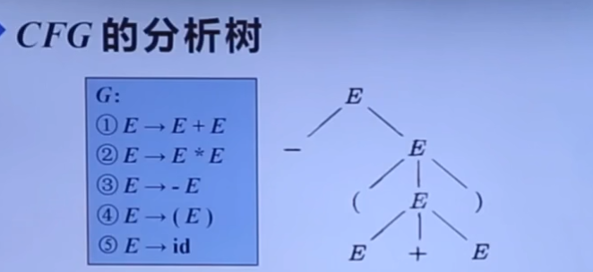

- **根节点**的标号为**文法开始符号**
- **内部结点**表示对一个产生式$A \rightarrow \beta$的应用，该**结点的标号**是此产生式**左部A**。该结点的**子结点的标号**从左到右构成了**产生式的右部**
- **叶结点**的标号既可以是**非终结符**，也可以是**终结符**。<u>从左到右排列叶结点得到的符号串称为是这棵树的产出（yield）或边缘（frontier）</u>

> 给定一个句型，其分析树中的每一棵**子树的边缘**称为该句型的一个短语（phrase）
>
> - 如果子树只有父子两代结点，那么这棵子树的边缘称为该句型的一个直接短语（immediate phrase）
>
> 注意：直接短语**一定**是某产生式的右部，但产生式的右部**不一定**是给定句型的直接短语！！！直接短语是某高度为2的子树的边缘！！！

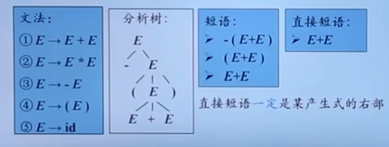

### 二义性文法（Ambiguous Grammar）！！！

> 如果一个文法可以为某个句子生成**多课分析树**，则称这个文法是二义性的。

例，

文法：
$$
S \rightarrow if \space E \space then \space S \space | \space if \space E \space then \space S \space else \space S \space | \space other
$$
句型：
$$
if \space E_1 \space then \space if \space E_2 \space then \space S_1 \space else \space S_2
$$
该句型可能有两棵分析树：

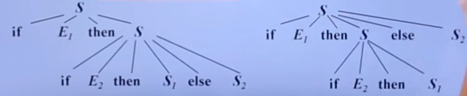

因此，该文法是一个二义性文法。

在C、C++等大多数程序设计语言中，通过**消歧规则**：每个else和最近的尚未匹配的if匹配，从而保证文法没有**二义性**。

#### 二义性文法的判定

对于任意一个上下文无关文法，不存在一个算法，判定它是无二义性的；<u>但能给出一组充分条件，满足这组充分条件的文法是无二义性的</u>。

- 即满足该**充分条件**，肯定无二义性
- 不满足，也未必是有二义性

### 有穷自动机(Finite Automata，FA)

有穷自动机（Finite Automata，FA）由两位神经物理学家MeCuloch和Pitts于1948年首先提出，是对**一类处理系统**建议的**数学模型**。

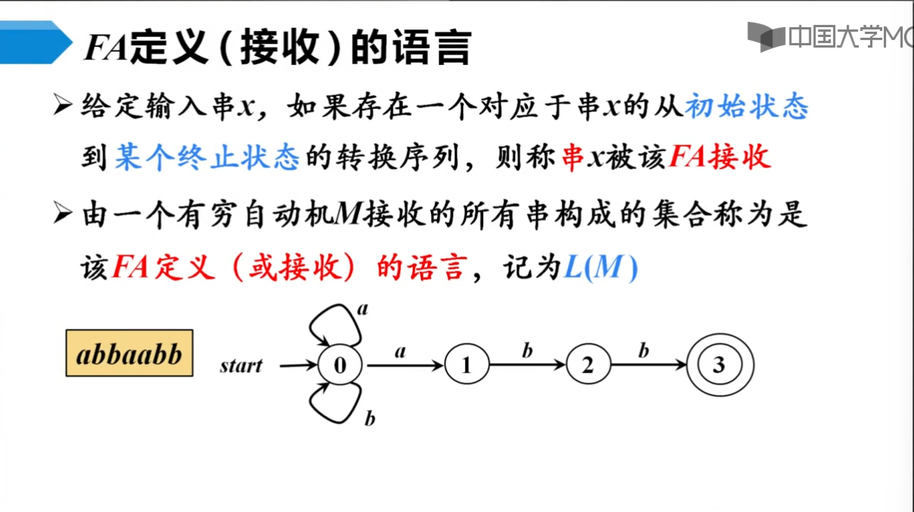

结论：L(M) = 所有以abb结尾的字母表 {a, b} 上的串的集合

#### 最长子串匹配原则（Longest String Matching Principle）

- 当输入串的**多个前缀**与一个或多个模式匹配时，总是选择**最长的前缀**进行匹配

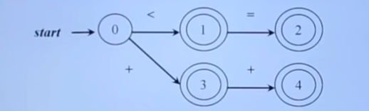

- 在到达某个终态之后，只要输入带上还有符号，FA就继续前进，以便寻找尽可能长的匹配

#### FA的分类

- 确定的FA（Deterministic finite automata，DFA）
- 非确定的FA（Nondeterministic finite automata，NFA）

##### 确定的有穷自动机（DFA）

$$
M=(S, \sum, \delta, s_0, F)
$$

S：有穷状态集

$\sum$：输入字母表，即**输入符号集合**。假设**$\varepsilon$不是$\sum$中的元素**

$\delta$：将$S\times\sum$映射到S的转换函数。$\forall s \in S, \alpha \in \sum,\delta(s, \alpha)$表示从状态S出发，沿着标记为$\alpha$的边所能到达的状态

$s_0$：开始状态（或初始状态），$s_0 \in S$

F：接受状态（或终止状态）集合，$F\subseteq S$

例如：

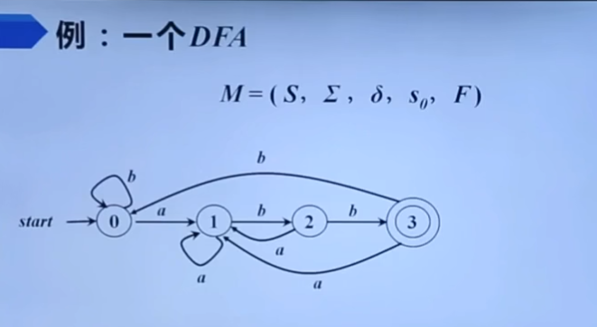
$$
\left\{\begin{array}{l}
S = {0, 1, 2, 3}\\
\sum = {a, b}\\ 
\delta如下 \\
s_0 = 0 \\
F = 3
\end{array}\right.
$$
$\delta$转换表（转换函数）

| 状态\输入  |  a   |  b   |
| :--------: | :--: | :--: |
|     0      |  1   |  0   |
|     1      |  1   |  2   |
|     2      |  1   |  3   |
| 3*（终态） |  1   |  0   |

> 转换图和转换表都可以用来表示DFA

##### 非确定的有穷自动机（NFA）

$$
M = (S, \sum, \delta, s_0, F)
$$

其与**确定的有穷自动机（NFA）**唯一的区别是：从状态s出发，沿着标记为a的边所能到达的状态集合（即，不止一个状态）。

> 如果转换函数没有给出对应于某个**状态-输入**对的信息，就把$\emptyset$放入相应的表项中

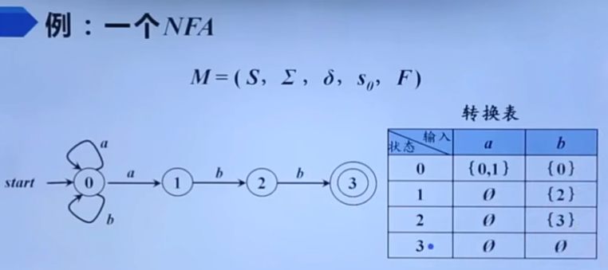

##### DFA和NFA的等价性

- 对任何NFA N，存在识别同一语言的DFA D
- 对任何DFA D，存在识别同一语言的NFA N

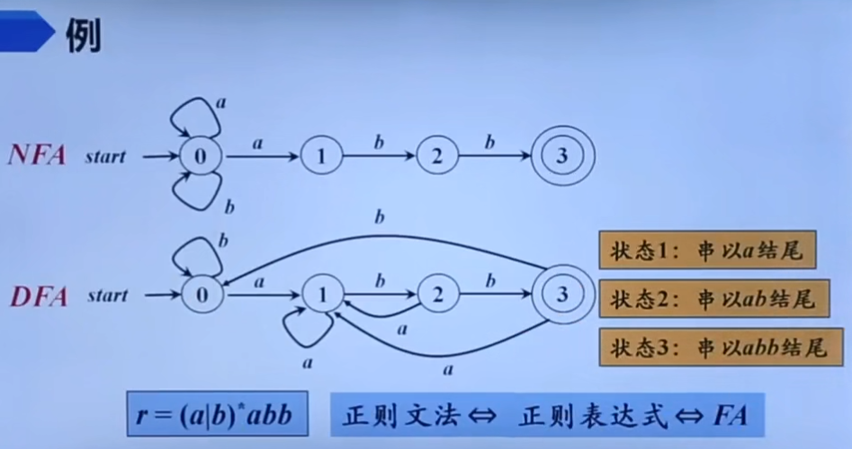

虽然DFA和NFA具有等价性，但是从人的角度上来看，NFA比较直观；从机器的实现上来说，DFA更容易实现。

##### 从正则表达式到非确定的有穷自动机（NFA）

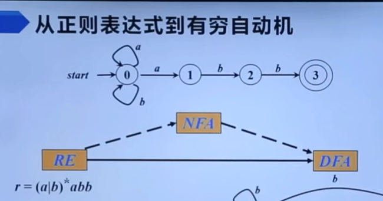

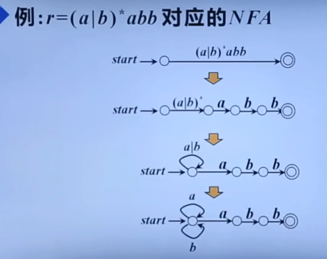

##### 从非确定的有穷自动机（NFA）到确定的有穷自动机（DFA）

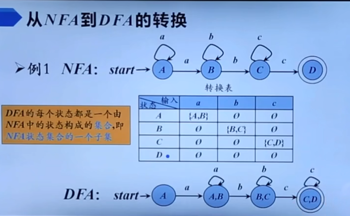

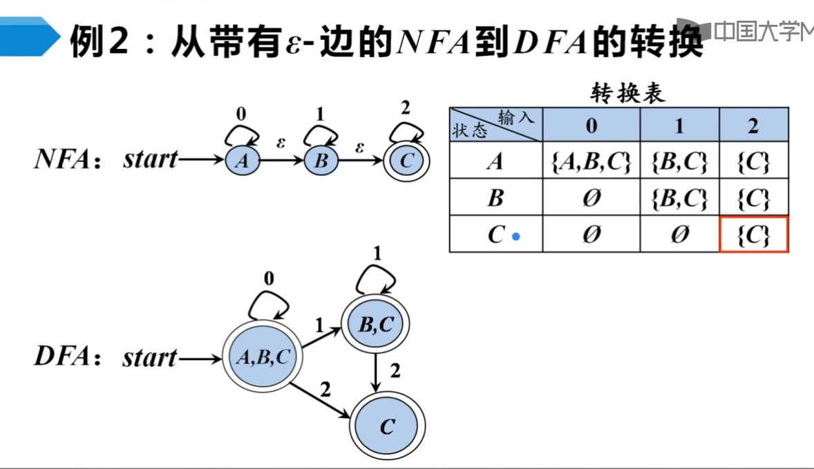

### 自顶向下的分析（Top-Down Parsing）

从分析树的顶部（根结点）向底部（叶结点）方向构造分析树，**可以看成是从文法开始符号S推导出词串w的过程**。

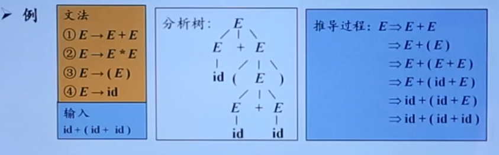

#### 最左推导

> 在最左推导中，总是选择每个句型的**最左非终结符**进行替换

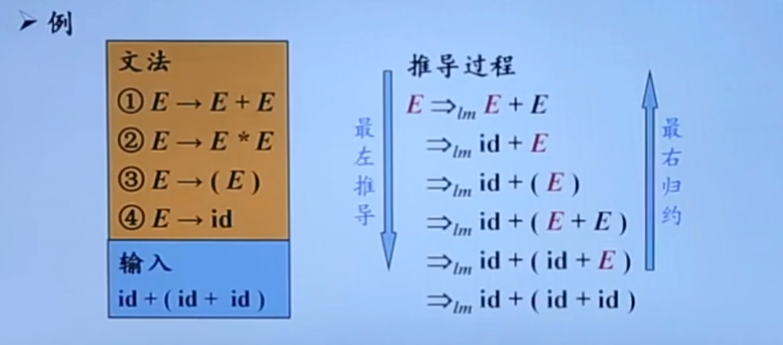

#### 最右推导

> 在最右推导中，总是选择每个句型的**最右非终结符**进行替换

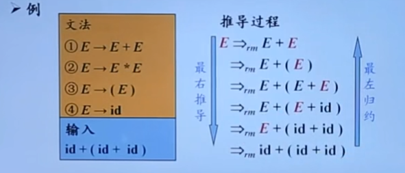

### 文法转换

问题一：

> 同一非终结符的多个候选式存在共同前缀，将导致**回溯**现象

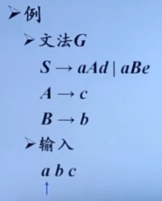

问题二：

> 含有$A \rightarrow A\alpha$形式产生式的文法称为是直接左递归的（immediate left recursive）。
>
> 1. 如果一个文法中有非终结符A使得对某个串$\alpha$存在一个推导$A \rightarrow \space^+A\alpha$，那么这个文法就是左递归的
> 2. 经过两步或两步以上推导产生的左递归称为是间接左递归的

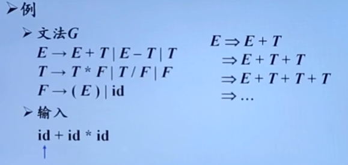

#### 消除左递归

1. 消除直接左递归：将**左递归**转换成**右递归**

> 消除左递归是要付出代价的——引进了一些**非终结符**和**$\varepsilon$_产生式**

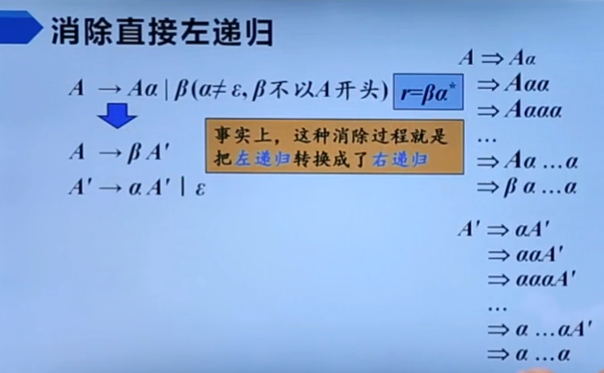

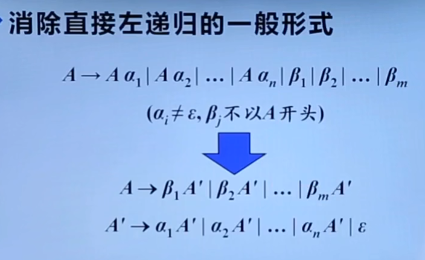

2. 消除间接左递归

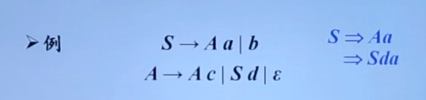

将间接左递归转换成直接左递归，再用直接左递归的结论进行改造

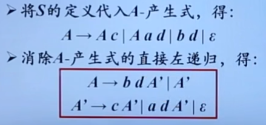

#### 提取左公因子

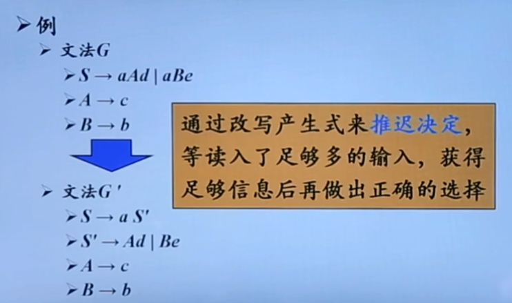

### LL(1)文法

> 实现任意串输入都只有**唯一可选**的产生式，从而不用回溯

S\_文法（简单的确定性文法，Korenjak & Hopcroft，1966），S\_文法**不含$\varepsilon-产生式$**

1. 每个产生式的右部都以**终结符**开始
2. 同一非终结符的各个候选式的**首终结符**都不同

#### 非终结符的后继符号集

> 可能在某个句型中紧跟在A后边的<u>**终结符a**</u>的集合，记为**FOLLOW(A)**
>
> $FOLLOW(A)=\{S\rightarrow^* \alpha A \alpha \beta, a \in V_T, \alpha,\beta \in (V_T \cup V_N)^*\}$
>
> 如果A是某个句型的最右符号，则将结束符”$“添加到FOLLOW(A)中

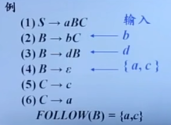

#### 产生式的可选集

> 产生式$A \rightarrow \beta$的可选集是指：可以选用产生式进行推导时对应的**输入符号**的集合，记作$SELECT(A \rightarrow \beta)$
>
> ”是否匹配成功“
>
> 如$A \rightarrow \alpha \beta$，只有匹配到$\alpha$才算一次匹配成功

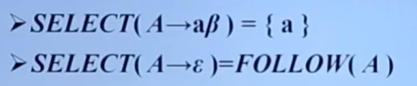

#### 串首终结符集

> 串首第一个符号，并且是终结符。简称为”首终结符“
>
> 给定一个文法符号串$\alpha$，$\alpha$的串首终结符集FIRST($\alpha$）被定义为可以从$\alpha$推导出的所有**串首终结符**构成的集合。如果$\alpha \rightarrow^* \varepsilon$

## 计算机系统结构

## 数据库系统原理

## 软件工程

## 通信原理

## 人工智能